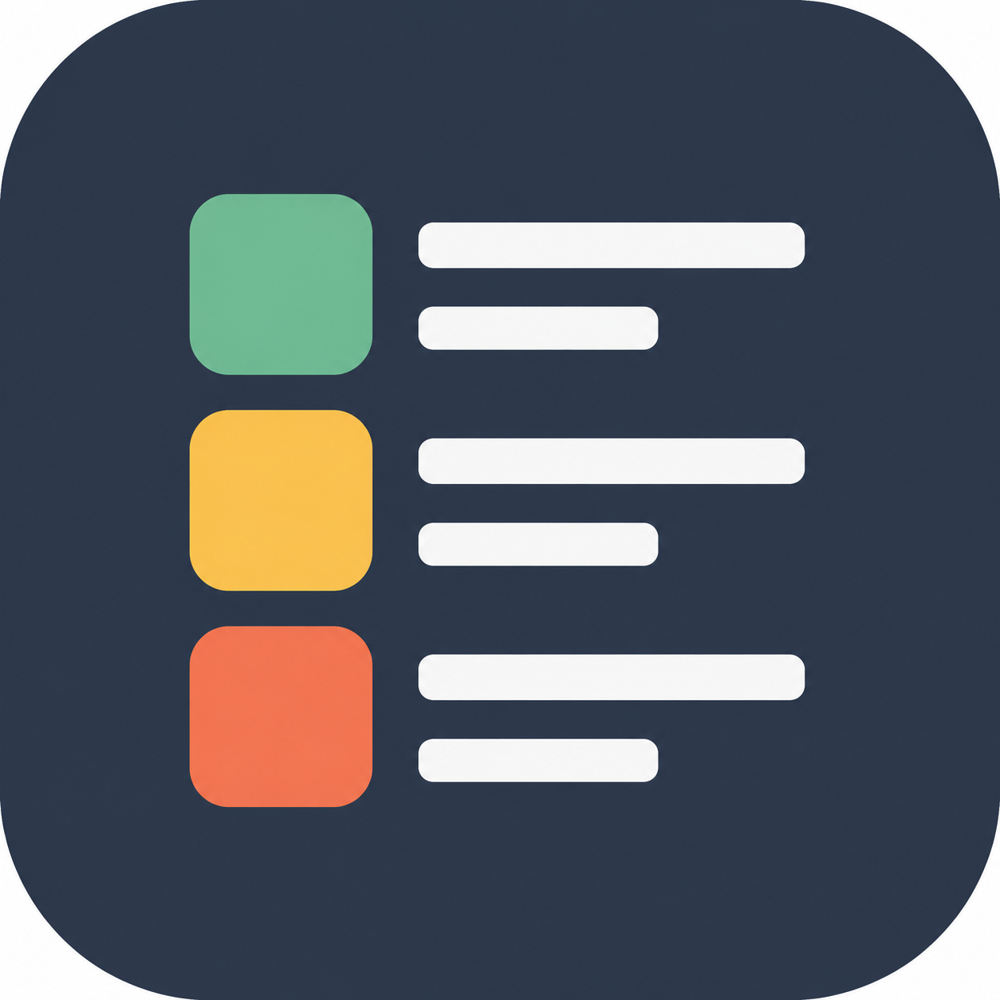
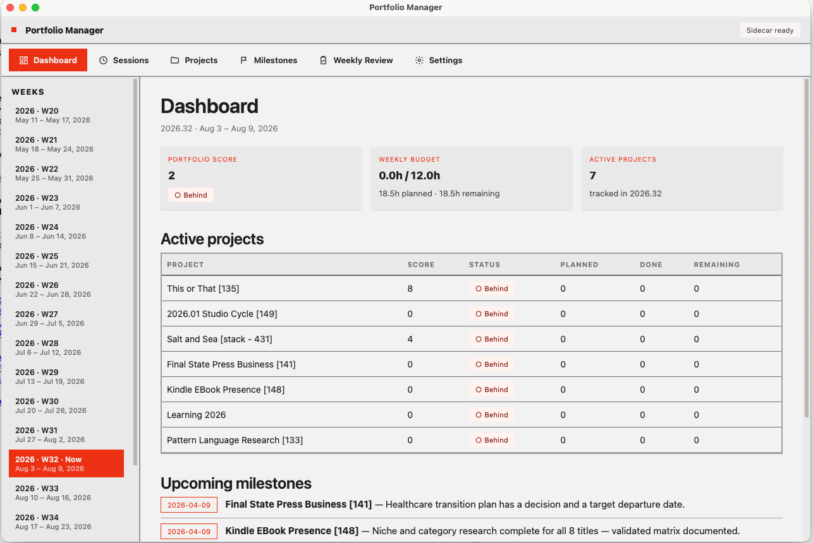

> [!IMPORTANT]
> Portfolio Manager is pre-release software. There is not a public packaged
> release yet; this repository is currently both the app and the macOS release
> rehearsal workspace.



# [Portfolio Manager](https://github.com/mattbriggs/personal-project-portfolio)

[](https://github.com/mattbriggs/personal-project-portfolio)
[](https://github.com/mattbriggs/personal-project-portfolio/actions/workflows/ci.yml)
[](https://www.apple.com/macos/)
[](#data-and-configuration)
[](#the-loop)
[](https://tauri.app/)
[](https://react.dev/)
[](https://fastapi.tiangolo.com/)
[](https://sqlite.org/)
[](https://www.rust-lang.org/)
[](https://www.python.org/)
[](./LICENSE)

A desktop application that enables a single user to manage, schedule, and
execute work across a portfolio of creative and technical projects using
time-boxed sessions.

It is fast and crude, and that is the point.

Portfolio Manager is for systems thinkers, programmers, math-minded planners,
and solo builders who want a finite weekly work budget instead of another
bottomless task database. It is not trying to become a team workspace, a Kanban
religion, or a broadly adopted SaaS product.



<!-- vim-markdown-toc GFM -->
- [Portfolio Manager](#portfolio-manager)
  - [Why](#why)
  - [Features](#features)
  - [The Loop](#the-loop)
  - [Install](#install)
  - [Developer Build](#developer-build)
  - [Data and Configuration](#data-and-configuration)
  - [Changelog](#changelog)
  - [FAQ](#faq)
    - [Is there a downloadable release?](#is-there-a-downloadable-release)
    - [Who is this for?](#who-is-this-for)
    - [Where is my data stored?](#where-is-my-data-stored)
    - [Will updating remove my projects?](#will-updating-remove-my-projects)
    - [Why does macOS warn about opening the app?](#why-does-macos-warn-about-opening-the-app)
    - [Which app version should I use?](#which-app-version-should-i-use)
  - [Motivation](#motivation)
  - [License](#license)
<!-- vim-markdown-toc -->

## Why

Most personal project tools reward capture: more tasks, more labels, more
places to put unfinished intentions. Portfolio Manager rewards allocation.

The unit of planning is a time-boxed session. Projects compete for a finite
weekly budget. Milestones describe outcomes. Reviews close the loop. Scores make
drift visible without pretending that personal creative work can be fully
reduced to tickets.

The app is intentionally direct. If a workflow needs twelve abstractions, it
probably belongs somewhere else.

## Features

* Portfolio dashboard with project health, scores, weekly session totals, and
  upcoming milestones
* Active, backlog, and archived project states
* Time-boxed sessions with project, milestone, date, duration, status, and notes
* Weekly budget tracking against configured capacity
* Milestones across backlog, planned, doing, done, and cancelled states
* Markdown project plans with Mermaid diagram support
* Weekly reviews for reflection and next-week planning
* Local SQLite storage with auto-save
* Tauri desktop shell with a bundled FastAPI/Python sidecar

## The Loop

1. Decide which projects are active.
2. Set a realistic weekly time budget.
3. Define milestones as outcomes, not chores.
4. Plan sessions against that budget.
5. Execute the sessions.
6. Mark sessions and milestones as they move.
7. Review the week.
8. Adjust the portfolio.

That is the whole machine.

## Install

There is no public packaged release yet.

When releases are available, they will appear on the
[GitHub releases](https://github.com/mattbriggs/personal-project-portfolio/releases)
page as macOS app builds.

For now, build and install locally:

```sh
npm install
python3 -m venv .venv
.venv/bin/python -m pip install -e "backend[dev,package]"
.venv/bin/python scripts/build_sidecar.py
PATH="$HOME/.cargo/bin:$PATH" npm run tauri build -- --bundles app
bash scripts/install_macos_app.sh --yes
```

The installer signs the built app bundle, verifies it, and installs it into:

```text
/Applications/Portfolio Manager.app
```

## Developer Build

Expected local toolchain:

```sh
xcode-select --install
rustup update
node --version
npm --version
```

Useful checks:

```sh
npm run typecheck
npm test
.venv/bin/python -m pytest backend/tests
cd src-tauri && cargo test
```

This repository is also a practice ground for shipping a downloadable macOS app
with the same stack intended for a later commercial release: Tauri, React,
FastAPI, Python, Rust, SQLite, GitHub Actions, and GitHub Releases.

Development notes, legacy launch scripts, architecture details, and release
status live in [DEV-AND-ROADMAP.md](DEV-AND-ROADMAP.md).

## Data and Configuration

On first launch, Portfolio Manager creates:

```text
~/.portfolio_manager/config.toml
~/.portfolio_manager/portfolio.db
```

The default weekly session budget is 12 hours and the default session length is
90 minutes. Both can be changed from Settings or by editing the config file.

Before trying pre-release builds, make a copy of:

```text
~/.portfolio_manager/portfolio.db
```

## Changelog

[CHANGELOG.md](CHANGELOG.md)

## FAQ

### Is there a downloadable release?

Not yet. This is a pre-release project. The current goal is to make the app
useful locally and prove the macOS packaging/release path before publishing a
download.

### Who is this for?

People who like explicit systems for their own work: developers, technical
writers, creative technologists, research-minded builders, and anyone who thinks
in budgets, constraints, feedback loops, and tradeoffs.

### Where is my data stored?

Your data is stored locally in SQLite at `~/.portfolio_manager/portfolio.db`.
Portfolio Manager does not require a hosted account or remote database.

### Will updating remove my projects?

No. The app bundle lives separately from your database. Replacing the desktop
app should not remove `~/.portfolio_manager/portfolio.db`.

### Why does macOS warn about opening the app?

Early local builds may be ad-hoc signed rather than Developer ID signed and
notarized. If macOS blocks the app, open it from Finder with right-click ->
Open, or remove quarantine from a trusted local build:

```sh
xattr -dr com.apple.quarantine "/Applications/Portfolio Manager.app"
```

### Which app version should I use?

Use the Tauri desktop app for daily work. The older Tkinter launcher remains in
the repository for compatibility and historical development workflows.

## Motivation

This app exists because personal work has a geometry. A week has only so many
hours. A portfolio has only so much attention. A project that receives no
sessions is not active in any meaningful sense.

Portfolio Manager makes those constraints visible without turning them into a
ceremony. It is a small, local instrument for asking: what am I actually working
on, what did I move forward, and what should get time next?

## License

[MIT](./LICENSE)
