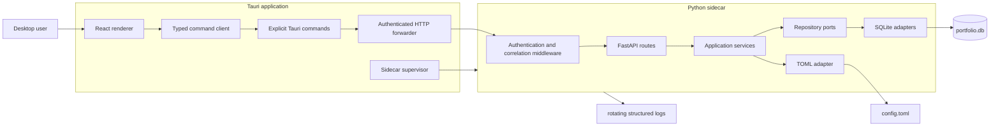
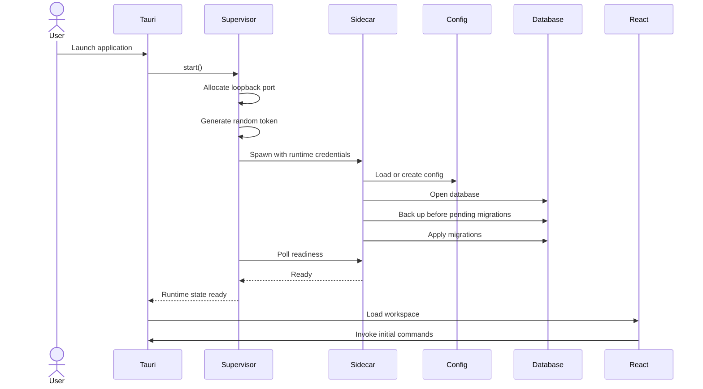
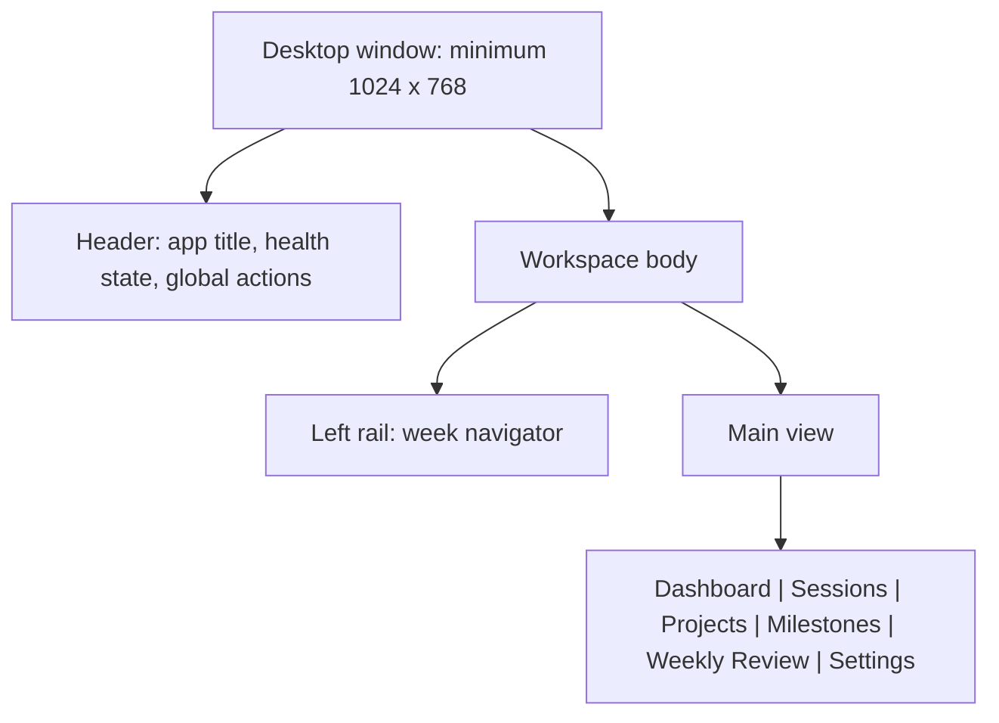

# Portfolio Manager Tauri Refactor — Implementation Instructions

## 1. Implementation Strategy

### 1.1 Objective

Refactor Portfolio Manager from a Python 3.11 Tkinter desktop application into a local-first desktop application composed of:

- A Tauri native desktop shell.
- A React and TypeScript renderer.
- A Rust process-supervision and security layer.
- A Python 3.11+ FastAPI sidecar.
- An existing SQLite database as the authoritative data store.
- TOML-based local configuration.
- Bundled Markdown and Mermaid rendering with no production runtime network dependency.

The refactor shall preserve existing domain behavior, scoring rules, database migrations, repository behavior, configuration paths, week-key calculations, and plan-document semantics wherever practical.

This is a presentation and runtime-shell migration, not a product redesign.

### 1.2 Required Boundary

The implementation shall enforce this call path:

```text
React renderer
    -> typed Tauri command client
    -> allowlisted Tauri command
    -> Rust HTTP forwarding adapter
    -> loopback-only FastAPI route
    -> Pydantic boundary contract
    -> Python application service
    -> repository interface
    -> SQLite repository
    -> SQLite database
```

The renderer shall never call the Python sidecar directly.

The renderer shall not receive or persist:

- The sidecar port.
- The sidecar authentication token.
- Internal sidecar process details.

### 1.3 Delivery Approach

Implement the refactor as vertical slices rather than building each technology layer independently.

Recommended slice order:

1. Runtime bootstrap, health checks, and sidecar security.
2. Settings and configuration.
3. Projects.
4. Project plans and Markdown/Mermaid preview.
5. Milestones.
6. Sessions and weekly budget.
7. Scoring and dashboard.
8. Weekly reviews.
9. Migration compatibility and packaging.
10. Cross-platform release preparation.

Each vertical slice shall include:

- Python domain and application behavior.
- Repository behavior.
- Pydantic contracts.
- FastAPI routes.
- Rust command forwarding.
- TypeScript command-client methods.
- React UI behavior.
- Unit, integration, contract, and component tests.
- Requirement traceability.
- Documentation updates.

### 1.4 Python Project Standards

The Python backend shall:

- Use Python 3.11 or later.
- Use a virtual environment.
- Use `pyproject.toml` as the authoritative package, dependency, tool, test, formatting, linting, typing, and build configuration.
- Use a `src` package layout.
- Use Pydantic for external contracts, validation, settings models, configuration models, and structured error payloads.
- Keep domain and application modules independent of FastAPI, Tauri, React, and packaging frameworks.
- Use explicit repository protocols or abstract base classes.
- Use explicit transaction boundaries for write operations.
- Use structured logging.
- Use Sphinx-compatible docstrings.
- Include full unit tests for domain and application behavior.

Recommended Python tools:

```text
Packaging:       hatchling or setuptools
Environment:     python -m venv
API:             FastAPI and Uvicorn
Validation:      Pydantic v2 and pydantic-settings
Database:        sqlite3 from the Python standard library
Testing:         pytest, pytest-cov, pytest-asyncio
HTTP testing:    httpx
Typing:          mypy
Linting:         Ruff
Formatting:      Ruff formatter
Security checks: Bandit
Build:           PyInstaller
Documentation:   Sphinx and MkDocs Material
```

Do not introduce an ORM unless repository behavior cannot reasonably be preserved with the existing `sqlite3` implementation.

### 1.5 Frontend Standards

The renderer shall:

- Use React and TypeScript.
- Use strict TypeScript settings.
- Access backend behavior only through a typed command-client module.
- Keep server-backed state separate from unsaved form state.
- Preserve form input after validation failures.
- Bundle Markdown and Mermaid dependencies.
- Avoid CDN-hosted runtime dependencies.
- Provide accessible labels, keyboard focus behavior, focus-trapped dialogs, and non-color status indicators.
- Use a desktop-oriented workspace layout rather than a marketing layout.

Recommended frontend tools:

```text
Build:              Vite
Testing:            Vitest
Component testing:  React Testing Library
Query/cache:         TanStack Query or an equivalent typed cache
Forms:               React Hook Form or explicit local state
Schema validation:   Zod for renderer-side usability validation
Markdown:            react-markdown
Mermaid:             mermaid
Sanitization:        DOMPurify or equivalent
End-to-end:          WebdriverIO or the Tauri-supported E2E approach selected by the team
```

Renderer validation improves user feedback but shall not replace authoritative Pydantic and service validation.

### 1.6 Rust and Tauri Standards

The Tauri core shall:

- Generate a cryptographically random token on every launch.
- Select an available loopback port dynamically.
- Launch the packaged sidecar with the port and token as process arguments or protected environment values.
- Store the token and port only in Tauri-managed in-memory state.
- Wait for sidecar readiness before exposing backend-dependent UI behavior.
- Attach the token to every protected sidecar request.
- Allow only explicitly declared command operations.
- Normalize HTTP and sidecar failures into typed renderer errors.
- Detect unexpected sidecar termination.
- Terminate the sidecar during application shutdown.
- Disable WebView developer tools in production.

Recommended Rust libraries:

```text
HTTP client:       reqwest
Serialization:     serde and serde_json
Error modeling:    thiserror
Random token:      rand or getrandom
Secret handling:   secrecy where useful
Async runtime:     Tokio through Tauri
Structured logs:   tracing and tracing-subscriber
```

### 1.7 Compatibility Rule

Before replacing any Tkinter controller or view, identify whether it contains:

- Validation.
- State-transition logic.
- Transaction orchestration.
- Score recomputation.
- Event-driven refresh behavior.
- Configuration behavior.
- Error translation.

Move durable behavior into Python application services before deleting the Tkinter implementation.

Do not reproduce business rules independently in React or Rust.

---

## 2. Proposed Project Structure

```text
personal-project-portfolio/
├── pyproject.toml
├── package.json
├── pnpm-lock.yaml
├── README.md
├── mkdocs.yml
├── .gitignore
├── .editorconfig
├── .env.example
├── backend/
│   ├── README.md
│   ├── src/
│   │   └── portfolio_manager/
│   │       ├── __init__.py
│   │       ├── bootstrap.py
│   │       ├── api/
│   │       │   ├── __init__.py
│   │       │   ├── app.py
│   │       │   ├── dependencies.py
│   │       │   ├── exception_handlers.py
│   │       │   ├── middleware/
│   │       │   │   ├── __init__.py
│   │       │   │   ├── authentication.py
│   │       │   │   ├── correlation.py
│   │       │   │   └── request_logging.py
│   │       │   └── routes/
│   │       │       ├── __init__.py
│   │       │       ├── health.py
│   │       │       ├── dashboard.py
│   │       │       ├── projects.py
│   │       │       ├── plans.py
│   │       │       ├── sessions.py
│   │       │       ├── milestones.py
│   │       │       ├── reviews.py
│   │       │       ├── scores.py
│   │       │       └── settings.py
│   │       ├── contracts/
│   │       │   ├── __init__.py
│   │       │   ├── common.py
│   │       │   ├── errors.py
│   │       │   ├── dashboard.py
│   │       │   ├── projects.py
│   │       │   ├── plans.py
│   │       │   ├── sessions.py
│   │       │   ├── milestones.py
│   │       │   ├── reviews.py
│   │       │   ├── scores.py
│   │       │   └── settings.py
│   │       ├── domain/
│   │       │   ├── __init__.py
│   │       │   ├── enums.py
│   │       │   ├── models/
│   │       │   │   ├── project.py
│   │       │   │   ├── session.py
│   │       │   │   ├── milestone.py
│   │       │   │   ├── project_score.py
│   │       │   │   └── weekly_review.py
│   │       │   ├── scoring.py
│   │       │   ├── week.py
│   │       │   ├── slug.py
│   │       │   └── errors.py
│   │       ├── application/
│   │       │   ├── __init__.py
│   │       │   ├── ports/
│   │       │   │   ├── unit_of_work.py
│   │       │   │   ├── project_repository.py
│   │       │   │   ├── session_repository.py
│   │       │   │   ├── milestone_repository.py
│   │       │   │   ├── score_repository.py
│   │       │   │   ├── review_repository.py
│   │       │   │   ├── settings_repository.py
│   │       │   │   └── clock.py
│   │       │   ├── services/
│   │       │   │   ├── project_service.py
│   │       │   │   ├── session_service.py
│   │       │   │   ├── milestone_service.py
│   │       │   │   ├── review_service.py
│   │       │   │   ├── scoring_service.py
│   │       │   │   ├── dashboard_service.py
│   │       │   │   ├── plan_service.py
│   │       │   │   └── settings_service.py
│   │       │   └── dto/
│   │       │       ├── dashboard.py
│   │       │       └── budget.py
│   │       ├── infrastructure/
│   │       │   ├── __init__.py
│   │       │   ├── db/
│   │       │   │   ├── connection.py
│   │       │   │   ├── unit_of_work.py
│   │       │   │   ├── row_mapping.py
│   │       │   │   ├── schema.py
│   │       │   │   ├── migrations/
│   │       │   │   │   ├── runner.py
│   │       │   │   │   └── versions/
│   │       │   │   └── repositories/
│   │       │   │       ├── projects.py
│   │       │   │       ├── sessions.py
│   │       │   │       ├── milestones.py
│   │       │   │       ├── scores.py
│   │       │   │       └── reviews.py
│   │       │   ├── config/
│   │       │   │   ├── models.py
│   │       │   │   ├── loader.py
│   │       │   │   └── toml_repository.py
│   │       │   ├── logging/
│   │       │   │   ├── configuration.py
│   │       │   │   ├── filters.py
│   │       │   │   └── context.py
│   │       │   ├── security/
│   │       │   │   └── token.py
│   │       │   └── system/
│   │       │       ├── clock.py
│   │       │       └── paths.py
│   │       └── cli/
│   │           ├── __init__.py
│   │           └── sidecar.py
│   └── tests/
│       ├── unit/
│       │   ├── domain/
│       │   └── application/
│       ├── integration/
│       │   ├── repositories/
│       │   ├── migrations/
│       │   └── config/
│       ├── contract/
│       │   └── api/
│       ├── compatibility/
│       │   └── tkinter_database/
│       ├── performance/
│       ├── fixtures/
│       └── conftest.py
├── frontend/
│   ├── index.html
│   ├── tsconfig.json
│   ├── vite.config.ts
│   └── src/
│       ├── main.tsx
│       ├── app/
│       │   ├── App.tsx
│       │   ├── AppShell.tsx
│       │   ├── providers.tsx
│       │   ├── routes.tsx
│       │   └── error-boundary.tsx
│       ├── command-client/
│       │   ├── invoke.ts
│       │   ├── errors.ts
│       │   ├── health.ts
│       │   ├── dashboard.ts
│       │   ├── projects.ts
│       │   ├── plans.ts
│       │   ├── sessions.ts
│       │   ├── milestones.ts
│       │   ├── reviews.ts
│       │   ├── scores.ts
│       │   └── settings.ts
│       ├── contracts/
│       │   ├── generated/
│       │   └── index.ts
│       ├── features/
│       │   ├── dashboard/
│       │   ├── projects/
│       │   ├── plans/
│       │   ├── sessions/
│       │   ├── milestones/
│       │   ├── reviews/
│       │   └── settings/
│       ├── components/
│       │   ├── navigation/
│       │   ├── dialogs/
│       │   ├── forms/
│       │   ├── tables/
│       │   ├── status/
│       │   └── feedback/
│       ├── hooks/
│       ├── state/
│       ├── styles/
│       ├── test/
│       └── utils/
├── src-tauri/
│   ├── Cargo.toml
│   ├── build.rs
│   ├── tauri.conf.json
│   ├── capabilities/
│   ├── binaries/
│   └── src/
│       ├── main.rs
│       ├── lib.rs
│       ├── app_state.rs
│       ├── errors.rs
│       ├── logging.rs
│       ├── sidecar/
│       │   ├── mod.rs
│       │   ├── supervisor.rs
│       │   ├── launcher.rs
│       │   ├── readiness.rs
│       │   └── shutdown.rs
│       ├── security/
│       │   ├── mod.rs
│       │   ├── token.rs
│       │   └── port.rs
│       ├── http/
│       │   ├── mod.rs
│       │   ├── client.rs
│       │   ├── forwarder.rs
│       │   └── response.rs
│       └── commands/
│           ├── mod.rs
│           ├── health.rs
│           ├── dashboard.rs
│           ├── projects.rs
│           ├── plans.rs
│           ├── sessions.rs
│           ├── milestones.rs
│           ├── reviews.rs
│           ├── scores.rs
│           └── settings.rs
├── tests/
│   ├── e2e/
│   ├── smoke/
│   └── fixtures/
│       └── legacy-databases/
├── docs/
│   ├── index.md
│   ├── getting-started/
│   ├── user-guide/
│   ├── development/
│   ├── architecture/
│   │   ├── context.md
│   │   ├── containers.md
│   │   ├── components.md
│   │   ├── runtime.md
│   │   ├── security.md
│   │   ├── persistence.md
│   │   └── decisions/
│   ├── api/
│   │   ├── sidecar.md
│   │   ├── tauri-commands.md
│   │   └── errors.md
│   ├── testing/
│   ├── release/
│   └── requirements/
│       ├── traceability.md
│       └── acceptance-criteria.md
├── sphinx/
│   ├── conf.py
│   ├── index.rst
│   └── api/
├── scripts/
│   ├── bootstrap.sh
│   ├── bootstrap.ps1
│   ├── generate_openapi.py
│   ├── generate_types.sh
│   ├── build_sidecar.py
│   ├── verify_no_renderer_http.py
│   └── verify_release_security.py
└── .github/
    └── workflows/
        ├── backend.yml
        ├── frontend.yml
        ├── rust.yml
        ├── docs.yml
        ├── integration.yml
        └── release.yml
```

---

## 3. Layer and Contract Model

### 3.1 Domain Layer

The domain layer owns framework-independent business concepts.

It shall define:

- Domain entities.
- Status enumerations.
- Domain invariants.
- ISO week calculations.
- Slug generation.
- Scoring calculations.
- Domain-specific errors.

It shall not import:

- FastAPI.
- Pydantic request or response contracts.
- SQLite.
- Tauri.
- React-specific concepts.
- Process or HTTP infrastructure.

Pydantic may be used for domain value objects only where doing so does not couple the domain to transport behavior. Existing dataclasses may be retained when they better preserve current behavior.

### 3.2 Application Layer

The application layer coordinates domain behavior and repository ports.

Required services:

| Service | Responsibility |
| --- | --- |
| `ProjectService` | Project creation, unique slug handling, updates, archive behavior, permanent deletion, archived-project restrictions |
| `SessionService` | Session creation, default duration resolution, week derivation, status transitions, rescheduling, completion timestamps |
| `MilestoneService` | Milestone creation, status transitions, completion dates, sorting, deletion |
| `ReviewService` | Get-or-create review, ISO date range derivation, review history, updates |
| `ScoringService` | Project score computation, status mapping, persistence, manual overrides, portfolio score |
| `DashboardService` | Aggregate active projects, session counts, minutes, scores, milestones, week range |
| `PlanService` | Plan retrieval and persistence; rendering contract coordination where required |
| `SettingsService` | Settings retrieval, validation, TOML persistence, restart-required metadata |

Application services shall depend on repository interfaces rather than concrete SQLite classes.

### 3.3 Repository Ports

Define typed repository contracts using `typing.Protocol` unless runtime abstract-base behavior is required.

Representative methods:

```python
class ProjectRepository(Protocol):
    def get(self, project_id: int) -> Project | None: ...
    def get_by_slug(self, slug: str) -> Project | None: ...
    def list(self, status: ProjectStatus | None = None) -> list[Project]: ...
    def create(self, project: Project) -> Project: ...
    def update(self, project: Project) -> Project: ...
    def delete(self, project_id: int) -> None: ...


class SessionRepository(Protocol):
    def get(self, session_id: int) -> Session | None: ...
    def list_for_week(self, week_key: str) -> list[Session]: ...
    def list_for_project(
        self,
        project_id: int,
        week_key: str | None = None,
    ) -> list[Session]: ...
    def create(self, session: Session) -> Session: ...
    def update(self, session: Session) -> Session: ...
    def delete(self, session_id: int) -> None: ...
    def count_by_status(
        self,
        project_id: int,
        week_key: str,
    ) -> Mapping[SessionStatus, int]: ...
```

Repository ports shall specify:

- Missing-record behavior.
- Duplicate-record behavior.
- Transaction expectations.
- Ordering guarantees.
- Cascade assumptions.
- Whether returned entities are detached values or live persistence objects.

### 3.4 Unit of Work

Use a Unit of Work abstraction to clarify transaction ownership for multi-repository writes.

Representative contract:

```python
class UnitOfWork(Protocol):
    projects: ProjectRepository
    sessions: SessionRepository
    milestones: MilestoneRepository
    scores: ScoreRepository
    reviews: ReviewRepository

    def __enter__(self) -> "UnitOfWork": ...
    def __exit__(
        self,
        exc_type: type[BaseException] | None,
        exc: BaseException | None,
        traceback: TracebackType | None,
    ) -> None: ...
    def commit(self) -> None: ...
    def rollback(self) -> None: ...
```

Use the Unit of Work for operations such as:

- Project deletion with related records.
- Session status changes followed by score recomputation.
- Milestone status changes followed by score recomputation.
- Dashboard-triggered score persistence.
- Migration recording.

### 3.5 API Contracts

Pydantic contracts shall be separated by resource and purpose.

Use distinct models for:

- Create request.
- Update request.
- Status transition request.
- Response.
- List response.
- Error response.
- Aggregate dashboard response.

Do not reuse database row models as HTTP contracts.

Representative contracts:

```python
class SessionCreateRequest(BaseModel):
    project_id: PositiveInt
    milestone_id: PositiveInt | None = None
    scheduled_date: date
    duration_minutes: int | None = Field(default=None, ge=15, le=480)
    status: SessionStatus = SessionStatus.BACKLOG
    description: str = Field(min_length=1)
    notes: str = ""


class SessionStatusRequest(BaseModel):
    status: SessionStatus


class ErrorResponse(BaseModel):
    code: str
    message: str
    field_errors: dict[str, list[str]] = Field(default_factory=dict)
    correlation_id: str
    retryable: bool = False
```

### 3.6 Contract Versioning

Use a versioned API prefix:

```text
/api/v1
```

Representative routes:

```text
GET    /health
GET    /ready
GET    /api/v1/dashboard
GET    /api/v1/projects
POST   /api/v1/projects
GET    /api/v1/projects/{project_id}
PUT    /api/v1/projects/{project_id}
POST   /api/v1/projects/{project_id}/archive
DELETE /api/v1/projects/{project_id}
```

Health behavior shall be clearly separated:

- `/health`: process liveness; may be unauthenticated.
- `/ready`: operational readiness; authentication behavior shall be selected deliberately and tested.
- All business routes: token required.

The SRS states that every non-health internal route requires authentication. Treat `/ready` as a health route only when its response contains no sensitive data.

### 3.7 TypeScript Contracts

Generate TypeScript contract types from the FastAPI OpenAPI schema during development.

The generated types shall be treated as build artifacts, not manually edited source.

Add a CI check that:

1. Starts or imports the FastAPI app.
2. Emits a deterministic OpenAPI document.
3. Regenerates TypeScript contract types.
4. Fails when committed types differ from generated types.

Tauri command wrappers may use generated response types but shall expose stable domain-specific TypeScript functions.

### 3.8 Rust Command Boundary

Do not implement a generic renderer command that accepts arbitrary HTTP methods and paths.

Each operation shall have a declared Tauri command, for example:

```rust
#[tauri::command]
async fn session_create(
    state: State<'_, AppState>,
    payload: SessionCreateRequest,
) -> Result<SessionResponse, CommandError>
```

Internally, commands may delegate to a generic Rust forwarder, but the renderer-visible command set shall remain explicit and allowlisted.

### 3.9 Error Taxonomy

Define stable error codes across Python, Rust, and TypeScript.

Minimum categories:

| Code | Meaning |
| --- | --- |
| `VALIDATION_ERROR` | Request or business validation failed |
| `NOT_FOUND` | Requested entity does not exist |
| `CONFLICT` | Duplicate slug, uniqueness conflict, or incompatible state |
| `ARCHIVED_READ_ONLY` | Attempted mutation of archived project |
| `AUTHENTICATION_FAILED` | Sidecar token missing or invalid |
| `DATABASE_ERROR` | Persistence operation failed |
| `MIGRATION_ERROR` | Startup migration failed |
| `SIDECAR_UNAVAILABLE` | Tauri cannot reach the sidecar |
| `SIDECAR_STARTUP_FAILED` | Sidecar did not become ready |
| `INTERNAL_ERROR` | Unexpected failure with sanitized details |

Python exceptions shall be translated into API error responses.

Rust shall translate transport failures and API error responses into a common `CommandError`.

React shall map `CommandError` to:

- Inline form messages.
- Entity-not-found state.
- Retryable banner.
- Degraded-state screen.
- Non-retryable notification.

### 3.10 Validation Rules

#### Project

- `name` is required after trimming.
- `slug` is generated from the name.
- Slug must be unique.
- `priority` must be an integer from 1 through 5.
- `status` must be `active`, `backlog`, or `archive`.
- Archived projects are read-only.
- Project deletion requires a confirmed renderer action but service authorization must not depend on renderer confirmation.
- Date ordering behavior is not defined in the SRS and shall not be invented without an approved decision.

#### Session

- `project_id` must reference an existing project.
- The project must not be archived for new or updated sessions.
- `milestone_id`, when present, must reference a milestone belonging to the same project.
- `scheduled_date` is required.
- `week_key` is derived and cannot be supplied authoritatively by the client.
- `duration_minutes` must be 15 through 480.
- Missing duration uses the configured default.
- Status must be a declared session status.
- Entering `done` sets `completed_at`.
- Leaving `done` clears `completed_at`.
- Rescheduling recomputes `week_key`.
- Backlog and cancelled sessions do not count toward score or budget.

#### Milestone

- Must reference an existing non-archived project for mutation.
- Description is required.
- Status must be a declared milestone status.
- Entering `done` sets `completed_date`.
- Leaving `done` clears `completed_date`.
- Cancelled milestones are excluded from scoring.
- Sorting shall be deterministic by `sort_order`, then stable identifier.

#### Weekly Review

- `week_key` must be a valid ISO `YYYY.W` identifier.
- At most one review exists per week key.
- `date_from` and `date_to` are derived from the week key.
- Get-or-create returns a blank persisted or transient review according to an explicit service decision.
- The SRS does not specify whether a blank review must be written immediately. Preserve current behavior.
- Reviews list most recent first.
- Saving updates `updated_at`.

#### Score

- Project scores range from 0 through 100.
- Session component contributes 0 through 60.
- Milestone component contributes 0 through 40.
- Manual override requires a non-empty reason.
- Automatic recomputation never replaces a manual override.
- Portfolio score is the rounded average of active-project scores.
- The zero-active-project portfolio score behavior is not specified and must preserve current implementation behavior or be resolved explicitly.

#### Settings

- Default session duration must be 15 through 480 minutes.
- Weekly budget must be 1 through 100 hours.
- Log level must use the supported current values.
- Theme must use the supported current values.
- Database path is displayed as a resolved path.
- Changing the database path requires restart.

---

## 4. Design Patterns Used

Use patterns only where they make boundaries, testing, integration, or replacement clearer.

### 4.1 Repository Pattern

Use repository interfaces to isolate application services from SQLite.

Benefits:

- Preserves the current architecture.
- Enables service unit tests with in-memory fakes.
- Enables database integration tests independently.
- Allows future persistence replacement without changing domain services.

Do not expose SQL, cursors, or SQLite rows outside infrastructure modules.

### 4.2 Service Layer

Use application services as the authoritative location for use-case orchestration.

Services shall own:

- Validation involving multiple entities.
- Lifecycle transitions.
- Derived fields.
- Score recomputation decisions.
- Transaction boundaries.
- Repository coordination.

FastAPI routes shall remain thin adapters.

### 4.3 Unit of Work

Use Unit of Work for transaction ownership and coordinated repository access.

Do not introduce it around simple read-only operations where it adds no clarity.

### 4.4 Strategy Pattern

Use pure strategies for replaceable calculations where multiple implementations or policy evolution is plausible.

Recommended strategies:

- Project scoring strategy.
- Score-to-traffic-light mapping.
- Slug collision resolution.
- Clock abstraction for completion timestamps.

The initial implementation shall have one scoring strategy matching the SRS.

### 4.5 Adapter Pattern

Use adapters at all external boundaries:

- FastAPI route adapters.
- SQLite repository adapters.
- TOML settings adapter.
- Rust HTTP forwarding adapter.
- Tauri command adapter.
- React command-client adapter.
- System clock adapter.

### 4.6 Facade Pattern

`DashboardService` may act as a read-model facade over projects, sessions, milestones, scores, settings, and week utilities.

It shall not become a generic catch-all service.

### 4.7 Supervisor Pattern

Use a `SidecarSupervisor` in Rust to encapsulate:

- Port selection.
- Token generation.
- Process launch.
- Readiness polling.
- Process monitoring.
- Restart or retry behavior.
- Shutdown.

The supervisor shall expose state transitions such as:

```text
NotStarted
Starting
Ready
Degraded
Stopping
Stopped
Failed
```

### 4.8 Dependency Injection

Use constructor injection for Python services and repository ports.

Use FastAPI dependency providers only at the transport composition boundary.

Use Tauri managed state for Rust runtime dependencies.

Avoid a global service locator.

### 4.9 Observer or Query Invalidation

Replace Tkinter event-bus UI refresh behavior with explicit query invalidation in the React query/cache layer.

Examples:

- Session mutation invalidates sessions, dashboard, scores, and weekly budget.
- Milestone mutation invalidates milestones, dashboard, and scores.
- Project mutation invalidates projects and dashboard.
- Review mutation invalidates review history and the selected review.
- Settings mutation invalidates settings and budget-dependent dashboard data.

Do not recreate a broad event bus unless explicit cache invalidation proves insufficient.

### 4.10 Patterns Not Required

Do not introduce these without a demonstrated need:

- CQRS infrastructure.
- Event sourcing.
- Microservice discovery.
- Message queues.
- Dependency injection frameworks.
- Generic CRUD frameworks.
- ORM abstraction.
- Distributed tracing systems.

The sidecar is a local process boundary, not an independently deployed network microservice.

---

## 5. Service and GUI Architecture

## 5.1 Process Architecture



### 5.2 Startup Flow



Startup shall fail safely when:

- The port cannot be allocated.
- The sidecar binary is missing.
- The sidecar exits before readiness.
- Configuration is invalid.
- The database cannot be opened.
- Backup creation fails before a pending migration.
- Migration execution fails.
- Readiness times out.

The degraded-state UI shall show:

- A user-safe summary.
- The log-file location.
- A retry command when retry is safe.
- An exit option.
- No token, internal stack trace, or full command line.

### 5.3 Sidecar Networking

The sidecar shall:

- Bind to `127.0.0.1`.
- Use the dynamic port selected by Rust.
- Accept the token through a designated startup input.
- Compare tokens using a timing-safe comparison where practical.
- Require the token through `X-API-Key`.
- Reject invalid tokens with `401`.
- Avoid permissive CORS configuration.
- Disable OpenAPI, Swagger, and ReDoc in production.
- Avoid logging authentication headers.
- Set explicit request-body size limits where supported.

No production feature shall require the user to configure a firewall or manually select a port.

### 5.4 Tauri Commands

Command modules shall map one renderer operation to one sidecar operation.

Each command shall document:

- Purpose.
- Renderer caller.
- Input contract.
- Sidecar method and path.
- Response contract.
- Failure mapping.
- Runtime-state dependency.
- Security behavior.
- Expected cache invalidations.
- Extension or replacement points.

Representative mapping:

| Tauri command | HTTP operation |
| --- | --- |
| `dashboard_get` | `GET /api/v1/dashboard` |
| `projects_list` | `GET /api/v1/projects` |
| `project_create` | `POST /api/v1/projects` |
| `project_update` | `PUT /api/v1/projects/{id}` |
| `project_archive` | `POST /api/v1/projects/{id}/archive` |
| `project_delete` | `DELETE /api/v1/projects/{id}` |
| `project_plan_get` | `GET /api/v1/projects/{id}/plan` |
| `project_plan_save` | `PUT /api/v1/projects/{id}/plan` |
| `sessions_for_week` | `GET /api/v1/sessions?week_key=...` |
| `session_create` | `POST /api/v1/sessions` |
| `session_set_status` | `POST /api/v1/sessions/{id}/status` |
| `session_reschedule` | `POST /api/v1/sessions/{id}/reschedule` |
| `milestones_for_project` | `GET /api/v1/projects/{id}/milestones` |
| `review_get_or_create` | `GET /api/v1/reviews/{week_key}` |
| `review_save` | `PUT /api/v1/reviews/{week_key}` |
| `score_override` | `POST /api/v1/scores/override` |
| `settings_get` | `GET /api/v1/settings` |
| `settings_update` | `PUT /api/v1/settings` |
| `sidecar_health` | `GET /health` |

### 5.5 React Application Shell

The application shell shall contain:

- Persistent primary workspace navigation.
- Persistent week navigator.
- Main content region.
- Global degraded-state banner.
- Global error boundary.
- Dialog host.
- Notification region.
- Sidecar health state.

Recommended desktop layout:



### 5.6 Week Navigator

The week navigator shall:

- Show the preceding 12 weeks.
- Show the current week.
- Show at least 4 future weeks.
- Load 4 additional future weeks per request.
- Display ISO week key and date range.
- Maintain the selected week.
- Update Sessions and Weekly Review views.
- Make selected-week behavior available to Dashboard where the SRS requires selected/current week reporting.

The exact persistence of selected week between launches is not specified. Do not persist it unless current behavior already does or the decision is approved.

### 5.7 Dashboard View

The dashboard shall display:

- Active projects only.
- Project score.
- Traffic-light label and icon.
- Planned session count.
- Done session count.
- Remaining session count.
- Portfolio score.
- Portfolio status.
- Planned minutes.
- Done minutes.
- Remaining minutes.
- Weekly budget comparison.
- Upcoming non-done and non-cancelled milestones.
- Current or selected ISO week and date range.

Dashboard loading shall use one aggregate command unless evidence shows that separate commands are required for responsiveness.

### 5.8 Sessions View

The Sessions view shall support:

- Week filtering.
- Create.
- Edit.
- Status changes.
- Mark done.
- Cancel.
- Reschedule.
- Delete after confirmation.
- Project and optional milestone selection.
- Weekly budget visualization.
- Validation without input loss.

State changes shall update score-dependent and dashboard-dependent queries.

### 5.9 Projects View

The Projects view shall support:

- Active, Backlog, Archive, and All filters.
- Create.
- Edit.
- Archive.
- Permanent delete after confirmation.
- Read-only archived-project detail.
- Plan-editor access.
- Priority and lifecycle display.

The UI shall prevent ordinary archived-project edits, but backend enforcement remains mandatory.

### 5.10 Plan Editor

The Plan Editor shall provide:

- Raw Markdown editing.
- Preview mode.
- Split edit/preview mode where practical.
- Mermaid rendering for fenced `mermaid` blocks.
- Raw syntax preservation.
- Sanitized HTML output.
- Explicit parse-error display.
- No runtime CDN dependency.
- Draft preservation after failed saves.

Prefer renderer-side Markdown and Mermaid rendering. The listed `POST /plans/render` endpoint is optional unless retained for compatibility or sanitization requirements. Do not duplicate rendering semantics across Python and React without a documented reason.

### 5.11 Milestones View

The Milestones view shall support:

- Project selection.
- Ordered milestone list.
- Associated session-minute total.
- Create.
- Edit.
- Status transitions.
- Delete after confirmation.
- Sort-order editing or explicit reordering.
- Target date and notes.

The SRS requires sorting but does not prescribe drag-and-drop. Use accessible controls unless drag-and-drop is separately approved.

### 5.12 Weekly Review View

The Weekly Review view shall provide:

- Selected-week context.
- Review history ordered most recent first.
- Get-or-create behavior.
- Hours invested.
- Sessions completed.
- What moved.
- What stalled.
- Signals.
- Decision next week.
- Primary focus.
- Project to deprioritize.
- Risk to watch.
- First session target.
- Written-to-repository flag.
- Save status and validation feedback.

### 5.13 Settings View

The Settings view shall expose:

- Log level.
- Theme.
- Default session duration.
- Weekly budget.
- Resolved database path.

When the database path changes:

- Save the setting.
- Mark restart as required.
- Do not hot-switch the active database.
- Display the currently active path separately from the configured next-start path when they differ.

### 5.14 Renderer State

Use three state categories:

| State category | Examples | Storage |
| --- | --- | --- |
| Server-backed state | Projects, sessions, dashboard, reviews, settings | Query/cache layer |
| Form draft state | Unsaved project, session, milestone, review, settings edits | Component or form state |
| Workspace state | Selected week, selected project filter, active workspace | App state or route-like state |

Do not store the sidecar token or port in any renderer state.

### 5.15 Failure Behavior

| Failure | Required behavior |
| --- | --- |
| Validation failure | Preserve form values and show field-level messages |
| Not found | Show stale-data message and refresh affected query |
| Conflict | Show actionable conflict detail |
| Sidecar unavailable | Enter degraded state and offer retry |
| Sidecar exits | Disable write actions and show recovery guidance |
| Migration failure | Do not continue to normal workspace |
| Database write failure | Roll back transaction and show safe error |
| Mermaid parse failure | Show source-preserving preview error |
| Settings write failure | Keep form values and report that settings were not persisted |
| Unexpected backend failure | Show correlation ID without exposing stack trace |

---

## 6. Documentation Plan

### 6.1 README.md

The root `README.md` shall include:

- Product overview.
- Target architecture.
- Supported platforms.
- Prerequisites.
- Python virtual-environment setup.
- Node package setup.
- Rust and Tauri setup.
- Development commands.
- Test commands.
- Documentation commands.
- Sidecar packaging commands.
- Tauri build commands.
- Default local paths.
- Security-boundary summary.
- Troubleshooting links.
- Release status.

### 6.2 MkDocs Material

Use MkDocs Material as the main developer and user documentation site.

Required sections:

```text
Home
Getting Started
  - Prerequisites
  - Local development
  - Running the full stack
  - Building the sidecar
  - Building Tauri
User Guide
  - Dashboard
  - Sessions
  - Projects
  - Plans and Mermaid
  - Milestones
  - Weekly Reviews
  - Settings
Architecture
  - System context
  - Container architecture
  - Python layers
  - Tauri security boundary
  - Runtime lifecycle
  - Persistence and migrations
  - Error model
  - Configuration
API
  - Sidecar API
  - Tauri commands
  - Contract generation
  - Error contracts
Testing
  - Test architecture
  - Coverage
  - Compatibility tests
  - Performance tests
Release
  - Sidecar packaging
  - Platform builds
  - Signing and notarization
  - Smoke testing
Requirements
  - Traceability matrix
  - Acceptance criteria
Decisions
  - Architecture decision records
```

Enable Mermaid support in MkDocs.

### 6.3 Sphinx API Documentation

Use Sphinx for generated Python API documentation.

Required configuration:

- `autodoc`.
- `autosummary`.
- `napoleon` only if useful for compatibility, while docstrings remain Sphinx-compatible.
- `intersphinx`.
- `viewcode`.
- Strict warnings in CI.
- Automatic module index generation.

Publish generated Sphinx output as part of the documentation build or link it from MkDocs.

### 6.4 Docstring Standard

All public modules, classes, protocols, services, adapters, and non-trivial functions shall use Sphinx-compatible docstrings.

Docstrings shall document:

- Abstraction purpose.
- Expected caller.
- Input contract.
- Important parameters.
- Return value.
- Failure behavior.
- Side effects.
- Transaction behavior.
- Framework integration.
- Security implications.
- Replacement or extension points.

Example:

```python
class SessionService:
    """Coordinate session lifecycle operations for application callers.

    The service is the authoritative application boundary for session
    creation, editing, status transitions, rescheduling, and deletion. API
    adapters should call this class instead of invoking repositories directly.

    Repository implementations are injected through a unit-of-work contract,
    allowing production SQLite adapters and isolated test doubles to share the
    same service behavior.

    :param unit_of_work_factory:
        Callable that creates an application unit of work for each operation.
    :param clock:
        Clock abstraction used when assigning or clearing completion
        timestamps. Tests should provide a deterministic clock.
    :param settings_provider:
        Provider used to resolve the configured default session duration.

    :raises ProjectNotFoundError:
        If the referenced project does not exist.
    :raises ArchivedProjectError:
        If a caller attempts to create or mutate work for an archived project.
    :raises InvalidSessionTransitionError:
        If a requested lifecycle transition violates the defined state model.

    .. note::
       This service must remain independent of FastAPI and Tauri. Transport
       error conversion belongs to the API adapter layer.
    """
```

### 6.5 Architecture Diagrams

Maintain Mermaid diagrams for:

- System context.
- Process/container architecture.
- Python layer dependencies.
- Startup sequence.
- Request sequence.
- Sidecar lifecycle state machine.
- Domain class model.
- Entity relationship model.
- Project lifecycle.
- Session lifecycle.
- Milestone lifecycle.
- Weekly workflow.
- Dashboard computation.
- Build and release pipeline.
- Failure and recovery flow.
- Contract-generation flow.

### 6.6 Architecture Decision Records

Create ADRs for decisions that are not fully resolved by the SRS.

Initial ADRs:

- ADR-001: Tauri-mediated sidecar access.
- ADR-002: Preserve Python domain and SQLite repository behavior.
- ADR-003: Query/cache library selection.
- ADR-004: UI component and accessibility approach.
- ADR-005: OpenAPI-to-TypeScript generation.
- ADR-006: Sidecar startup credential transport.
- ADR-007: Readiness endpoint authentication.
- ADR-008: Blank weekly review persistence behavior.
- ADR-009: Zero-active-project portfolio score behavior.
- ADR-010: macOS sidecar architecture strategy.
- ADR-011: Frontend-only versus backend-assisted Markdown rendering.

### 6.7 Requirement Traceability

Maintain `docs/requirements/traceability.md`.

Each requirement shall map to:

- Implementation module.
- Contract or command.
- Automated test.
- Documentation page.
- Completion status.

Example:

| Requirement | Implementation | Test |
| --- | --- | --- |
| FR-SESS-003 | `domain/week.py`, `SessionService` | `test_create_session_derives_iso_week_key` |
| NFR-SEC-003 | Rust runtime state and logging filters | `token_is_not_persisted_or_logged` |
| UI-021 | React form components | Component tests for retained form input |
| FR-DB-006 | Legacy database compatibility fixture | Compatibility startup test |

---

## 7. Testing and Coverage Plan

### 7.1 Testing Principles

Tests shall verify behavior at the narrowest useful boundary.

Use:

- Unit tests for pure domain behavior.
- Service tests for application orchestration.
- Integration tests for SQLite and TOML.
- Contract tests for FastAPI.
- Rust unit tests for supervision and forwarding.
- React component tests for user-visible behavior.
- End-to-end tests for cross-process workflows.
- Compatibility tests against Tkinter-created database fixtures.
- Performance tests against the specified dataset scale.
- Release security checks against packaged builds.

### 7.2 Python Unit Tests

Required domain tests include:

- ISO week-key generation at year boundaries.
- Week date-range derivation.
- Slug normalization.
- Slug collision handling.
- Session scoring.
- Milestone scoring.
- Combined score rounding and cap.
- Traffic-light boundaries at 59, 60, 79, and 80.
- Zero denominator behavior.
- Domain helper methods.

Required service tests include:

- Empty project name rejection.
- Duplicate slug rejection.
- Priority bounds.
- Archived-project mutation rejection.
- Project archive preservation.
- Project permanent deletion behavior.
- Session default-duration behavior.
- Session duration bounds.
- Session week-key derivation.
- Session rescheduling.
- Completion timestamp assignment and clearing.
- Session and milestone project consistency.
- Milestone completion-date assignment and clearing.
- Cancelled milestone score exclusion.
- Get-or-create weekly review.
- Review ordering.
- Manual score override reason validation.
- Manual override preservation.
- Portfolio score calculation.
- Dashboard aggregate calculation.
- Settings validation.
- Database-path restart-required behavior.

Use deterministic clocks for time-sensitive tests.

### 7.3 Repository Integration Tests

Run repository tests against temporary SQLite databases.

Verify:

- Schema initialization.
- CRUD for every entity.
- Unique project slug constraint.
- Foreign-key behavior.
- Project deletion cascade behavior.
- Milestone-associated session behavior.
- One score per project/week.
- One review per week.
- Transaction commit.
- Transaction rollback.
- Stable ordering.
- Session status count helpers.
- Milestone session-minute totals.
- Upcoming milestone queries.
- Backup-before-migration behavior.
- Migration version recording.
- Failed migration rollback behavior.

Do not use only mocked repositories for persistence acceptance.

### 7.4 API Contract Tests

Use FastAPI test clients with isolated test databases.

For every route, test:

- Missing token.
- Invalid token.
- Valid token.
- Valid request.
- Boundary-value request.
- Invalid payload.
- Missing entity.
- Conflict.
- Sanitized unexpected error.
- Response-schema conformance.
- Correlation ID presence.

Production configuration tests shall verify:

- Swagger disabled.
- ReDoc disabled.
- OpenAPI endpoint disabled or inaccessible according to configuration.
- Stack traces omitted.
- Authentication values omitted from logs.

### 7.5 Rust Tests

Required Rust tests:

- Dynamic port selection produces a loopback-capable free port.
- Token generation meets selected entropy and length requirements.
- Token remains only in runtime state.
- Sidecar launch arguments are assembled correctly without logging the token.
- Readiness polling succeeds.
- Readiness polling times out.
- Early sidecar exit is detected.
- Command forwarding attaches `X-API-Key`.
- Explicit commands map to correct methods and paths.
- API validation errors normalize to `CommandError`.
- Transport failures normalize to `SIDECAR_UNAVAILABLE`.
- Shutdown terminates the child process.
- Production configuration disables devtools.
- Command allowlist exposes no generic arbitrary-path operation.

Use a mock HTTP server for forwarder tests and a small fixture process for supervisor lifecycle tests.

### 7.6 React Tests

Required component tests:

- Application shell renders all six workspace entries.
- Week navigator shows required past/current/future range.
- Loading more future weeks adds four.
- Week selection updates dependent views.
- Project filters work.
- Project form retains values after validation error.
- Archived projects render read-only.
- Delete and archive actions require confirmation.
- Session form applies default duration.
- Session form displays duration bounds.
- Session status actions invalidate dependent queries.
- Milestones render in deterministic order.
- Weekly review displays all eight structured text fields plus tracked numeric and boolean fields.
- Settings show resolved database path.
- Database-path change displays restart requirement.
- Status indicators include text or icons.
- Dialog focus is trapped and restored.
- Markdown renders.
- Mermaid fenced blocks render.
- Invalid Mermaid preserves source and shows an error.
- No direct HTTP call exists in renderer production modules.

Mock the typed command client, not internal `invoke()` calls in every component test.

### 7.7 End-to-End Tests

Minimum end-to-end workflow:

1. Launch the packaged or development Tauri application.
2. Confirm sidecar reaches ready state.
3. Create an active project.
4. Add a milestone.
5. Add a planned session for the selected week.
6. Verify budget and dashboard planned count.
7. Mark the session done.
8. Mark the milestone done.
9. Verify score recomputation.
10. Add Markdown plan content with a Mermaid block.
11. Verify preview rendering.
12. Save a weekly review.
13. Restart the application.
14. Verify persisted data remains available.

Additional E2E tests:

- Invalid form retains entered values.
- Delete requires confirmation.
- Sidecar startup failure displays degraded UI.
- Sidecar termination during runtime displays degraded UI.
- Offline application use remains functional.
- Existing Tkinter database opens without manual conversion.

### 7.8 Compatibility Tests

Maintain sanitized database fixtures produced by supported Tkinter schema versions.

For each fixture:

- Copy to a temporary portfolio directory.
- Start the sidecar.
- Verify backup creation when migrations are pending.
- Verify migrations complete.
- Read projects, sessions, milestones, scores, reviews, and plans.
- Perform a write.
- Restart.
- Verify the write persists.
- Confirm original fixture remains available for repeated testing.

### 7.9 Performance Tests

Create deterministic fixture generation for:

- 100 projects.
- 1,000 milestones.
- 5,000 sessions.
- 260 weekly reviews.

Measure:

- CRUD operations.
- Sessions-by-week query.
- Projects list.
- Milestones with minute totals.
- Dashboard aggregation.
- Sidecar readiness.
- Initial application interaction time in release builds.

Acceptance thresholds:

- Typical CRUD under 500 ms.
- Dashboard refresh under 1 second.
- Installed app interactive within 5 seconds on the primary development macOS machine.

Record:

- Hardware.
- OS version.
- Build type.
- Dataset.
- Warm or cold start.
- Number of runs.
- Median and slowest result.

### 7.10 Coverage Targets

Minimum required Python coverage:

```text
Domain:          95% line, 90% branch
Application:     90% line, 85% branch
Repositories:    85% line, 75% branch
API adapters:    85% line, 75% branch
Overall backend: at least 80% line coverage
```

Recommended frontend targets:

```text
Command client:     90% line
Form validation:    90% line
Feature components: 80% line
Overall frontend:   80% line
```

Recommended Rust targets:

```text
Security utilities:    90% line
HTTP forwarding:       85% line
Command mapping:       85% line
Supervisor logic:      80% line
Overall Rust core:     75% line
```

Coverage percentages shall not replace behavioral acceptance tests.

### 7.11 Coverage Measurement

Python:

```bash
pytest backend/tests \
  --cov=portfolio_manager \
  --cov-branch \
  --cov-report=term-missing \
  --cov-report=xml:artifacts/python-coverage.xml \
  --cov-report=html:artifacts/python-coverage
```

Frontend:

```bash
pnpm vitest run --coverage
```

Rust:

```bash
cargo llvm-cov \
  --workspace \
  --lcov \
  --output-path artifacts/rust-coverage.lcov
```

CI shall:

- Fail below configured thresholds.
- Upload machine-readable coverage.
- Publish HTML coverage artifacts.
- Report changed-line coverage where practical.
- Prevent unexplained exclusions.

Coverage exclusions shall be limited to:

- Platform-specific unreachable branches.
- Generated contract code.
- Packaging bootstraps that are verified by smoke tests.
- Defensive fatal-process paths that cannot be safely exercised.

Every exclusion shall include a documented reason.

---

## 8. Implementation Plan Table

| Phase | Task | Files | Contracts | Tests | Docs | Dependencies | Completion criteria |
| --- | --- | --- | --- | --- | --- | --- | --- |
| 0 | Capture baseline behavior and run current tests | Existing Python source and tests; `docs/requirements/traceability.md` | Existing domain and repository APIs | Existing suite; baseline data fixtures | Baseline report | Current application source | Existing behavior, schema versions, test results, and known failures are recorded |
| 0 | Inventory Tkinter controller behavior before deletion | Current controller and view modules; migration notes | Controller-to-service responsibility map | Characterization tests for undocumented durable behavior | Migration inventory | Existing Tkinter code | Every controller behavior is classified as UI-only, application logic, or obsolete |
| 1 | Establish Python `pyproject.toml` and virtual environment workflow | `pyproject.toml`, `backend/README.md`, bootstrap scripts | Package metadata and tool configuration | Tool smoke tests | README setup | Python 3.11+, pytest, Ruff, mypy | Clean environment can install, lint, type-check, and test backend |
| 1 | Establish frontend and Tauri workspaces | `package.json`, `frontend/*`, `src-tauri/*` | Build interfaces | Vite and Cargo smoke tests | Development setup | Node, pnpm, Rust, Tauri CLI | React renderer and Tauri shell start with placeholder view |
| 1 | Configure CI pipelines | `.github/workflows/*` | Artifact and quality-gate contracts | Pipeline dry runs | CI guide | CI runner support | Backend, frontend, Rust, docs, and integration lanes execute |
| 2 | Refactor domain models and enums into framework-independent modules | `backend/src/.../domain/*` | Domain entity and enum contracts | Domain unit tests | Python API docs; domain model | Existing models | Domain modules contain no FastAPI, SQLite, Tauri, or React imports |
| 2 | Implement week and slug utilities | `domain/week.py`, `domain/slug.py` | ISO week and slug contracts | Boundary and collision tests | Utility API docs | Python standard library | Year-boundary week tests and unique-slug behavior pass |
| 2 | Implement scoring policy | `domain/scoring.py` | Scoring input/output contract | Formula, edge, rounding, status tests | Scoring design | None | All FR-SCORE formula tests pass |
| 3 | Define repository ports and Unit of Work | `application/ports/*` | Repository protocols; Unit of Work | Protocol fakes used by service tests | Layer design | Typing | Application services can run without SQLite |
| 3 | Implement SQLite connection and Unit of Work | `infrastructure/db/connection.py`, `unit_of_work.py` | Transaction contract | Commit and rollback tests | Persistence docs | sqlite3 | Writes commit atomically and failures roll back |
| 3 | Port repositories and row mapping | `infrastructure/db/repositories/*`, `row_mapping.py` | Repository contracts | CRUD, ordering, counts, cascade tests | Repository API docs | Existing schema | Repository parity tests pass against temporary SQLite |
| 3 | Preserve migration runner and backup behavior | `infrastructure/db/migrations/*` | Migration contract | Upgrade, backup, rollback, version tests | Migration guide | Existing migrations | Pending migrations create backup and record applied versions |
| 3 | Add legacy database compatibility fixtures | `tests/fixtures/legacy-databases/*` | Existing SQLite schema compatibility | Fixture startup/read/write/restart tests | Compatibility matrix | Sanitized legacy DBs | Supported Tkinter-created databases open without manual conversion |
| 4 | Implement Pydantic configuration models | `infrastructure/config/models.py` | Settings contract | Bounds, defaults, path tests | Configuration reference | Pydantic settings | Default config values and validation match SRS |
| 4 | Implement TOML repository | `config/loader.py`, `toml_repository.py` | Settings read/write port | Create, load, update, invalid TOML tests | Settings docs | TOML library or stdlib-compatible implementation | First launch creates config and updates persist |
| 4 | Configure structured Python logging | `infrastructure/logging/*` | Log event fields and redaction contract | Redaction, rotation, correlation tests | Observability guide | Logging library or stdlib JSON formatter | Tokens and sensitive request bodies never appear in logs |
| 5 | Implement project service | `application/services/project_service.py` | Project create/update/archive/delete inputs | Full service unit tests | Project behavior docs | Repository ports | FR-PROJ requirements pass at service layer |
| 5 | Implement session service | `session_service.py` | Session operations and transition contracts | Duration, week, timestamps, transition tests | Session lifecycle docs | Settings provider, clock | FR-SESS requirements pass at service layer |
| 5 | Implement milestone service | `milestone_service.py` | Milestone operations | Completion date, sorting, exclusion tests | Milestone lifecycle docs | Repository ports, clock | FR-MILE requirements pass |
| 5 | Implement review service | `review_service.py` | Review get-or-create/save/list | One-per-week, date range, order tests | Review docs | Week utilities | FR-REV requirements pass |
| 5 | Implement scoring and dashboard services | `scoring_service.py`, `dashboard_service.py` | Score and dashboard read-model contracts | Automatic/manual score and aggregate tests | Dashboard computation docs | Project, session, milestone, score repositories | FR-SCORE and FR-DASH service tests pass |
| 5 | Implement plan and settings services | `plan_service.py`, `settings_service.py` | Plan content and settings update contracts | Persistence, validation, restart tests | Plan/settings docs | Project repository, TOML adapter | Plan text is preserved and settings behavior matches SRS |
| 6 | Define Pydantic request, response, and error models | `contracts/*` | `/api/v1` JSON contracts | Schema and serialization tests | API contract docs | Pydantic | All routes have explicit input and output models |
| 6 | Build FastAPI composition root | `api/app.py`, `dependencies.py`, `bootstrap.py` | Application factory | Development and production config tests | Sidecar startup docs | FastAPI, Uvicorn | App can start against an isolated config and database |
| 6 | Implement token authentication and correlation middleware | `api/middleware/*` | `X-API-Key`; correlation ID | Missing, invalid, valid token tests | Security docs | Secret token provider | Protected routes reject unauthenticated requests |
| 6 | Implement exception mapping | `api/exception_handlers.py`, `contracts/errors.py` | Stable error taxonomy | Validation, not-found, conflict, internal error tests | Error contract docs | FastAPI handlers | No production stack trace or secret leakage |
| 6 | Implement health and readiness routes | `routes/health.py` | Health response contracts | Starting, ready, failed state tests | Operations docs | Bootstrap state | Tauri can distinguish liveness from readiness |
| 6 | Implement all resource routes | `routes/projects.py`, `sessions.py`, etc. | REST endpoints from SRS | Auth, happy-path, validation, conflict, not-found tests | Generated route docs | Application services | Every representative endpoint has contract tests |
| 6 | Configure production API hardening | `api/app.py`, build settings | Production-mode behavior | Docs-disabled and logging tests | Security checklist | Environment configuration | Swagger, ReDoc, and unsafe diagnostics are disabled |
| 7 | Generate OpenAPI and TypeScript types | `scripts/generate_openapi.py`, `frontend/src/contracts/generated/*` | OpenAPI/type-generation contract | Drift test | Contract-generation guide | OpenAPI generator | CI fails when generated types are stale |
| 7 | Implement Python sidecar CLI | `cli/sidecar.py` | `--port`, token input, production flag | CLI parsing and bind-address tests | Sidecar CLI docs | Uvicorn | Sidecar binds only to supplied loopback port |
| 7 | Configure PyInstaller build | Spec file or build script; `scripts/build_sidecar.py` | Target-triple binary naming | Frozen-binary smoke test | Packaging guide | PyInstaller | Frozen sidecar starts and serves readiness endpoint |
| 8 | Implement Rust runtime state and secret generation | `app_state.rs`, `security/token.rs` | In-memory runtime-state contract | Entropy, non-serialization, redaction tests | Security design | rand/getrandom | Token is generated per run and is never persisted |
| 8 | Implement dynamic port selection | `security/port.rs` | Port-allocation contract | Allocation and collision tests | Startup docs | std networking | Sidecar starts on a dynamic local port |
| 8 | Implement sidecar supervisor | `sidecar/supervisor.rs`, launcher/readiness/shutdown modules | Supervisor state and lifecycle | Ready, timeout, crash, shutdown tests | Lifecycle diagram | Tauri process APIs | Startup, monitoring, degraded state, and shutdown work |
| 8 | Implement authenticated HTTP forwarder | `http/*` | Internal request and response mapping | Header attachment, timeout, error tests | Forwarding design | reqwest, serde | Every protected call attaches token and normalizes errors |
| 8 | Implement explicit Tauri commands | `commands/*` | Renderer-visible command contracts | Command mapping and payload tests | Tauri command reference | Forwarder | No renderer-visible generic arbitrary HTTP command exists |
| 8 | Add Rust structured logging and redaction | `logging.rs` | Rust log schema | Token and header redaction tests | Observability docs | tracing | Runtime diagnostics are useful without leaking credentials |
| 9 | Implement typed React command client | `frontend/src/command-client/*` | Typed TypeScript functions and errors | Unit tests with mocked `invoke` | Frontend integration docs | Tauri API, generated types | Views never invoke raw command strings directly |
| 9 | Implement application shell and degraded UI | `app/AppShell.tsx`, error boundary, feedback components | Shell and health-state contracts | Navigation and degraded-state tests | UI architecture | React | Six workspaces and sidecar health state are accessible |
| 9 | Implement week navigator | Navigation components and state | Selected-week contract | Range, selection, load-more tests | Week navigation guide | Week utilities | UI-004 through UI-006 pass |
| 10 | Implement Projects vertical slice | `features/projects/*` | Project command contracts | Form, filter, archive, delete, read-only tests | Projects guide | Project backend commands | Project CRUD and archive behavior work end to end |
| 10 | Implement Plan Editor vertical slice | `features/plans/*` | Plan get/save contracts | Markdown, Mermaid, invalid syntax, offline tests | Plans guide | Mermaid, Markdown, sanitizer | Plan content persists and Mermaid renders offline |
| 10 | Implement Milestones vertical slice | `features/milestones/*` | Milestone command contracts | CRUD, order, status, confirmation tests | Milestones guide | Milestone backend commands | Milestone workflow works end to end |
| 10 | Implement Sessions vertical slice | `features/sessions/*` | Session command contracts | Form, transitions, reschedule, budget tests | Sessions guide | Session commands, query cache | Session workflow and budget behavior work end to end |
| 10 | Implement Dashboard vertical slice | `features/dashboard/*` | Dashboard aggregate response | Rendering, score, status, milestone tests | Dashboard guide | Dashboard command | Dashboard results match service calculations |
| 10 | Implement Weekly Review vertical slice | `features/reviews/*` | Review contracts | Get-or-create, fields, history, save tests | Review guide | Review commands | One review per week behavior works end to end |
| 10 | Implement Settings vertical slice | `features/settings/*` | Settings contracts | Validation, save, restart-required tests | Settings guide | Settings commands | Settings persist and database-path changes require restart |
| 11 | Implement cache invalidation rules | Query hooks and mutation modules | Mutation-to-query dependency contract | Invalidation tests | State-management design | Query/cache library | Dependent views refresh after successful mutations |
| 11 | Perform accessibility validation | Components and styles | Accessibility behavior | Automated checks and keyboard tests | Accessibility guide | Testing utilities | Labels, focus, dialogs, and non-color indicators meet SRS |
| 11 | Add renderer direct-network prohibition | `scripts/verify_no_renderer_http.py`, lint rules | No-direct-sidecar contract | Static CI check | Security guide | AST or grep-based verifier | Production renderer code contains no backend HTTP calls |
| 12 | Build cross-process E2E workflow | `tests/e2e/*` | Full-stack behavior | Required create-to-review workflow | E2E guide | Tauri test harness | Required user workflow passes from packaged or release-like build |
| 12 | Add sidecar-failure E2E tests | E2E failure fixtures | Degraded-state behavior | Startup failure and runtime crash tests | Troubleshooting guide | Fixture processes | User-safe degraded UI appears and writes are disabled |
| 12 | Add offline E2E test | E2E environment controls | Offline operation | Network-disabled workflow | Offline behavior docs | Test runner network controls | Core workflows and Mermaid preview work offline |
| 13 | Add performance dataset and benchmarks | `tests/performance/*` | Performance fixture contract | CRUD, dashboard, startup benchmarks | Performance report template | Benchmark tools | NFR-PERF thresholds pass on recorded reference machine |
| 13 | Enforce coverage thresholds | Tool configuration and CI | Coverage policy | Coverage jobs | Testing/coverage docs | pytest-cov, Vitest, cargo llvm-cov | CI fails below approved thresholds |
| 14 | Configure MkDocs Material | `mkdocs.yml`, `docs/*` | Documentation navigation | Strict docs build | Full documentation site | MkDocs Material | Site builds without warnings and includes Mermaid diagrams |
| 14 | Configure Sphinx API docs | `sphinx/*` | Python API documentation | Strict Sphinx build | Generated API docs | Sphinx | Public Python APIs are generated and linked |
| 14 | Complete traceability matrix | `docs/requirements/traceability.md` | SRS-to-code/test mapping | Traceability completeness check | Requirements docs | All prior phases | Every shall-requirement maps to code and at least one verification method |
| 15 | Build macOS release package | Tauri config, binaries, release scripts | Packaged app contract | Install and smoke tests | macOS release guide | macOS runner, sidecar binary | Packaged app launches, persists data, and shuts sidecar down |
| 15 | Verify production security posture | Verification scripts and packaged config | Production-hardening contract | Docs/devtools/token/log checks | Security release checklist | Release build | All mandatory NFR-SEC requirements pass |
| 15 | Add signing and notarization workflow | Release CI and Tauri config | Signed artifact process | Signed-install smoke test | Signing guide | Apple credentials | Distribution artifact meets approved signing requirements |
| 16 | Add Windows and Linux build lanes after macOS parity | CI matrix and platform configs | Target-specific packaging | Platform smoke tests | Platform release guides | Native runners | Each target builds with matching sidecar and passes smoke workflow |
| 17 | Retire Tkinter presentation layer | Legacy UI modules and migration notes | No remaining runtime dependency | Regression and compatibility suite | Migration completion report | All parity phases | Tauri app reaches accepted parity and Tkinter UI is no longer required |
| 18 | Produce final completion report | `docs/release/completion-report.md` | Completion-report template | Final suite and coverage artifacts | Final status report | All phases | Status, exceptions, coverage, performance, and acceptance results are recorded |

---

## 9. Completion Report Template

# Portfolio Manager Tauri Refactor — Completion Report

## Release Information

| Field | Value |
| --- | --- |
| Release version | |
| Commit | |
| Build date | |
| Primary platform | |
| Sidecar Python version | |
| Tauri version | |
| React version | |
| Database schema version | |
| Report author | |

## Executive Status

| Area | Status | Notes |
| --- | --- | --- |
| Python domain preservation | Not started / In progress / Complete / Blocked | |
| SQLite compatibility | | |
| FastAPI sidecar | | |
| Sidecar security | | |
| Tauri supervision | | |
| React workspaces | | |
| Markdown and Mermaid | | |
| Settings | | |
| Migrations and backups | | |
| Automated testing | | |
| Documentation | | |
| macOS packaging | | |
| Windows packaging | | |
| Linux packaging | | |

## Implementation Plan Status

| Phase | Task | Planned completion criteria | Final status | Evidence | Exceptions |
| --- | --- | --- | --- | --- | --- |
| 0 | Baseline behavior | | | | |
| 1 | Workspace and tooling | | | | |
| 2 | Domain extraction | | | | |
| 3 | Persistence | | | | |
| 4 | Configuration and logging | | | | |
| 5 | Application services | | | | |
| 6 | FastAPI API | | | | |
| 7 | Sidecar packaging | | | | |
| 8 | Tauri security and supervision | | | | |
| 9 | React foundation | | | | |
| 10 | Feature views | | | | |
| 11 | State and accessibility | | | | |
| 12 | E2E and failure behavior | | | | |
| 13 | Performance and coverage | | | | |
| 14 | Documentation | | | | |
| 15 | macOS release | | | | |
| 16 | Windows/Linux lanes | | | | |
| 17 | Tkinter retirement | | | | |

## Requirement Verification Summary

| Requirement group | Total | Passed | Failed | Deferred | Not tested |
| --- | ---: | ---: | ---: | ---: | ---: |
| Constraints | | | | | |
| UI requirements | | | | | |
| Tauri command requirements | | | | | |
| API requirements | | | | | |
| Project requirements | | | | | |
| Session requirements | | | | | |
| Milestone requirements | | | | | |
| Review requirements | | | | | |
| Scoring requirements | | | | | |
| Plan requirements | | | | | |
| Dashboard requirements | | | | | |
| Settings requirements | | | | | |
| Database requirements | | | | | |
| Performance requirements | | | | | |
| Security requirements | | | | | |
| Reliability requirements | | | | | |
| Maintainability requirements | | | | | |
| Testing requirements | | | | | |
| UX requirements | | | | | |

## Test Results

| Suite | Passed | Failed | Skipped | Duration | Artifact |
| --- | ---: | ---: | ---: | ---: | --- |
| Python unit | | | | | |
| Python integration | | | | | |
| API contract | | | | | |
| Legacy DB compatibility | | | | | |
| React unit/component | | | | | |
| Rust unit | | | | | |
| Tauri command | | | | | |
| End-to-end | | | | | |
| Offline | | | | | |
| Performance | | | | | |
| Packaged smoke | | | | | |

## Code Coverage

| Area | Line coverage | Branch coverage | Target | Status |
| --- | ---: | ---: | ---: | --- |
| Python domain | | | 95% / 90% | |
| Python application | | | 90% / 85% | |
| Python repositories | | | 85% / 75% | |
| Python API | | | 85% / 75% | |
| Python overall | | | At least 80% line | |
| Frontend command client | | | 90% line | |
| Frontend feature code | | | 80% line | |
| Frontend overall | | | 80% line | |
| Rust security | | | 90% line | |
| Rust HTTP forwarding | | | 85% line | |
| Rust commands | | | 85% line | |
| Rust supervisor | | | 80% line | |
| Rust overall | | | 75% line | |

Coverage was measured using:

```text
Python:
pytest --cov --cov-branch

Frontend:
vitest --coverage

Rust:
cargo llvm-cov
```

List all coverage exclusions and their justifications:

| Exclusion | Reason | Alternative verification |
| --- | --- | --- |
| | | |

## Performance Results

| Scenario | Requirement | Result | Environment | Status |
| --- | --- | --- | --- | --- |
| Installed application startup | Interactive within 5 seconds | | | |
| Typical project CRUD | Under 500 ms | | | |
| Typical session CRUD | Under 500 ms | | | |
| Typical milestone CRUD | Under 500 ms | | | |
| Dashboard refresh | Under 1 second | | | |

## Security Verification

| Control | Result | Evidence |
| --- | --- | --- |
| Dynamic startup port | | |
| Cryptographically random per-run token | | |
| Loopback-only binding | | |
| Token absent from disk | | |
| Token absent from renderer storage | | |
| Token absent from logs | | |
| Renderer cannot call sidecar directly | | |
| Protected routes reject missing token | | |
| Protected routes reject invalid token | | |
| Production API docs disabled | | |
| Production WebView devtools disabled | | |
| Sidecar terminates with app | | |
| Unexpected failures omit stack traces | | |

## Data Compatibility

| Fixture/schema version | Migration required | Backup created | Read verified | Write verified | Restart verified | Status |
| --- | --- | --- | --- | --- | --- | --- |
| | | | | | | |

## Acceptance Criteria

| Criterion | Status | Evidence |
| --- | --- | --- |
| Existing Python behavior tests pass | | |
| Packaged Tauri app launches on macOS | | |
| Sidecar starts on dynamic port | | |
| Unauthenticated sidecar requests fail | | |
| Six workspace views are available | | |
| Project workflow passes | | |
| Milestone workflow passes | | |
| Session workflow passes | | |
| Plan and Mermaid workflow passes offline | | |
| Weekly review workflow passes | | |
| Dashboard score matches SRS formula | | |
| Legacy database opens without manual conversion | | |
| Production API docs are disabled | | |
| Production WebView devtools are disabled | | |
| Coverage targets are met | | |
| Performance targets are met | | |

## Deviations and Deferred Work

| Item | SRS reference | Reason | Risk | Approved by | Planned resolution |
| --- | --- | --- | --- | --- | --- |
| | | | | | |

## Known Defects

| Defect | Severity | User impact | Workaround | Target release |
| --- | --- | --- | --- | --- |
| | | | | |

## Final Decision

```text
[ ] Accepted for release
[ ] Accepted with documented exceptions
[ ] Rejected pending corrective work
```

Decision rationale:

---

# Assumptions

1. The existing Python source and tests remain available during implementation.
2. Existing database migrations are authoritative and can be moved without changing their semantics.
3. Existing domain models may remain dataclasses where Pydantic would introduce unnecessary transport coupling.
4. Pydantic will be used at API, settings, validation, and serialized boundary contracts.
5. The SQLite `sqlite3` repository implementation will be retained unless repository inspection demonstrates a necessary change.
6. macOS is the first release target.
7. Windows and Linux work begins after macOS feature parity and packaging stability.
8. Mermaid rendering will occur primarily in React.
9. The sidecar is a single local process and does not require service discovery, containers, or distributed infrastructure.
10. Docker is not required for the packaged desktop runtime. It may be used only for reproducible documentation or CI utilities where it adds clear value.
11. The database contains one local user’s data and no authentication account model is required.
12. Destructive-action confirmation is a UI responsibility; backend authorization does not assume that confirmation occurred.
13. Automatic score recomputation is triggered after relevant successful mutations and when dashboard data is requested.
14. Current Tkinter behavior is the tie-breaker where the SRS explicitly requires preservation but leaves a detail unspecified.

# Open Questions

1. What is the current behavior when no active projects exist and a portfolio score is requested?
2. Does `GET /reviews/{week_key}` persist a blank review immediately or return an unsaved blank contract?
3. Which current log-level and theme values must be preserved?
4. How are duplicate slugs currently resolved: rejection only, numeric suffixing, or another rule?
5. Are project start and end dates currently validated for chronological order?
6. What happens to sessions referencing a milestone when that milestone is deleted?
7. Is restoration of archived projects already supported despite being described as future behavior?
8. Should `/ready` require the token, or is it intentionally treated as an unauthenticated health route?
9. Should the startup token be passed by command-line argument or environment variable? Both are permitted by the SRS wording, but they have different process-inspection exposure.
10. Which frontend query/cache and component libraries are approved?
11. Is OpenAPI-generated TypeScript mandatory or optional for the first release?
12. Is macOS packaging universal, or will separate Apple Silicon and Intel artifacts be produced?
13. Which Tkinter-created schema versions must be covered by compatibility fixtures?
14. Does project deletion currently cascade scores as well as sessions and milestones?
15. Is `POST /plans/render` required for compatibility, or can all preview rendering remain in React?
16. What exact retry behavior is permitted after sidecar startup failure?
17. Should selected week and selected workspace persist between launches?
18. What application data, if any, should be treated as sensitive for log-body redaction beyond tokens?
19. Which Tauri-compatible E2E framework is approved for packaged desktop testing?
20. What constitutes the primary development macOS machine for performance acceptance measurement?

This instruction can be used directly as the implementation backlog and completion checklist.