# Portfolio Manager Tauri Refactor SRS and Design Report

IEEE 830 software requirements specification with UML/Mermaid system design for the Tauri, React, and Python sidecar refactor.

# Executive Summary

Portfolio Manager is a local-first desktop application for managing a single user's portfolio of creative and technical projects through projects, milestones, scheduled work sessions, weekly reviews, Markdown plan documents, Mermaid diagrams, and score-based portfolio health indicators.

The current implementation is a Python 3.11 Tkinter application with a layered MVC/service/repository architecture and a SQLite database at `~/.portfolio_manager/portfolio.db`. The target refactor replaces the Tkinter presentation layer with a Tauri desktop shell, a React/TypeScript renderer, and a Python FastAPI sidecar. The Python sidecar should retain the existing domain model, scoring behavior, database migrations, repository boundary, configuration behavior, and Markdown/Mermaid plan rendering semantics wherever practical.

The central design decision is to keep the authoritative business logic and persistence in Python while making Rust/Tauri the process supervisor and security boundary. React shall never call Python directly. React shall call Tauri commands; Tauri shall forward allowed requests to the loopback-only sidecar using a dynamic startup port and per-run secret token. SQLite remains the local source of truth.

# At A Glance

| Area | Specification |
| --- | --- |
| Product | Portfolio Manager |
| Target stack | Tauri, Rust, React, TypeScript, FastAPI, Python 3.11+, SQLite |
| Current stack | Python 3.11, Tkinter, SQLite, Markdown, Mermaid.js |
| Primary user | Single local desktop user managing 3-8 concurrent projects |
| Primary platform | macOS first; Windows and Linux are targetable through Tauri build lanes |
| Data model | Project, Session, Milestone, ProjectScore, WeeklyReview, SchemaMigration |
| Core workflow | Plan, execute, review weekly portfolio work |
| Security model | Local-first, loopback-only sidecar, dynamic port, per-run token, no direct renderer-to-sidecar access |
| Diagram syntax | UML-style Mermaid.js diagrams embedded as fenced `mermaid` blocks |
| Standard | IEEE 830-1998 SRS structure |

# Introduction

## 1. IEEE 830 Introduction

### 1.1 Purpose

This document specifies the requirements, system design, UML model, interface model, and migration constraints for refactoring Portfolio Manager from a Python Tkinter desktop application into a Tauri desktop application with a React/TypeScript frontend and a Python FastAPI sidecar.

The intended audiences are:

- The developer implementing the refactor.
- Future maintainers of the Tauri, React, and Python sidecar code.
- Test authors validating behavioral parity against the current Tkinter application.
- Documentation authors updating the user guide and developer guide.

This document is both an IEEE 830 Software Requirements Specification and a design report. The requirements use "shall" language and stable identifiers for test traceability.

### 1.2 Scope

Portfolio Manager shall remain a self-contained, local-first desktop application for personal project orchestration. It shall manage projects, sessions, milestones, plan documents, weekly reviews, settings, and computed portfolio health scores.

Included scope:

- Tauri native desktop shell.
- React/TypeScript renderer.
- Python FastAPI sidecar containing domain and persistence behavior.
- SQLite authoritative local database.
- Markdown plan editing and Mermaid.js diagram preview.
- Weekly planning, session execution, and review workflow.
- Project, session, milestone, score, review, and settings management.
- Secure sidecar startup handshake and loopback-only API.
- Migration from the existing Tkinter UI to feature-parity React views.
- Test strategy for Python, Rust/Tauri, React, API contracts, and end-to-end user flows.

Excluded scope:

- Multi-user collaboration.
- Cloud sync.
- Web-hosted application deployment.
- Mobile applications.
- External calendar integration.
- AI-assisted project planning.
- Multi-database support.
- Direct browser access to the sidecar.

### 1.3 Definitions, Acronyms, and Abbreviations

| Term | Definition |
| --- | --- |
| SRS | Software Requirements Specification |
| IEEE 830 | IEEE Recommended Practice for Software Requirements Specifications |
| Tauri | Rust-based desktop application framework using platform WebViews |
| Renderer | React application running inside the native WebView |
| Sidecar | Frozen Python FastAPI service launched and supervised by Tauri |
| Loopback | Local network interface `127.0.0.1` only |
| Project | A unit of portfolio work with goals, lifecycle status, priority, plan content, milestones, and sessions |
| Session | A time-boxed work unit of 15-480 minutes linked to a project and optionally a milestone |
| Milestone | An outcome-based project checkpoint |
| Weekly Review | Structured reflection and planning record for one ISO week |
| Week Key | ISO week identifier in `YYYY.W` format, such as `2026.15` |
| Project Score | Weekly health score from 0-100 for a project |
| Portfolio Score | Average of active project scores for a week |
| Traffic-Light Status | `green`, `yellow`, or `red` health classification |
| Plan Document | Per-project Markdown text with Mermaid diagram support |
| Repository | Python data access object that maps SQLite rows to domain objects |
| Service | Python business logic object that validates and orchestrates repository calls |
| Contract | Pydantic request or response model used by the sidecar API |

### 1.4 References

| Reference | Use in this specification |
| --- | --- |
| `README.md` | Product summary, features, setup, configuration, development commands |
| `design/tauri-python-stack-guide.md` | Target stack, sidecar security handshake, build and hardening guidance |
| `site/src/architecture.md` | Current layered architecture and lifecycle diagrams |
| `site/src/data-model.md` | Current SQLite data model and migration behavior |
| `site/src/design-patterns.md` | MVC, repository, strategy, observer, singleton, template method, transaction patterns |
| `site/src/development.md` | Development standards, logging, migration process |
| `site/src/testing.md` | Test tiers and coverage target |
| `site/src/guide/*.md` | User workflow, UI reference, status values, scoring rules, configuration, troubleshooting |
| `src/portfolio_manager/**` | Current implementation details used as behavioral source |
| `srs/Portfolio-Manager-V2-SRS.md` | Prior Tkinter-oriented SRS baseline |

### 1.5 Overview

This document is organized as follows:

- Sections 1-3 follow the IEEE 830 SRS structure.
- Sections 4-7 define the Tauri/React/Python system design.
- Sections 8-10 define data, API, UI, and security specifications.
- Sections 11-13 define migration, testing, deployment, and traceability.
- The appendix provides Mermaid UML diagrams and source notes.

# Key Findings

## 2. Current System Facts

1. The existing application already separates most durable behavior from Tkinter through models, repositories, services, controllers, and an event bus.
2. SQLite is the only authoritative state store and should remain so.
3. The view/controller layer is the primary replacement surface.
4. The scoring, week-key, migration, configuration, plan rendering, and repository behavior are suitable for preservation in Python.
5. The Tauri guide requires a secure sidecar pattern: dynamic port, per-run token, loopback binding, disabled production docs, and Tauri-mediated access.
6. The React frontend should reproduce the six existing user workspaces: Dashboard, Sessions, Projects, Milestones, Weekly Review, and Settings.

## 3. Product Perspective

### 3.1 Target System Context

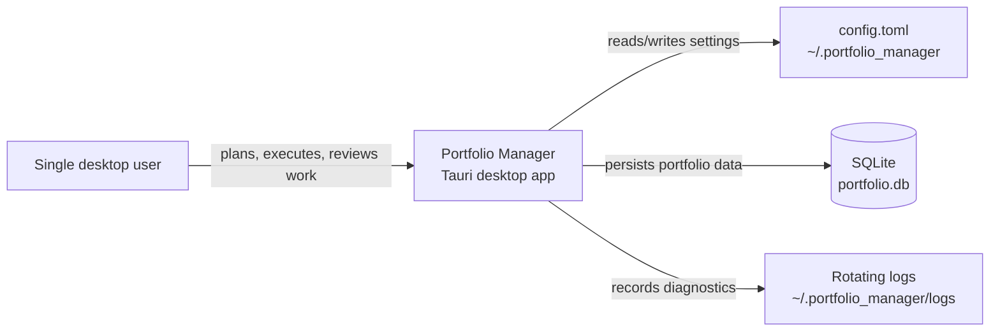

The system is local-first. No feature shall require Internet access after installation, except optional documentation links or development-time dependency installation. Mermaid preview rendering shall use bundled frontend dependencies in the Tauri application rather than requiring a CDN at runtime.

### 3.2 Product Functions

The system shall:

- Manage projects through active, backlog, and archive states.
- Maintain project priority values from 1 to 5.
- Store project plan documents as Markdown with Mermaid diagrams.
- Manage milestones through backlog, planned, doing, done, and cancelled states.
- Manage sessions through backlog, planned, doing, done, and cancelled states.
- Derive ISO week keys from session scheduled dates.
- Track planned, done, and remaining weekly session time against a configurable budget.
- Compute project scores using 60 percent session completion and 40 percent milestone completion.
- Compute portfolio score as the average of active project scores.
- Support manual score overrides with required reasons.
- Store one weekly review per week key.
- Provide dashboard summaries for project health and upcoming milestones.
- Persist all user changes locally.
- Run as a packaged desktop application.

### 3.3 User Characteristics

The intended user:

- Works locally on a desktop computer.
- Manages several concurrent creative or technical projects.
- Uses weekly planning as the main cadence.
- Is comfortable with Markdown and Mermaid syntax.
- Values low-friction entry and review over collaboration features.
- Does not require cloud accounts or network services for normal operation.

### 3.4 Constraints

| ID | Constraint |
| --- | --- |
| CON-001 | The refactored app shall use Tauri for the native shell. |
| CON-002 | The renderer shall use React and TypeScript. |
| CON-003 | The business/persistence sidecar shall use Python 3.11 or later. |
| CON-004 | The sidecar shall expose FastAPI routes bound only to `127.0.0.1`. |
| CON-005 | The renderer shall not directly call the sidecar HTTP API. |
| CON-006 | Tauri shall mediate sidecar calls through commands. |
| CON-007 | SQLite shall remain the local authoritative datastore. |
| CON-008 | The existing database path default shall remain `~/.portfolio_manager/portfolio.db`. |
| CON-009 | The existing configuration path default shall remain `~/.portfolio_manager/config.toml`. |
| CON-010 | The system shall preserve the existing domain states and scoring rules unless a later change explicitly supersedes them. |

### 3.5 Assumptions and Dependencies

- The initial refactor is behavior-preserving rather than feature-expanding.
- Existing Tkinter controllers may be retired after equivalent API and React behavior is implemented.
- Existing tests remain useful for Python domain behavior.
- Tauri packaging requires per-target builds.
- PyInstaller or an equivalent freezer will produce sidecar binaries for each supported target.
- Mermaid rendering can be handled inside React without using `tkinterweb`.

# Context And Conditions

## 4. Overall Design

### 4.1 Target Architecture

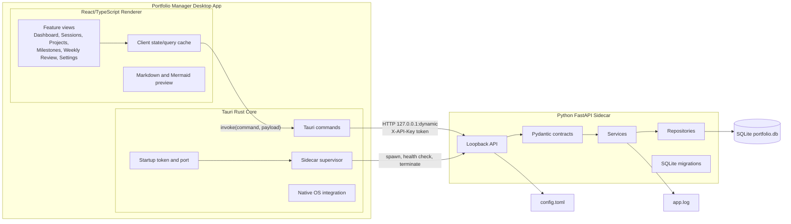

### 4.2 Architectural Layers

| Layer | Technology | Responsibility |
| --- | --- | --- |
| Renderer | React, TypeScript | User interaction, forms, tables, navigation, Markdown/Mermaid preview, optimistic UI state |
| Tauri core | Rust | App startup, sidecar supervision, dynamic port/token generation, command authorization, native menus/dialogs, packaging |
| API | FastAPI | Local contract boundary for domain operations |
| Contracts | Pydantic | Request/response schemas, validation serialization, OpenAPI in development |
| Domain/services | Python | Business rules, scoring, week calculations, lifecycle transitions |
| Repositories | Python, sqlite3 | SQL execution, row mapping, transaction discipline |
| Storage | SQLite | Durable local portfolio state |
| Configuration | TOML | App, session, and database settings |

### 4.3 Component Diagram

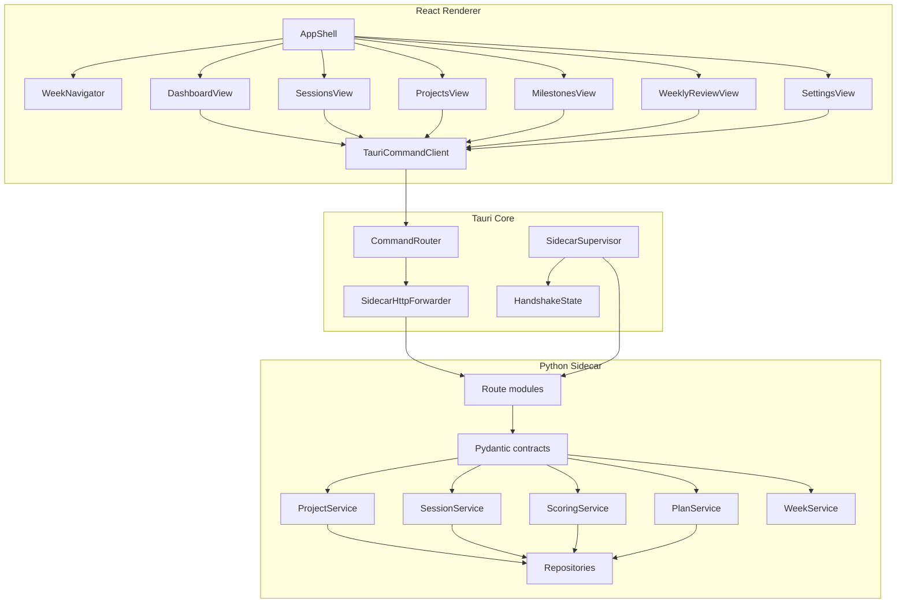

### 4.4 Deployment Diagram

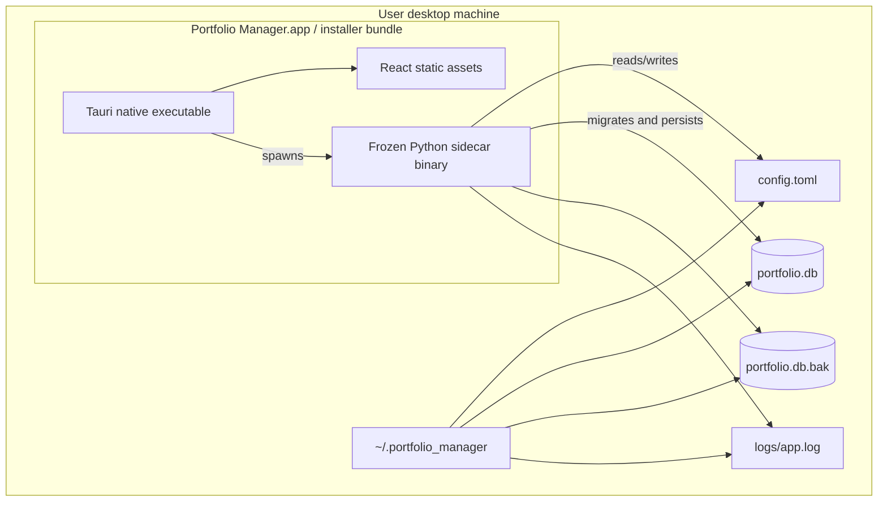

### 4.5 Startup Sequence

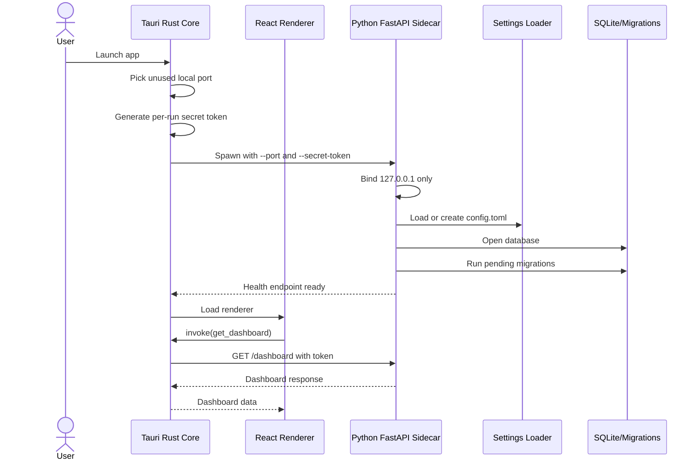

### 4.6 Runtime Request Sequence

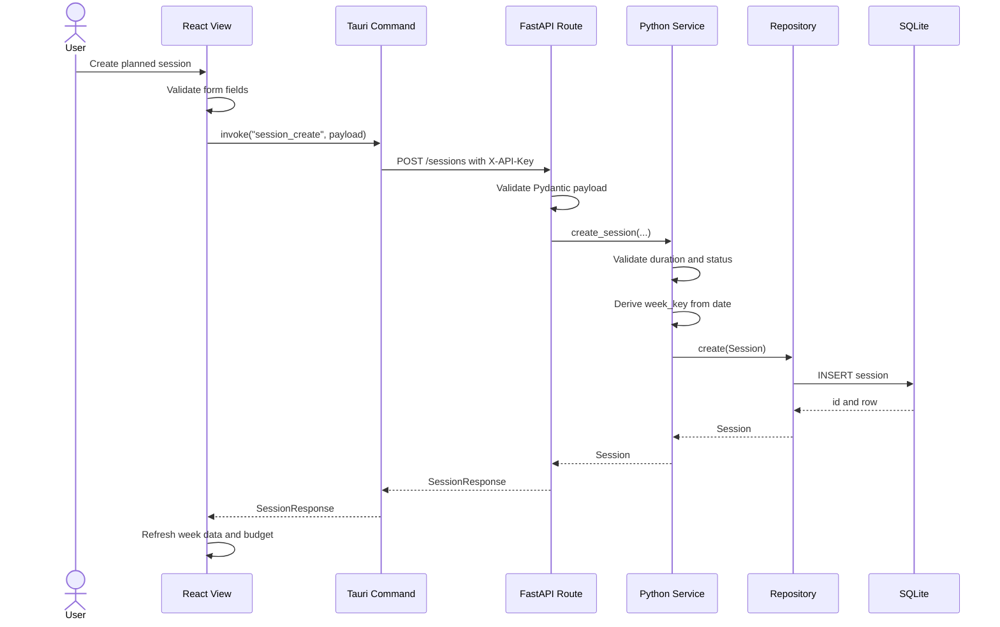

# Patterns In The Evidence

## 5. Domain Model

### 5.1 UML Class Diagram

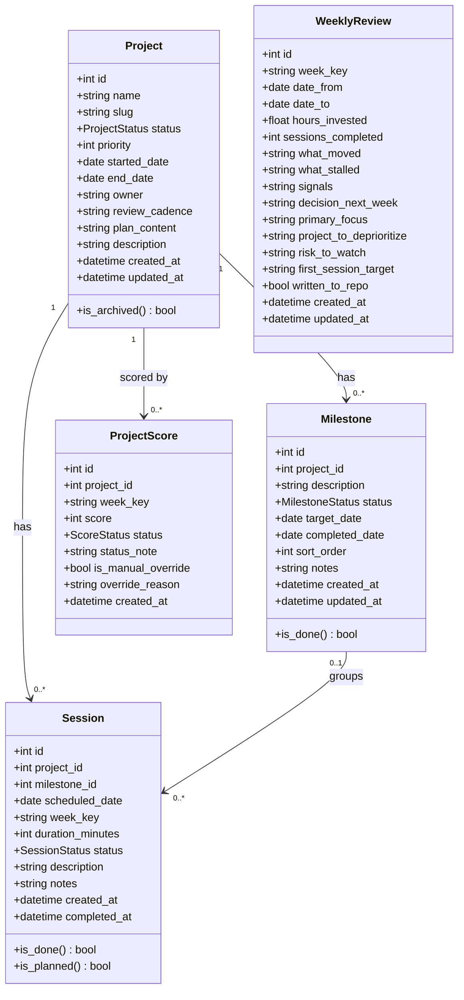

### 5.2 Entity Relationship Diagram

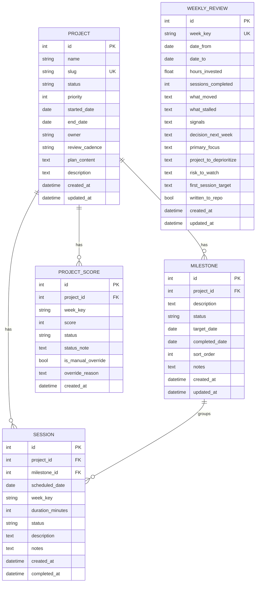

### 5.3 State Diagrams

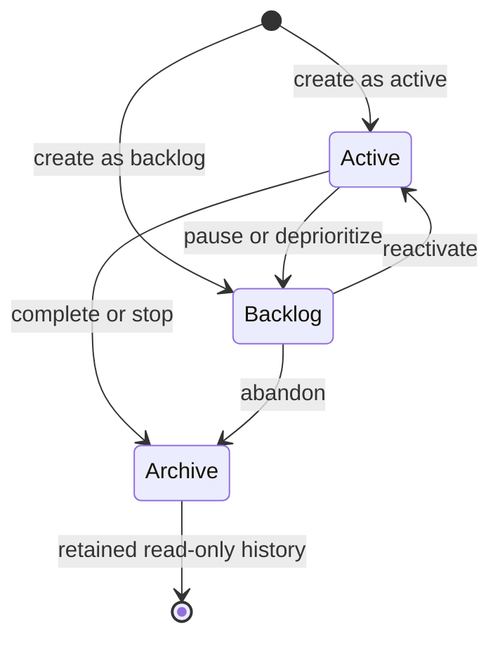

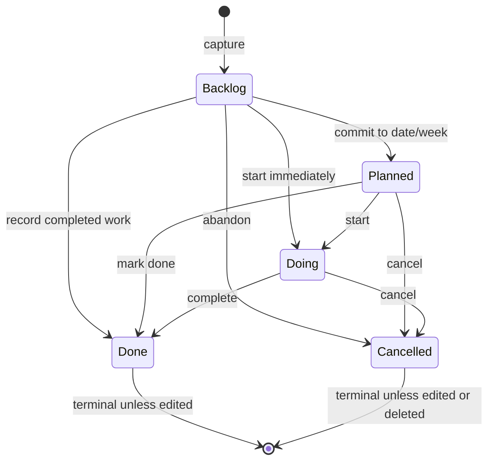

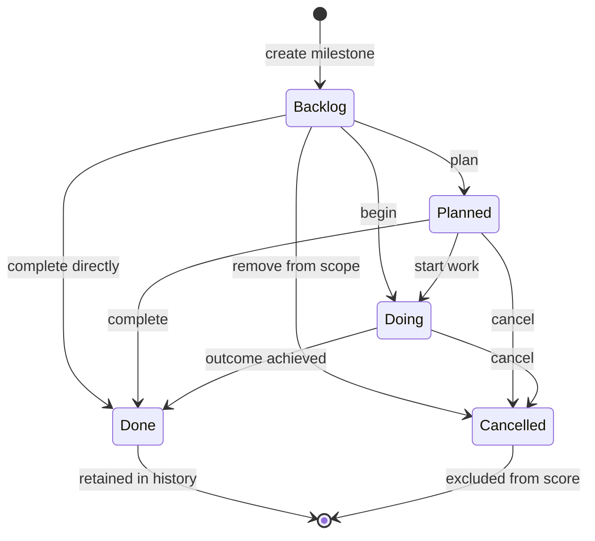

### 5.4 Weekly Workflow Activity Diagram

```mermaid
flowchart LR
    subgraph Plan["Plan"]
        A1["Check dashboard for red/yellow projects"]
        A2["Create or promote sessions"]
        A3["Set committed sessions to planned"]
        A4["Verify weekly budget"]
        A1 --> A2 --> A3 --> A4
    end

    subgraph Execute["Execute"]
        B1["Review session purpose"]
        B2["Set doing if useful"]
        B3["Mark session done"]
        B4["Advance milestone when outcome is reached"]
        B1 --> B2 --> B3 --> B4
    end

    subgraph Review["Review"]
        C1["Inspect dashboard"]
        C2["Complete reflection fields"]
        C3["Record next-week decisions"]
        C4["Save weekly review"]
        C1 --> C2 --> C3 --> C4
    end

    A4 --> B1
    B4 --> C1
    C4 --> A1
```

## 6. Specific Requirements

### 6.1 External Interface Requirements

#### 6.1.1 User Interface Requirements

| ID | Requirement |
| --- | --- |
| UI-001 | The renderer shall provide a persistent application shell with a week navigator and primary workspace navigation. |
| UI-002 | The renderer shall provide Dashboard, Sessions, Projects, Milestones, Weekly Review, and Settings views. |
| UI-003 | The minimum supported application viewport shall be 1024 by 768 CSS pixels for desktop use. |
| UI-004 | The week navigator shall show the 12 preceding weeks, the current week, and at least 4 future weeks. |
| UI-005 | The week navigator shall allow loading additional future weeks in groups of 4. |
| UI-006 | Selecting a week shall update the Sessions and Weekly Review views to that week. |
| UI-007 | The Dashboard shall show active project rows with score, status, planned session count, done session count, and remaining session count. |
| UI-008 | The Dashboard shall show portfolio score and traffic-light status for the selected/current week. |
| UI-009 | The Dashboard shall show weekly planned minutes, done minutes, remaining minutes, and upcoming milestones. |
| UI-010 | The Sessions view shall support creating, editing, marking done, cancelling, rescheduling, deleting, and filtering sessions by week. |
| UI-011 | The Sessions view shall display a weekly budget bar using planned, done, and remaining hours. |
| UI-012 | The Projects view shall support filtering by Active, Backlog, Archive, and All. |
| UI-013 | The Projects view shall support creating, editing, archiving, and deleting projects. |
| UI-014 | The Projects view shall expose the project plan editor. |
| UI-015 | The Milestones view shall support project selection, milestone creation, editing, status update, deletion, and sorting. |
| UI-016 | The Weekly Review view shall list review history and support loading or creating one review per week key. |
| UI-017 | The Weekly Review view shall expose the eight structured reflection/planning fields currently documented. |
| UI-018 | The Settings view shall expose log level, theme, default session duration, weekly budget, and database path display. |
| UI-019 | Destructive actions shall require confirmation before the command is sent. |
| UI-020 | Status indicators shall include text or icons in addition to color. |
| UI-021 | Form fields shall expose validation errors without losing user-entered data. |
| UI-022 | Markdown plan preview shall render Mermaid diagrams in the renderer. |

#### 6.1.2 Tauri Command Interface Requirements

| ID | Requirement |
| --- | --- |
| CMD-001 | React shall use Tauri `invoke()` commands for all backend operations. |
| CMD-002 | Tauri commands shall validate command names against an allowlist. |
| CMD-003 | Tauri commands shall forward approved operations to the sidecar with the startup token. |
| CMD-004 | Tauri commands shall normalize sidecar errors into typed renderer errors. |
| CMD-005 | Tauri commands shall never expose the sidecar token to persistent storage. |
| CMD-006 | Tauri commands shall support health/status checks for degraded-state UI. |

#### 6.1.3 Sidecar HTTP API Requirements

| ID | Requirement |
| --- | --- |
| API-001 | The sidecar shall bind only to `127.0.0.1`. |
| API-002 | The sidecar shall require the startup token on every non-health internal route. |
| API-003 | The sidecar shall reject missing or invalid tokens with `401 Unauthorized`. |
| API-004 | The sidecar shall disable Swagger and ReDoc in production builds. |
| API-005 | The sidecar shall expose JSON request and response bodies. |
| API-006 | The sidecar shall use Pydantic contracts for request and response validation. |
| API-007 | The sidecar shall map validation failures to `400` or `422` responses with user-actionable messages. |
| API-008 | The sidecar shall map missing records to `404`. |
| API-009 | The sidecar shall map unexpected failures to `500` without leaking secret tokens or stack traces in production. |

#### 6.1.4 Hardware Interfaces

No special hardware interface is required. The system shall support keyboard, mouse/trackpad, and standard desktop display devices.

#### 6.1.5 Software Interfaces

| Interface | Requirement |
| --- | --- |
| SQLite | Use local SQLite through Python repositories and migrations. |
| TOML config | Read and write `~/.portfolio_manager/config.toml`. |
| Filesystem | Write database backups before migrations and rotating logs under `~/.portfolio_manager`. |
| OS WebView | Use Tauri-supported native WebView for React renderer. |
| PyInstaller sidecar | Bundle a frozen Python sidecar for each target platform. |

### 6.2 Functional Requirements

#### 6.2.1 Project Management

| ID | Requirement |
| --- | --- |
| FR-PROJ-001 | The system shall create a project with name, status, priority, description, dates, owner, review cadence, and plan content fields. |
| FR-PROJ-002 | The system shall reject project creation when the name is empty. |
| FR-PROJ-003 | The system shall generate a URL-safe unique slug from the project name. |
| FR-PROJ-004 | The system shall reject duplicate project slugs. |
| FR-PROJ-005 | The system shall restrict priority to integer values 1 through 5. |
| FR-PROJ-006 | The system shall support project statuses `active`, `backlog`, and `archive`. |
| FR-PROJ-007 | The system shall list projects by status or list all projects. |
| FR-PROJ-008 | The system shall allow updates to non-archived projects. |
| FR-PROJ-009 | The system shall treat archived projects as read-only except for explicitly supported restoration in a future release. |
| FR-PROJ-010 | The system shall archive projects without deleting their historical sessions, milestones, reviews, or scores. |
| FR-PROJ-011 | The system shall permanently delete a project and cascade associated sessions and milestones only after confirmation. |

#### 6.2.2 Session Management

| ID | Requirement |
| --- | --- |
| FR-SESS-001 | The system shall create sessions associated with a project and optionally a milestone. |
| FR-SESS-002 | The system shall require each session to have a scheduled date. |
| FR-SESS-003 | The system shall derive `week_key` from `scheduled_date` using ISO 8601 week rules. |
| FR-SESS-004 | The system shall restrict session duration to 15-480 minutes. |
| FR-SESS-005 | The system shall use the configured default duration when creating a new session if the user does not specify a duration. |
| FR-SESS-006 | The system shall support session statuses `backlog`, `planned`, `doing`, `done`, and `cancelled`. |
| FR-SESS-007 | The system shall set `completed_at` when a session transitions to `done`. |
| FR-SESS-008 | The system shall clear `completed_at` when a session leaves `done`. |
| FR-SESS-009 | The system shall list sessions by week across all projects. |
| FR-SESS-010 | The system shall list sessions by project, optionally filtered by week. |
| FR-SESS-011 | The system shall reschedule a session and recompute its `week_key`. |
| FR-SESS-012 | The system shall delete a session only after confirmation. |
| FR-SESS-013 | Planned, doing, and done sessions shall count toward planned session totals. |
| FR-SESS-014 | Done sessions shall count toward completed session totals. |
| FR-SESS-015 | Backlog and cancelled sessions shall not count toward budget or score. |

#### 6.2.3 Milestone Management

| ID | Requirement |
| --- | --- |
| FR-MILE-001 | The system shall create milestones associated with a project. |
| FR-MILE-002 | The system shall support milestone statuses `backlog`, `planned`, `doing`, `done`, and `cancelled`. |
| FR-MILE-003 | The system shall set `completed_date` when a milestone transitions to `done`. |
| FR-MILE-004 | The system shall clear `completed_date` when a milestone leaves `done`. |
| FR-MILE-005 | The system shall support optional target dates. |
| FR-MILE-006 | The system shall support milestone notes. |
| FR-MILE-007 | The system shall list milestones for a project in sort order. |
| FR-MILE-008 | The system shall list milestones with total associated session minutes. |
| FR-MILE-009 | The system shall delete a milestone only after confirmation. |
| FR-MILE-010 | Cancelled milestones shall be excluded from scoring denominators. |

#### 6.2.4 Weekly Review

| ID | Requirement |
| --- | --- |
| FR-REV-001 | The system shall store at most one weekly review per week key. |
| FR-REV-002 | The system shall create a blank weekly review when no review exists for a requested week key. |
| FR-REV-003 | The system shall derive `date_from` and `date_to` from the requested ISO week. |
| FR-REV-004 | The system shall persist `hours_invested` and `sessions_completed`. |
| FR-REV-005 | The system shall persist `what_moved`, `what_stalled`, `signals`, and `decision_next_week`. |
| FR-REV-006 | The system shall persist `primary_focus`, `project_to_deprioritize`, `risk_to_watch`, and `first_session_target`. |
| FR-REV-007 | The system shall list reviews most recent first. |
| FR-REV-008 | Saving a review shall update `updated_at`. |

#### 6.2.5 Scoring

| ID | Requirement |
| --- | --- |
| FR-SCORE-001 | The system shall compute session score as `(done_sessions / planned_sessions) * 60`. |
| FR-SCORE-002 | The system shall compute session score as 0 when planned session count is 0. |
| FR-SCORE-003 | The system shall compute milestone score as `(done_milestones / total_non_cancelled_milestones) * 40`. |
| FR-SCORE-004 | The system shall compute milestone score as 0 when total non-cancelled milestone count is 0. |
| FR-SCORE-005 | The system shall compute project score as `round(session_score + milestone_score)` capped at 100. |
| FR-SCORE-006 | Scores 80-100 shall map to `green`. |
| FR-SCORE-007 | Scores 60-79 shall map to `yellow`. |
| FR-SCORE-008 | Scores 0-59 shall map to `red`. |
| FR-SCORE-009 | The system shall persist one score per project and week key. |
| FR-SCORE-010 | The system shall support manual score overrides with a required reason. |
| FR-SCORE-011 | The system shall not overwrite a manual override during automatic recomputation. |
| FR-SCORE-012 | The portfolio score shall be the rounded average of active project scores for the selected week. |

#### 6.2.6 Plan Documents

| ID | Requirement |
| --- | --- |
| FR-PLAN-001 | The system shall store each project plan document as Markdown text in the project record. |
| FR-PLAN-002 | The system shall save plan content without requiring an external file. |
| FR-PLAN-003 | The renderer shall preview Markdown content. |
| FR-PLAN-004 | The renderer shall preview Mermaid diagrams embedded in fenced code blocks. |
| FR-PLAN-005 | The plan editor shall preserve raw Mermaid syntax during edits. |
| FR-PLAN-006 | Plan rendering shall not require runtime network access in production. |

#### 6.2.7 Dashboard and Weekly Budget

| ID | Requirement |
| --- | --- |
| FR-DASH-001 | The dashboard shall include only active projects in project health rows. |
| FR-DASH-002 | The dashboard shall recompute non-overridden project scores when source data changes. |
| FR-DASH-003 | The dashboard shall show planned, done, and remaining session counts per project. |
| FR-DASH-004 | The dashboard shall show aggregate weekly planned and done minutes. |
| FR-DASH-005 | The dashboard shall show upcoming non-done, non-cancelled milestones with target dates. |
| FR-DASH-006 | The dashboard shall show current week key and date range. |
| FR-DASH-007 | The weekly budget bar shall compare planned/done time to `weekly_budget_hours`. |

#### 6.2.8 Settings and Configuration

| ID | Requirement |
| --- | --- |
| FR-SET-001 | The system shall create `config.toml` with defaults on first launch. |
| FR-SET-002 | The system shall load app log level, theme, default session duration, weekly budget, and database path from TOML. |
| FR-SET-003 | The system shall persist settings changes to TOML. |
| FR-SET-004 | The system shall validate default session duration as 15-480 minutes. |
| FR-SET-005 | The system shall validate weekly budget as 1-100 hours. |
| FR-SET-006 | The system shall display the resolved database path. |
| FR-SET-007 | Changing the database path shall require restart unless a later migration explicitly supports hot switching. |

#### 6.2.9 Migration and Persistence

| ID | Requirement |
| --- | --- |
| FR-DB-001 | The sidecar shall initialize the database on startup. |
| FR-DB-002 | The sidecar shall run pending migrations on startup. |
| FR-DB-003 | The migration runner shall record applied versions in `schema_migration`. |
| FR-DB-004 | The migration runner shall back up the database before applying pending migrations. |
| FR-DB-005 | Repository writes shall use transaction boundaries. |
| FR-DB-006 | The system shall preserve existing user data created by the Tkinter version. |

### 6.3 Non-Functional Requirements

| ID | Requirement |
| --- | --- |
| NFR-PERF-001 | The app shall launch to an interactive initial view within 5 seconds on the primary development macOS machine after installation. |
| NFR-PERF-002 | Typical CRUD operations shall complete within 500 ms for portfolios of up to 100 projects, 1,000 milestones, 5,000 sessions, and 260 weekly reviews. |
| NFR-PERF-003 | Dashboard refresh shall complete within 1 second for the expected single-user dataset. |
| NFR-SEC-001 | The sidecar shall use a dynamic local port at each startup. |
| NFR-SEC-002 | The sidecar shall require a cryptographically random per-run token. |
| NFR-SEC-003 | The sidecar token shall not be written to disk, config, localStorage, or logs. |
| NFR-SEC-004 | The sidecar shall bind to `127.0.0.1` only. |
| NFR-SEC-005 | Production builds shall disable sidecar API docs and WebView developer tools. |
| NFR-SEC-006 | Production logs shall not include secret tokens or full request bodies containing sensitive fields. |
| NFR-REL-001 | The Tauri core shall detect sidecar startup failure and show a degraded-state UI with retry guidance. |
| NFR-REL-002 | The Tauri core shall terminate the sidecar when the app exits. |
| NFR-REL-003 | The sidecar shall return structured errors for validation, not-found, and unexpected failures. |
| NFR-MAINT-001 | Python domain logic shall remain independent of Tauri and React imports. |
| NFR-MAINT-002 | React components shall call a typed command client rather than invoking command names inline throughout views. |
| NFR-MAINT-003 | API contracts shall be versioned or otherwise managed to prevent accidental renderer/backend mismatch. |
| NFR-TEST-001 | Python unit and integration tests shall maintain at least 80 percent coverage across domain, service, repository, and utility code. |
| NFR-TEST-002 | React view behavior shall be covered with component tests for form validation and high-value workflows. |
| NFR-TEST-003 | Tauri end-to-end tests shall verify startup, sidecar health, and at least one CRUD workflow. |
| NFR-UX-001 | User-entered form data shall not be discarded after validation failures. |
| NFR-UX-002 | The app shall remain usable without network connectivity. |
| NFR-UX-003 | Color-coded statuses shall also include text labels or icons. |

# Implications

## 7. API Design

The sidecar API is an internal local API. The renderer shall not consume it directly, but the API surface still needs stable contracts because Tauri commands forward to it.

### 7.1 API Resource Model

| Resource | Representative endpoints |
| --- | --- |
| Health | `GET /health`, `GET /ready` |
| Dashboard | `GET /dashboard?week_key=YYYY.W` |
| Projects | `GET /projects`, `POST /projects`, `GET /projects/{id}`, `PUT /projects/{id}`, `POST /projects/{id}/archive`, `DELETE /projects/{id}` |
| Plans | `GET /projects/{id}/plan`, `PUT /projects/{id}/plan`, `POST /plans/render` |
| Sessions | `GET /sessions?week_key=...`, `POST /sessions`, `GET /sessions/{id}`, `PUT /sessions/{id}`, `POST /sessions/{id}/status`, `POST /sessions/{id}/reschedule`, `DELETE /sessions/{id}` |
| Milestones | `GET /projects/{id}/milestones`, `POST /projects/{id}/milestones`, `PUT /milestones/{id}`, `POST /milestones/{id}/status`, `DELETE /milestones/{id}` |
| Reviews | `GET /reviews`, `GET /reviews/{week_key}`, `PUT /reviews/{week_key}` |
| Scores | `POST /scores/compute`, `POST /scores/override`, `GET /scores/portfolio?week_key=...` |
| Settings | `GET /settings`, `PUT /settings` |

### 7.2 Tauri Command Model

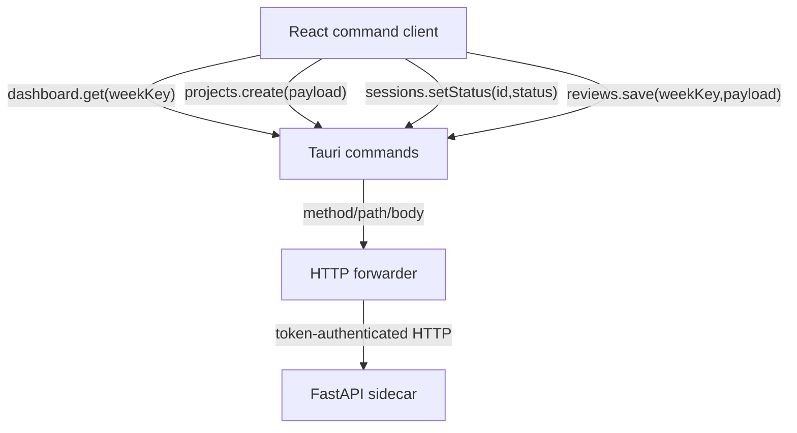

Recommended command groups:

- `dashboard_get`
- `projects_list`, `project_get`, `project_create`, `project_update`, `project_archive`, `project_delete`
- `project_plan_get`, `project_plan_save`, `plan_render`
- `sessions_for_week`, `sessions_for_project`, `session_create`, `session_update`, `session_set_status`, `session_reschedule`, `session_delete`
- `milestones_for_project`, `milestone_create`, `milestone_update`, `milestone_set_status`, `milestone_delete`
- `reviews_list`, `review_get_or_create`, `review_save`
- `score_compute`, `score_override`, `portfolio_score_get`
- `settings_get`, `settings_update`
- `sidecar_health`

### 7.3 Contract Sketch

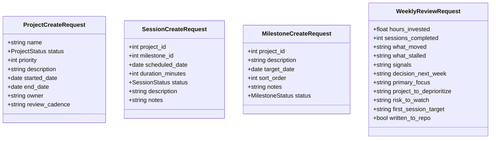

## 8. User Experience Design

### 8.1 Application Shell

The React app shall use a work-focused shell, not a marketing-style landing page. The first screen shall be the usable portfolio workspace. The left side shall provide week navigation. The main region shall provide the selected workspace view. Navigation shall be stable, compact, and optimized for repeated weekly use.

### 8.2 View Mapping From Tkinter To React

| Current Tkinter surface | Target React surface |
| --- | --- |
| `MainWindow` | `AppShell` |
| Week navigator panel | `WeekNavigator` |
| `DashboardView` | `DashboardView` |
| `SessionView` | `SessionsView` |
| `ProjectView` | `ProjectsView` |
| Project dialog plan editor | `ProjectEditor` plus `PlanEditor` |
| `MilestoneView` | `MilestonesView` |
| `ReviewView` | `WeeklyReviewView` |
| `SettingsView` | `SettingsView` |
| Tk dialogs | React modal dialogs or side panels |
| `tkinterweb` Markdown preview | React Markdown/Mermaid preview |

### 8.3 React State Strategy

React shall keep server-backed state in a query/cache layer or equivalent feature stores. Form state shall be local to forms until submitted. The selected week and selected project filters shall be URL-like app state where practical, but the system shall not require a browser URL for correct operation.

### 8.4 Accessibility and Input Behavior

- All form controls shall have labels.
- Tables shall support keyboard focus and row selection.
- Dialogs shall trap focus while open and restore focus on close.
- Confirmation dialogs shall identify the entity being deleted or archived.
- Status colors shall include text labels or icons.
- Long text review fields shall support comfortable editing.

# Recommendations

## 9. Migration Design

### 9.1 Migration Strategy

The refactor should proceed as a vertical-slice migration:

1. Extract Python domain/application/repository code into a backend package shape suitable for FastAPI.
2. Add Pydantic contracts that mirror current dataclasses.
3. Add FastAPI routes for health, settings, projects, sessions, milestones, reviews, plans, scores, and dashboard.
4. Add sidecar token middleware and production docs disabling.
5. Scaffold Tauri and React.
6. Implement Tauri sidecar supervisor, dynamic port, and token handshake.
7. Implement typed Tauri command client.
8. Port each Tkinter tab to a React feature view.
9. Preserve and run existing Python tests.
10. Add API, React, Rust, and Tauri end-to-end tests.
11. Package sidecar binaries per target triple.

### 9.2 Package Structure

Recommended target structure:

```text
personal-project-portfolio/
├── backend/
│   └── src/portfolio_manager/
│       ├── api/
│       │   ├── app.py
│       │   ├── dependencies.py
│       │   └── routes/
│       ├── contracts/
│       ├── models/
│       ├── services/
│       ├── repositories/
│       ├── db/
│       ├── config/
│       ├── events/
│       └── security/
├── frontend/
│   └── src/
│       ├── app/
│       ├── features/
│       ├── components/
│       ├── command-client/
│       └── styles/
├── src-tauri/
│   ├── Cargo.toml
│   ├── tauri.conf.json
│   ├── binaries/
│   └── src/
│       ├── main.rs
│       ├── sidecar.rs
│       ├── commands/
│       └── security/
├── design/
├── guide/
├── site/
└── tests/
```

### 9.3 Security Requirements From The Stack Guide

The following are mandatory for the refactor:

- Rust core picks an unused local port at startup.
- Rust core generates a cryptographically random token at startup.
- Rust core launches the sidecar with port and token arguments.
- Sidecar binds to `127.0.0.1:<port>` only.
- Sidecar requires the token in an HTTP header on every protected route.
- Renderer never calls the sidecar directly.
- Token is stored only in Tauri-managed runtime state.
- Production FastAPI docs are disabled.
- Production WebView developer tools are disabled.
- Sidecar process is monitored and terminated by Tauri.

Optional hardening for later commercial distribution:

- Cython or PyArmor for sensitive Python modules.
- Move truly sensitive logic to Rust commands.
- SQLCipher for encrypted SQLite.
- OS keychain-managed database key.
- Code signing, notarization, hardened runtime, and platform-specific installer signing.

### 9.4 Data Migration

No schema migration is required solely because of the UI refactor. The sidecar shall open the existing database and apply the same migration framework. The first Tauri release shall be able to run against a database created by the Tkinter release.

If API-specific metadata is later needed, it shall be added as a normal migration with backup behavior preserved.

### 9.5 Risks And Mitigations

| Risk | Impact | Mitigation |
| --- | --- | --- |
| Renderer accidentally bypasses Tauri and calls sidecar directly | Security model weakens | Do not expose token to renderer storage; keep dynamic port private to Tauri command layer |
| CDN Mermaid dependency breaks offline behavior | Plan preview fails offline | Bundle Mermaid with frontend dependencies |
| Tkinter controller logic is lost during migration | Behavioral regression | Move any useful controller orchestration into sidecar routes/services before deleting Tkinter code |
| API contracts drift from frontend types | Runtime errors | Generate TypeScript types from OpenAPI in development or maintain checked contract tests |
| Sidecar packaging differs per OS | Release failures | Use CI matrix and target-triple binary naming |
| Existing DB migration failure damages user data | Data loss | Preserve pre-migration backup behavior and add migration tests |

## 10. Testing Specification

### 10.1 Test Architecture

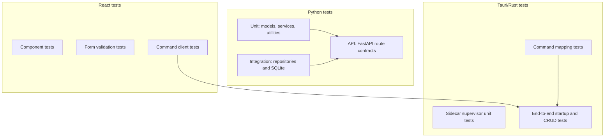

### 10.2 Required Test Coverage

| Area | Minimum tests |
| --- | --- |
| Python domain | Dataclass creation, helper methods, validation where present |
| Python services | Project creation/update/archive/delete, session transitions, milestone completion date behavior, scoring, reviews |
| Repositories | CRUD, cascade behavior, count helpers, migrations |
| FastAPI | Auth failures, validation failures, happy paths for each resource |
| React | Form validation, navigation, table rendering, dialog confirmation, Markdown/Mermaid preview |
| Tauri | Sidecar startup, health check, command forwarding, token attachment, sidecar shutdown |
| End-to-end | Launch app, create project, create planned session, mark done, see dashboard score update, save weekly review |

### 10.3 Acceptance Criteria

The refactor is acceptable when:

- Existing Python service/repository tests pass.
- The app launches from a packaged Tauri build on macOS.
- The sidecar starts on a dynamic port and rejects unauthenticated requests.
- The React UI supports the documented six workspace views.
- A user can create a project, milestone, session, plan document, and weekly review.
- Dashboard scores match the documented scoring algorithm.
- Existing Tkinter-created SQLite data opens without manual migration.
- Mermaid diagrams render in plan preview without Internet access.
- Production build has FastAPI docs and WebView devtools disabled.

## 11. Build And Release Specification

### 11.1 Build Pipeline

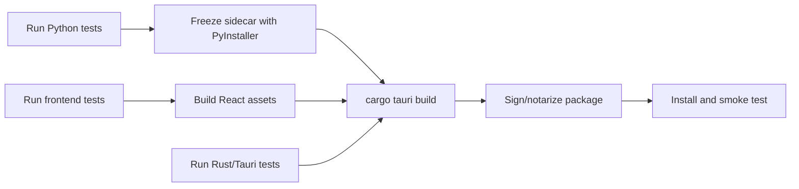

### 11.2 Platform Notes

- Tauri builds are platform-native. Build macOS packages on macOS and Windows packages on Windows.
- Sidecar binaries shall be produced per target triple and placed under `src-tauri/binaries/`.
- macOS release builds should include Apple Silicon and Intel binaries or a universal strategy.
- Code signing and notarization are required before broad macOS distribution.

# Conclusion

The Tauri refactor is a presentation and runtime-shell migration, not a product reset. Portfolio Manager's durable value is already expressed in Python domain models, services, repositories, SQLite migrations, scoring rules, and documentation. The target system should preserve those assets while replacing Tkinter with a modern React workspace and wrapping Python behind a secure Tauri-mediated sidecar.

The most important implementation guardrail is the boundary: React handles interaction, Tauri handles supervision and security, and Python handles portfolio business behavior and persistence. Keeping that boundary sharp will make the refactor smaller, safer, easier to test, and easier to package.

# Appendix

## A. IEEE 830 Requirement Traceability Matrix

| User/document source | Requirement coverage |
| --- | --- |
| README features | UI-001 through UI-022, FR-PROJ, FR-SESS, FR-MILE, FR-REV, FR-SCORE, FR-PLAN, FR-DASH |
| Tauri stack guide | CON-001 through CON-006, NFR-SEC, build/release requirements |
| Architecture docs | Component, startup, domain, repository, service, and migration requirements |
| Data model docs | ERD, schema preservation, FR-DB, domain contracts |
| UI reference | Dashboard, Sessions, Projects, Milestones, Weekly Review, Settings requirements |
| Status references | Project, session, and milestone lifecycle requirements |
| Scoring reference | FR-SCORE requirements |
| Config reference | FR-SET requirements |
| Testing docs | NFR-TEST and test architecture |

## B. Sidecar Security Sequence

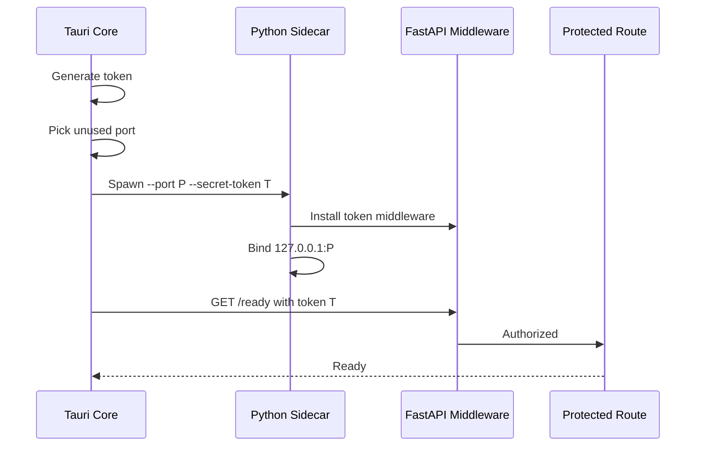

## C. Dashboard Computation

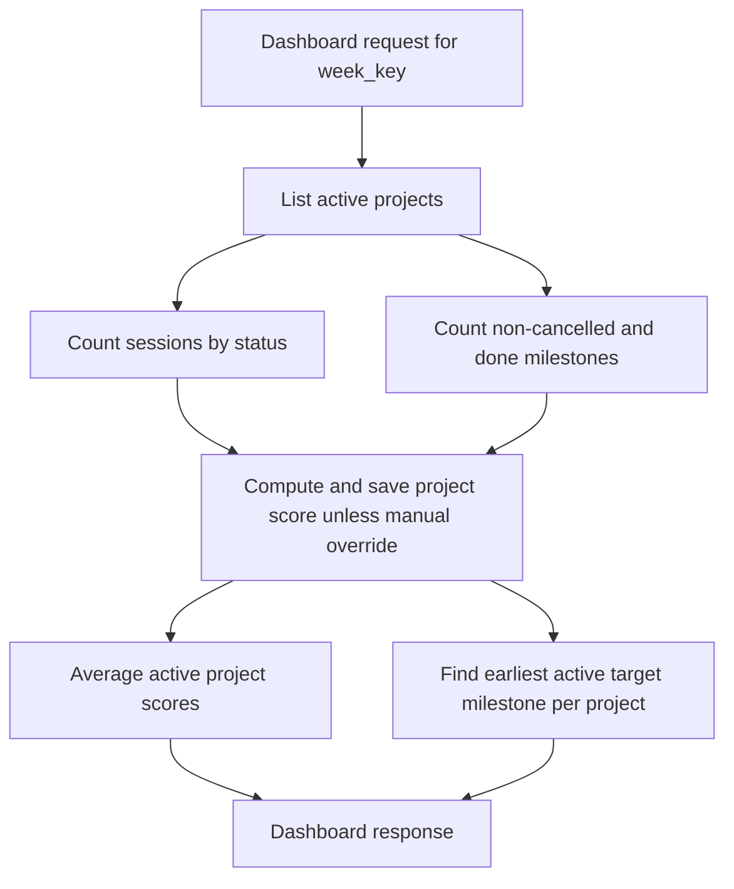

## D. Scoring Formula

```text
planned_sessions = planned + doing + done
done_sessions = done
session_score = (done_sessions / planned_sessions) * 60

total_milestones = all milestones except cancelled
done_milestones = done
milestone_score = (done_milestones / total_milestones) * 40

project_score = min(100, round(session_score + milestone_score))
portfolio_score = round(average(project_score for active projects))
```

Edge cases:

- If `planned_sessions` is 0, `session_score` is 0.
- If `total_milestones` is 0, `milestone_score` is 0.
- If a score has `is_manual_override = true`, recomputation shall return the override.

## E. Open Decisions

| Decision | Default recommendation |
| --- | --- |
| Frontend state library | Use a query/cache library or a small typed command-client store; avoid global state for every form field. |
| UI component library | Choose a desktop-friendly, accessible React component approach and keep dense work surfaces rather than a landing-page style. |
| API type generation | Generate TypeScript types from FastAPI OpenAPI during development if tooling cost is acceptable. |
| Database encryption | Defer SQLCipher until sensitive-data threat model justifies key management complexity. |
| Windows/Linux release timing | Build macOS first, then add CI target matrices when macOS parity is stable. |

## F. Source Notes

This specification was derived from the repository-local documentation and implementation available at the time of writing:

- `README.md`
- `design/tauri-python-stack-guide.md`
- `site/src/architecture.md`
- `site/src/data-model.md`
- `site/src/design-patterns.md`
- `site/src/development.md`
- `site/src/testing.md`
- `site/src/guide/*.md`
- `src/portfolio_manager/**/*.py`
- `srs/Portfolio-Manager-V2-SRS.md`
