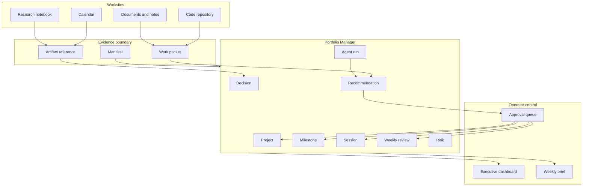

# Executive Function for Single-Operator Portfolio Management

## Executive Summary

Information type: Concept

This white paper defines an executive function layer for a single operator who manages a portfolio of projects with help from AI workflows and agents. The current Portfolio Manager product already provides the personal operating rhythm: projects, milestones, time-boxed sessions, weekly reviews, plan documents, and health scoring. The proposed executive function extends that rhythm into an artifact-driven labor substrate, where AI agents help plan, execute, summarize, validate, and escalate work without turning the operator's workspace into an unmanaged pile of chats.

The business problem is that a single operator must act as strategist, project manager, analyst, builder, reviewer, and administrator. Portfolio Manager reduces that load by making work visible, but the current application remains largely manual: the user creates sessions, updates milestones, writes plans, and records weekly reflection. The white paper's requirement is to add an AI-assisted coordination layer that can convert project evidence into structured work packets, decision records, next sessions, and executive briefs.

The recommended solution is to evolve Portfolio Manager from a local tracking app into a managed personal workforce system. This project should be the home for the work, rather than a separate new system, because it already contains the operator control loop that the white paper requires. The system should keep the current product's strengths: single-user focus, forgiving time-boxing, local SQLite storage, weekly review, and portfolio health scoring. It should add typed artifact contracts, agent-role definitions, ingestion of worksite evidence, AI-assisted planning, decision queues, and traceable automation.

The near-term path should be incremental. Portfolio Manager should first become the coordination surface for one operator, not a replacement for code repositories, documents, calendars, or AI coding tools. AI should assist the labor substrate by proposing sessions, summarizing work, detecting stale projects, drafting weekly reviews, preparing decision briefs, and creating work packets from project artifacts while preserving human approval for priority, scope, and commitment decisions.

## Problem

Information type: Fact

A single operator has more roles than available attention. Creative and technical portfolios require problem framing, requirements analysis, design, implementation, review, documentation, scheduling, risk management, and reflection. When these roles live in separate tools, the operator loses the thread between strategic intent and the next concrete work session.

The current Portfolio Manager product solves part of the problem by turning commitments into a visible portfolio. The codebase implements projects, sessions, milestones, plan documents, weekly reviews, and a scoring model. It does not yet implement AI agents, work packets, cross-repository ingestion, calendar automation, structured decision logs, or artifact validation.

The white paper solves a different part of the problem by describing an artifact-driven AI coordination model. It proposes `.coord` folders, manifests, work packets, role-based agents, typed schemas, CI checks, and executive dashboards. It is strong as an operating model, but it currently reads as a future-state architecture rather than a direct product plan for the existing application.

The gap is therefore not conceptual ambition; it is product integration. Portfolio Manager has the personal portfolio workflow. The white paper has the AI labor-management architecture. The next version should connect them through a small number of durable data contracts and operator-facing workflows.

## Context

Information type: Structure

Portfolio Manager is a single-user Tkinter desktop application backed by SQLite. The repository is organized with a layered MVC architecture: views render the interface, controllers translate user actions, services enforce business rules, repositories handle SQL, and infrastructure handles database, settings, logging, and events. This structure is appropriate for adding automation because the service layer already gives AI or scripts a cleaner target than direct UI manipulation.

The implemented product model is intentionally personal and forgiving. Projects move through active, backlog, and archive states. Sessions are time-boxed blocks of work, not detailed task lists. Milestones represent outcomes. Weekly reviews capture what moved, what stalled, signals, next-week decisions, focus, deprioritization, risk, and first-session target. The scoring service combines session completion and milestone completion into a weekly project health signal.

The proposed white paper model is artifact-first and agent-ready. It defines worksites as code repos, documents, notebooks, or other execution spaces. Each worksite would publish a `.coord` contract containing manifests, work packets, and status. A coordination layer would ingest those artifacts into project records, decision logs, dashboards, and executive briefs.

The market context confirms that AI productivity tools are converging on scheduling, prioritization, summaries, and workflow automation. Motion markets AI projects, tasks, calendars, workflows, dashboards, and automatic replanning for individuals and teams. Reclaim emphasizes AI scheduling for tasks, habits, focus time, meetings, planner flows, and workforce analytics. Notion AI positions agents inside docs, databases, projects, connected apps, and reports. Todoist's AI assistant focuses more conservatively on making tasks actionable. Agent frameworks such as OpenAI Agents SDK, LangGraph, and CrewAI provide orchestration, handoffs, guardrails, memory, and human-in-the-loop controls for custom workflows.

The specific opportunity for Portfolio Manager is narrower and more personal than these platforms. The product does not need to become a team project-management suite or a general AI workspace. It can become a single-operator executive function: a local, inspectable system that converts evidence into attention, sessions, decisions, and review.

## Thesis Fit

Information type: Fact

This project supports the thesis of the white paper because the thesis is about executive function, not about agent orchestration for its own sake. The essential claim is that a single operator needs a system that turns portfolio evidence into attention, decisions, and executable work. Portfolio Manager already does most of that manually through its core entities and weekly operating rhythm.

The existing product is a better home than a new system because it starts from the operator's real control loop. A new agent orchestration system would need to rediscover projects, commitments, priorities, milestones, sessions, and review rituals. Portfolio Manager already has those primitives, so AI can be added as a managed layer over established behavior rather than as a parallel workspace.

The project is especially aligned with the white paper in five areas. It is single-user by design. It treats work as a portfolio rather than an undifferentiated task list. It uses time-boxed sessions as the basic unit of labor. It closes the week with reflection and next-week planning. It turns activity into management signals through scoring and traffic-light status.

The project does not yet prove the full AI-management thesis. It lacks work packets, artifact references, first-class decision records, agent-run logs, recommendation review, and explicit approval queues. Those gaps are substantial, but they are additive. They do not require replacing the current product model.

The product-direction decision is therefore clear. Portfolio Manager should become the single-operator executive function, and AI agents should feed it rather than replace it. The agent layer should produce work packets, decision briefs, risks, recommendations, and proposed sessions; the application should remain the place where the operator reviews and commits those changes.

## Solution

Information type: Principle

Portfolio Manager should treat AI as a management layer over labor signals, not as an independent boss. The operator keeps authority over goals, priorities, deadlines, and commitments. AI agents gather evidence, propose structure, detect drift, prepare summaries, and recommend next work units.

The labor substrate should be the smallest complete set of objects needed to run work. In the current product, that substrate is project, milestone, session, score, plan, and weekly review. In the AI-enabled version, the substrate should add worksite, artifact, work packet, decision, risk, agent run, and recommendation.

The coordination rule should be artifact before automation. AI should not update portfolio state from chat alone. It should read approved artifacts, code changes, meeting notes, plans, and session notes; produce typed summaries; and ask for approval when it changes priority, scope, schedule, or status.

The product rule should be operator focus before platform completeness. Similar tools optimize calendars, teams, databases, and enterprise workflow. Portfolio Manager should optimize the single operator's question: "What should I do next, why, and what decision am I avoiding?"

The architectural rule should be extension before reinvention. The current MVC, service, repository, SQLite, and event-bus structure is sufficient for the next stage of work. AI capabilities should be added through service-layer workflows, typed contracts, and approval records before any separate orchestration platform is introduced.

## Current Product Assessment

Information type: Classification

| Category | Current code rank | White paper rank | Assessment | Required improvement |
|---|---:|---:|---|---|
| Single-operator fit | 9/10 | 7/10 | The app is clearly designed for one person, local use, forgiving tracking, and a three-to-eight project portfolio. The white paper sometimes drifts toward organization-scale coordination. | Keep the product anchored on one operator and translate agent language into personal role support. |
| Portfolio visibility | 8/10 | 7/10 | Dashboard scores, traffic lights, priorities, milestones, and weekly reviews create useful visibility. The white paper adds executive briefs but does not map them to the existing dashboard. | Add AI-generated portfolio brief fields and a decision queue to the dashboard. |
| Labor substrate | 7/10 | 8/10 | Sessions, milestones, and reviews are a strong work substrate. The white paper adds work packets and manifests, which would make AI labor traceable. | Add work packets, artifacts, decisions, risks, and agent runs as first-class records. |
| AI workflow readiness | 2/10 | 8/10 | The code has clean services but no AI interfaces, agent definitions, prompts, or approval flows. The white paper provides the conceptual agent architecture. | Expose service-layer commands and typed input/output models for AI-assisted workflows. |
| Artifact management | 4/10 | 9/10 | Plan documents are stored as Markdown, but work evidence is not linked to repos, commits, docs, or files. The white paper is strong on artifact contracts. | Add artifact registry fields and `.coord` ingestion before adding complex orchestration. |
| Decision governance | 5/10 | 8/10 | Weekly reviews capture decisions informally, and manual score overrides require reasons. The white paper calls for decision records and escalation. | Add a decision table with status, rationale, source packet, due date, and review outcome. |
| Automation safety | 6/10 | 7/10 | Current automation is safe because it is minimal. The white paper calls for schemas and validation but should define approval gates more explicitly. | Require human approval for priority changes, archive actions, external writes, and agent-created commitments. |
| Observability and audit | 5/10 | 8/10 | SQLite records and tests provide some traceability, but there is no agent-run log or artifact history. The white paper emphasizes versioned artifacts. | Log automation inputs, outputs, approvals, source artifacts, and resulting state changes. |
| Data architecture | 7/10 | 7/10 | MVC, services, repositories, migrations, and tests are solid. One inconsistency remains: `schema.sql` shows older session and milestone forms while migrations move the database to the current model. | Normalize schema documentation, add current-state schema generation, and introduce typed contract models. |
| Individual workforce management | 6/10 | 8/10 | The product tracks personal execution well, but it does not yet manage delegated AI work. The white paper describes agent labor but not the user experience. | Build a "workforce" view showing agent roles, open packets, proposed sessions, pending decisions, and blocked work. |

The combined readiness score is promising but uneven. The current code is strongest where the white paper is weakest: lived single-user workflow. The white paper is strongest where the code is weakest: AI coordination, artifact contracts, and role-based labor management.

The practical reading is that the project is already roughly two-thirds of the right product conceptually, even though the AI workforce layer is still early. That is a favorable starting point. The operator should not start with a blank system; the operator should deepen this one.

## Compare and Contrast

Information type: Fact

| Requirement in the white paper | Evidence in current product and code | Fit | Analyst note |
|---|---|---|---|
| Worksites publish `.coord` manifests and work packets. | No `.coord` concept exists. The app stores project plans and status in SQLite. | Gap | Start with manual import of a work packet into a project before adding cross-repo automation. |
| Agents produce bounded outputs by role. | No agent roles exist. The code has service boundaries that could support roles. | Gap | Define agent roles as prompts plus allowed service commands, not as autonomous personalities. |
| Decisions escalate to an executive layer. | Weekly review has `decision_next_week`; scoring override stores reasons. | Partial | Promote decisions into first-class records linked to packets, projects, and reviews. |
| Artifacts are versioned and auditable. | The repo is versioned; user data lives in SQLite; plans are Markdown text in the database. | Partial | Add artifact references and optional export to repo files for long-lived records. |
| Schemas validate all handoffs. | The domain uses dataclasses and SQLite constraints, not Pydantic or JSON Schema. | Partial | Add Pydantic contract models at the automation boundary without replacing internal dataclasses immediately. |
| Dashboards surface only executive attention. | The dashboard surfaces scores, sessions, and milestones. | Partial | Add "decisions needed," "stale projects," "at-risk commitments," and "next best session." |
| CI can run AI review and artifact validation. | The repo has unit, integration, and e2e tests; no AI CI exists. | Partial | Add schema tests first, then optional Claude Code or OpenAI-powered review workflows. |
| Promotion levels prevent clutter. | The app has backlog, active, archive, and session states, but no artifact promotion model. | Partial | Map promotion levels to inbox, session note, work packet, project artifact, decision brief, and reusable pattern. |
| Coordination repo stores summaries, not raw work. | The current app is itself the coordination app; it does not coordinate other repos yet. | Partial | Treat Portfolio Manager as the coordination surface before creating a separate `mattops` repo. |
| Human judgment governs automation. | The app is human-operated; no automation can overreach today. | Strong but incomplete | Preserve this advantage with explicit approval gates as AI is added. |

The white paper should be reframed as an extension of Portfolio Manager, not a parallel architecture. A separate `mattops` repository may become useful later, but the current product already has the core coordination concepts and should remain the first implementation target.

The distinction matters because the product should manage the operator's commitments, not merely run agents. Agent frameworks can help later, but the valuable asset is the portfolio control loop already present in the application. The right sequence is to add decisions, artifacts, packets, recommendations, and agent logs to Portfolio Manager before creating another coordination repository.

## How AI Runs the Labor Substrate

Information type: Process

AI should help run the labor substrate by moving evidence through a controlled loop. First, the agent reads project plans, session notes, milestones, recent commits, documents, or imported work packets. Next, it classifies the evidence into findings, risks, decisions, and candidate work. Then it proposes updates to sessions, milestones, decisions, and reviews. Finally, the operator approves, edits, or rejects those proposals.

The first AI role should be a Chief of Staff Agent. This agent reviews the portfolio and produces a weekly executive brief: projects that moved, projects that stalled, decisions needed, risks to watch, and recommended first sessions. It should not change the database directly until the operator approves the changes.

The second AI role should be a Business Analyst Agent. This agent converts vague project descriptions, plan notes, and work packets into problem statements, acceptance criteria, milestone candidates, and decision options. It should be optimized for clarity and traceability rather than creative ideation.

The third AI role should be a Worksite Reporter Agent. This agent summarizes activity from a repository, document, or notebook into a work packet. It should list objective, inputs, outputs, findings, risks, decisions needed, and recommended next sessions.

The fourth AI role should be a QA/Critic Agent. This agent compares outputs against acceptance criteria, checks whether milestones are supported by evidence, flags stale plans, and recommends tests or review actions. It should be allowed to create findings and risks, but not to mark work complete without user approval.

The fifth AI role should be a Scheduler Agent. This agent turns approved next actions into time-boxed session proposals that respect the weekly budget and portfolio priorities. It should propose a schedule, not silently rearrange commitments.

## Target Information Model

Information type: Structure

The current model should be extended rather than replaced. Projects, milestones, sessions, scores, and weekly reviews remain the center. New AI-oriented records should connect to those existing entities.

| Entity | Purpose | Key fields | Relationship |
|---|---|---|---|
| Worksite | Identifies where concrete work happens. | name, type, path or URL, status, default project | Belongs to zero or more projects. |
| Artifact | References evidence without copying everything. | title, type, URI/path, version, source worksite, status | Links to projects, milestones, decisions, and packets. |
| Work packet | Summarizes a bounded unit of work. | objective, inputs, outputs, findings, risks, decisions needed, next actions | Links worksite evidence to portfolio state. |
| Decision | Captures choices that need operator judgment. | question, options, recommendation, rationale, status, due date | Links to project, packet, review, and artifacts. |
| Agent run | Records an AI action. | role, prompt/template, inputs, outputs, model/tool, timestamp, approval status | Provides auditability and debugging. |
| Recommendation | Holds proposed changes before approval. | target entity, proposed change, confidence, reason, status | Becomes a session, milestone, decision, or review update after approval. |

This model keeps AI outputs inspectable. The system can show not only what changed but why it changed, which source artifact supported it, and whether the operator approved it.

## Proposed Workflow

Information type: Procedure

1. Capture evidence from a worksite.
   The operator or an agent selects recent commits, session notes, documents, or project-plan changes.

2. Generate a work packet.
   The Worksite Reporter Agent creates a typed packet with objective, inputs, outputs, findings, risks, decisions needed, and next actions.

3. Validate the packet.
   The system checks required fields and asks the operator to resolve missing evidence, vague decisions, or unsupported completion claims.

4. Ingest the packet into Portfolio Manager.
   The approved packet creates or updates artifacts, findings, risks, recommendations, and decision records.

5. Propose portfolio changes.
   The Chief of Staff Agent recommends milestone updates, session proposals, project score notes, and weekly-review language.

6. Approve state changes.
   The operator confirms any priority, schedule, status, decision, or archive changes before they are written.

7. Review the portfolio.
   The weekly review combines actual sessions, milestone movement, agent findings, and unresolved decisions into the next week's plan.

This workflow is intentionally conservative. It lets AI do the expensive synthesis work while keeping commitment authority with the single operator.

## Similar Tools

Information type: Classification

| Tool or framework | Relevant capability | Difference from this product |
|---|---|---|
| Motion | AI task planning, project management, calendar optimization, automatic status updates, dashboards, and workflows. | Motion is broad and cloud-centered; Portfolio Manager should be local-first and focused on one operator's portfolio decisions. |
| Reclaim.ai | AI scheduling for tasks, habits, focus time, meetings, buffers, planner flows, and time analytics. | Reclaim is calendar-first; Portfolio Manager is portfolio-first and should schedule sessions only after project intent is clear. |
| Notion AI | Agents in docs, databases, projects, connected apps, meeting notes, and reporting. | Notion is a general workspace; Portfolio Manager should keep a smaller, opinionated model for personal execution. |
| Todoist AI Assistant | Task breakdown and making tasks more actionable. | Todoist is task-list centered; Portfolio Manager should preserve time-boxed sessions and milestones rather than expanding into granular task management. |
| OpenAI Agents SDK | Agents, handoffs, guardrails, sessions, tool use, tracing, and human-in-the-loop mechanisms. | This is a build framework, not a product; it could power future controlled agent workflows. |
| LangGraph | Stateful, controllable agent workflows with human-in-the-loop checks and persistence. | This is useful when workflows become graph-shaped, but it may be too much before packet ingestion and approvals are proven. |
| CrewAI | Multi-agent crews, flows, guardrails, memory, knowledge, observability, and enterprise integrations. | CrewAI fits heavier multi-agent automation; Portfolio Manager should start with lighter local prompts and typed contracts. |
| Claude Code GitHub Actions | AI code automation in GitHub workflows, including PRs, implementation, fixes, and custom scheduled prompts. | This can support worksite reporting and review, but it should feed Portfolio Manager through packets rather than bypassing the portfolio layer. |

The market shows demand for AI scheduling, prioritization, work summaries, and autonomous task execution. Portfolio Manager's specific advantage is that it can use those ideas without inheriting team-management overhead. It can be the operator's private control room for deciding what work deserves attention.

## Requirements

Information type: Principle

The system must remain the home for the operator's portfolio. External repositories, documents, calendars, and AI coding tools may supply evidence, but Portfolio Manager should remain the system of record for commitments, sessions, decisions, milestones, reviews, and portfolio health.

The system must preserve the operator's agency. AI may recommend, draft, classify, summarize, and validate. The operator must approve changes that alter commitments, priorities, project status, schedule, archival state, or external artifacts.

The system must make every AI action traceable. Each agent run should record its role, source artifacts, output, proposed changes, approval result, and affected records. A user should be able to reconstruct why a session, milestone, decision, or risk appeared.

The system must prefer typed handoffs over free-form chat. Work packets, decisions, artifacts, recommendations, and agent runs should have schemas that can be validated in tests and migrations. Markdown can remain the human-readable surface, but the machine contract must be structured.

The system must remain useful without AI. A single operator should still be able to create projects, schedule sessions, update milestones, write reviews, and view scores manually. AI should accelerate the workflow rather than become a required dependency for basic use.

The system must be specific to personal portfolio management. It should not add team permissions, assignee balancing, enterprise analytics, or complex workflow builders until the single-operator loop is excellent.

## Implementation Roadmap

Information type: Procedure

1. Confirm Portfolio Manager as the product home.
   Treat the white paper as a product-extension strategy for this repository. Defer a separate coordination system until Portfolio Manager can ingest and review AI-generated work locally.

2. Stabilize the current data contract.
   Update schema documentation so the initial schema and migrations clearly describe the current session and milestone model. Add a generated or tested current-state schema reference.

3. Add structured records for decisions and artifacts.
   Create database tables, models, repositories, services, and tests for decisions and artifacts. Link decisions to projects and weekly reviews.

4. Add work packet import.
   Define a Pydantic or JSON Schema contract for work packets. Add a manual import workflow that validates a packet and creates recommendations instead of direct state changes.

5. Add recommendation review.
   Build a review screen for AI-proposed sessions, milestones, risks, decisions, and weekly-review text. The operator can accept, edit, reject, or defer each item.

6. Add agent run logging.
   Record prompts, roles, source artifacts, generated outputs, approvals, and resulting state changes. Use this log for debugging and trust.

7. Add local AI-assisted summaries.
   Start with user-triggered prompts for weekly briefs, stale-project review, and work-packet drafting. Avoid autonomous scheduled changes until approval workflows are mature.

8. Add optional external integrations.
   Integrate code repositories, calendars, and AI CI only after work packets and approvals work locally. External tools should feed the substrate, not own it.

## Analyst Findings

Information type: Fact

The existing product is a strong foundation because it already defines a personal operating cadence. The weekly review fields are especially important because they capture the human judgment that pure scheduling tools miss. The session model is also valuable because it converts intentions into bounded work rather than endless task inventory.

The project supports the white paper's thesis because it already models the operator's work as a portfolio of commitments. A new system would mostly recreate concepts that already exist here: project, priority, session, milestone, score, plan, review, and status. The higher-value move is to turn those concepts into an AI-ready coordination layer.

The white paper is strategically strong but too implementation-broad in its original form. It introduces `.coord`, Pydantic schemas, agents, CI, dashboards, prompts, and framework options before clearly tying those elements to the current product's entities. This rewrite makes the existing app the center of gravity.

The largest product gap is not AI model choice. The largest gap is the absence of first-class records for decisions, artifacts, work packets, recommendations, and agent runs. Without those records, agent output would become another stream of ungoverned text.

The largest operational risk is overautomation. A single operator needs relief from coordination load, but the cost of wrong automation is high because there is no team to catch drift. The product should therefore automate synthesis before action and proposals before writes.

The largest documentation issue is consistency between architectural aspiration and implemented behavior. The repository currently documents a mature portfolio workflow, while the white paper describes an adjacent coordination architecture. The next set of requirements should explicitly map each new AI capability to an existing service, table, view, or workflow.

## Revised Architecture

Information type: Structure

The revised architecture keeps concrete work in its native worksite. Portfolio Manager ingests evidence summaries, stores decisions and recommendations, and presents only the items that need operator attention. AI agents work at the boundary between evidence and approval.

## References

Information type: Fact

- Motion: https://www.usemotion.com/
- Reclaim.ai: https://reclaim.ai/
- Notion AI: https://www.notion.com/product/ai
- Todoist AI Assistant: https://todoist.com/help/articles/use-the-ai-assistant-with-todoist-r8je3Fj8V
- OpenAI Agents SDK: https://openai.github.io/openai-agents-python/
- LangGraph: https://www.langchain.com/langgraph
- CrewAI documentation: https://docs.crewai.com/
- Claude Code GitHub Actions: https://code.claude.com/docs/en/github-actions
- Robert Horn structured writing and information types: https://en.wikipedia.org/wiki/Structured_writing
