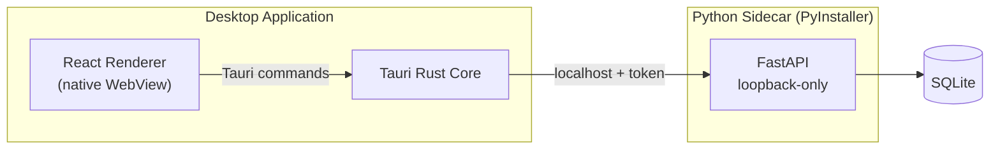

# Tauri + Python Desktop Stack: Reference Architecture and Hardening Guide

**Purpose:** A reusable, project-agnostic reference for building local-first desktop applications on **Tauri (Rust core) + React/TypeScript (renderer) + Python (FastAPI sidecar)**. Use this as a starting point for new applications in this stack, and as a checklist when hardening a build for release.

This document is intentionally generic — it describes the stack pattern and its security model, not any one application's domain.

---

# 1. The Stack

| Layer | Technology | Role |
|---|---|---|
| Renderer | React + TypeScript, running in the OS-native WebView | UI, visualization, user interaction |
| Application shell | Tauri (Rust) | Process supervision, native OS integration, security boundary, packaging |
| Analytical/business backend | Python (FastAPI), frozen with PyInstaller | Domain logic, data processing, persistence access |
| Storage | SQLite (optionally SQLCipher-encrypted) | Local, authoritative application state |

The defining shape of this stack is: **a compiled native shell (Rust) supervises a frozen Python service (the "sidecar") and mediates all access between the UI and that service.** The UI never talks to Python directly, and Python never talks to the OS or filesystem in ways the Rust core hasn't sanctioned.



## 1.1 Why this shape, and why not Electron

Electron bundles a full Chromium + Node.js runtime and ships the frontend as an unencrypted `.asar` archive — trivially unpacked with `npx asar extract`. Any anti-tampering or licensing logic written in JavaScript runs in a highly dynamic, easily-hooked runtime and is easy to bypass by patching the extracted files.

Tauri compiles the frontend into the native application binary and uses the operating system's own WebView (WebView2 on Windows, WKWebView on macOS, WebKitGTK on Linux) instead of bundling Chromium. This has two consequences that shape everything below:

1. **No portable browser runtime is bundled.** The app is smaller, and there's no `.asar`-equivalent to unpack — but anything that assumed "Chromium is always available" (e.g., a uniform `printToPDF()` call) needs a per-platform native equivalent instead.
2. **No cross-compilation.** Because Tauri produces native per-OS binaries, you must build on each target OS (or via CI runners for each OS). There is no building a Windows installer from a Mac or vice versa.

In exchange, security-critical logic can live in Rust, which compiles to stripped, optimized machine code — reversing it requires disassembly (e.g., Ghidra), not a two-second archive extraction.

## 1.2 When to reach for this stack

This pattern fits well when:

* the application is local-first / offline-capable by default;
* there's a substantial body of existing or preferred-language Python logic (data processing, ML, scientific libraries) that isn't worth rewriting;
* the UI needs a modern web frontend (React, D3, rich components);
* IP protection, tamper resistance, or a smaller/faster shell than Electron matters.

It fits poorly when the "backend" is trivial (a thin CRUD layer might not need a whole sidecar process) or when the target platforms can't support a Python runtime reliably (rare, but worth checking for constrained environments).

---

# 2. Project Skeleton

```text
<app-name>/
├── pyproject.toml
├── README.md
│
├── backend/
│   └── src/<package_name>/
│       ├── api/
│       │   └── routes/
│       ├── contracts/              # Pydantic request/response models
│       ├── domain/
│       │   ├── models/
│       │   ├── value_objects/
│       │   └── errors.py
│       ├── application/
│       │   ├── commands/
│       │   ├── queries/
│       │   └── ports/
│       ├── infrastructure/         # DB, filesystem, external adapters
│       └── security/
│           ├── sidecar_auth.py     # token-header enforcement middleware
│           └── startup_handshake.py
│
├── frontend/
│   └── src/
│       └── renderer/
│           └── features/
│
└── src-tauri/
    ├── Cargo.toml
    ├── tauri.conf.json
    ├── binaries/                   # PyInstaller-frozen sidecar, one per target triple
    │   ├── <sidecar>-x86_64-pc-windows-msvc.exe
    │   ├── <sidecar>-x86_64-apple-darwin
    │   └── <sidecar>-aarch64-apple-darwin
    └── src/
        ├── main.rs
        ├── sidecar.rs               # spawn/monitor/terminate the Python process
        ├── commands/                # #[tauri::command] entry points called from React
        └── security/
            ├── handshake.rs         # token + port generation
            └── anti_debug.rs        # optional, hardened builds only
```

Keep the Python backend organized as a normal layered application (domain / application / infrastructure) — the fact that it's shipped as a sidecar shouldn't leak into how it's structured internally. The Rust side stays thin: process supervision, security handshake, native OS integration, and any explicitly isolated "secret" logic (Section 4).

---

# 3. The Sidecar Security Handshake

This is the core pattern that makes the stack trustworthy. Apply it to every project using this architecture, not just ones with strong IP-protection requirements — dynamic ports and a session token cost little and close an entire class of local-attacker access.

**Sequence at every application startup:**

1. Rust core picks an unused local port (never hardcode one).
2. Rust core generates a cryptographically random token.
3. Rust core launches the Python sidecar, passing `--port` and `--secret-token` as arguments.
4. The sidecar binds `Uvicorn`/FastAPI to `127.0.0.1:<port>` only — **never** `0.0.0.0`.
5. The sidecar requires the token in an `X-API-Key` header (or similar) on every request and rejects anything missing or mismatched.
6. The React renderer never talks to the sidecar directly — it calls Tauri commands, and the Rust core forwards requests with the token attached. The token lives only in Rust/renderer memory, never in a file or localStorage.

```rust
// src-tauri/src/sidecar.rs (illustrative)
use tauri::process::Command;
use rand::{distributions::Alphanumeric, Rng};

fn start_secure_sidecar() {
    let token: String = rand::thread_rng()
        .sample_iter(&Alphanumeric)
        .take(32)
        .map(char::from)
        .collect();

    let port = portpicker::pick_unused_port().expect("No free ports");

    let (_receiver, _child) = Command::new_sidecar("app-api")
        .expect("failed to create sidecar")
        .args(["--port", &port.to_string(), "--secret-token", &token])
        .spawn()
        .expect("failed to spawn sidecar");

    // Store token + port in Tauri-managed state; expose to the renderer
    // only through commands, never through a file or the DOM.
}
```

```python
# backend security/sidecar_auth.py (illustrative)
from fastapi import Header, HTTPException

EXPECTED_TOKEN = read_token_from_startup_args()

def require_token(x_api_key: str = Header(...)):
    if x_api_key != EXPECTED_TOKEN:
        raise HTTPException(status_code=401, detail="invalid or missing token")
```

**Also:**

* Set `docs_url=None, redoc_url=None` on the FastAPI app in production builds — Swagger/ReDoc otherwise hand an attacker a full map of your backend.
* Have the sidecar verify it was actually launched by the Tauri parent (e.g., require the startup token be present before serving any route) and exit if not.
* Let the Rust core own the sidecar's lifecycle: detect crashes, and be able to forcibly terminate it. A dead sidecar should surface as a visible degraded state in the UI, never silent failure.

---

# 4. Layered Hardening (Apply Proportionally)

Not every app needs every layer below at full strength — a free internal tool and a paid commercial product have different threat models. Treat this as a menu, ordered roughly from "do this by default" to "do this only if IP protection or tamper resistance is a real requirement."

## Layer 0 — Always do this
* Loopback-only binding (`127.0.0.1`, never `0.0.0.0`).
* Dynamic port + session token handshake (Section 3).
* Disable Swagger/ReDoc in production.
* Disable WebView developer tools in production builds.
* Minify/strip the production React build (Vite/Terser).
* Code-sign installers for every platform you ship (SignTool on Windows, Apple Developer ID + notarization on macOS). Unsigned binaries get flagged or blocked by the OS regardless of IP concerns.

## Layer 1 — Python source protection
Raw `.py` files bundled by PyInstaller are just zipped bytecode — trivially unpacked and decompiled. If the Python code contains logic worth protecting:

* **Cython** (gold standard): compile sensitive modules to native `.so`/`.pyd` C extensions. Genuinely hard to decompile; PyInstaller bundles the compiled output transparently.
* **PyArmor** (quicker, less invasive): encrypts bytecode and obfuscates runtime state. Works when Cython's build complexity isn't worth it for your dependency set.

## Layer 2 — Move the truly sensitive logic to Rust
If a small fraction of the codebase (a proprietary algorithm, a license check) is the actual crown jewel, don't ship it as Python at all — reimplement just that piece as a native Tauri command in Rust. A stripped release-mode Rust binary requires assembly-level reverse engineering to break; Python bytecode, even obfuscated, is a fundamentally softer target.

## Layer 3 — Storage
If the local SQLite database holds sensitive data:

* Use **SQLCipher** instead of plain SQLite for encryption at rest.
* Manage the decryption key from the **Rust core**, sourced from the OS keychain (e.g., the `keyring` crate), and inject it into the Python layer at startup. Never hardcode keys in Python or the frontend.

## Layer 4 — Anti-tampering (release-hardened builds only)
* Optional Rust-side debugger detection (e.g., `IsDebuggerPresent` on Windows) that terminates the app if a debugger attaches.
* Code signing (Layer 0) is also your tamper defense here: the OS refuses to run a binary that's been patched post-signing.
* On macOS, Hardened Runtime + notarization prevents dylib injection and is required for the app to launch without a security warning.

---

# 5. Cross-Platform Build Notes

* **No cross-compilation.** Build Windows binaries on Windows, macOS binaries on macOS. Use CI (e.g., GitHub Actions with a `windows-latest` / `macos-latest` matrix) rather than trying to cross-build from one machine.
* **Sidecar binaries are per-target-triple.** PyInstaller-freeze the backend separately for each OS/architecture and place the outputs in `src-tauri/binaries/`, named per Tauri's target-triple convention (e.g., `app-api-x86_64-pc-windows-msvc.exe`, `app-api-aarch64-apple-darwin`). Reference the base name in `tauri.conf.json`'s `bundle.externalBin`.
* **macOS: build for both architectures.** Compile (or `lipo`-merge) `x86_64-apple-darwin` and `aarch64-apple-darwin` sidecar binaries so Apple Silicon and Intel Macs are both native, not translated.
* **Recommended build pipeline order:**
  1. Obfuscate/compile sensitive Python (Cython/PyArmor), if applicable.
  2. Freeze with `pyinstaller --onedir --clean` targeting the hardened entry point.
  3. Move the frozen output into `src-tauri/binaries/`, correctly named.
  4. Build the React frontend with full minification (`npm run build`).
  5. `cargo tauri build` — compiles Rust, embeds the sidecar and frontend, produces the signed installer (MSI/DMG/DEB).

---

# 6. Guidance on Rust

You don't need to become a systems programmer to use this stack productively — Rust's role here is narrow and mostly mechanical once the pattern is set up. Still, a few things are worth knowing going in.

## 6.1 What actually needs to be written in Rust

In this architecture, Rust code is almost entirely:

* `main.rs` / sidecar supervision (spawn, monitor, terminate the Python process);
* the startup handshake (token + port generation, passing them to Python and the renderer);
* thin `#[tauri::command]` functions that the React frontend calls via `invoke()` — typically just forwarding to the Python API or doing native OS work (file dialogs, native print, keychain access);
* optionally, a small number of genuinely proprietary or performance-critical functions (Layer 2 above).

You are *not* typically writing your application's domain logic in Rust. If you find yourself building out large stateful services, ORMs, or business rules in `src-tauri/`, that's a sign the boundary has drifted — that logic belongs in the Python sidecar.

## 6.2 Learning curve, realistically

For someone comfortable in Python, becoming functional enough in Rust for *this* stack (not systems programming in general) takes roughly **4–6 weeks of part-time study (40–60 hours)** — you already understand programming logic and API design; the new part is how Rust enforces memory safety at compile time.

* **Week 1 — easy:** `cargo`, variable bindings, basic types, `match`, `Option`/`Result` for error handling. `cargo` will feel like a relief compared to `pip` + virtualenvs. Strict typing is the main early friction.
* **Weeks 2–3 — the real wall:** the borrow checker (ownership, borrowing, lifetimes). This is where most Python developers get stuck, and it's normal. Push through with small, concrete exercises rather than trying to learn the theory abstractly.
* **Weeks 4–6:** enough comfort with `async`/`await` (Tokio), error propagation (`?`), and the Tauri command/state APIs to write and confidently modify the sidecar-supervision and command code described above.

You do not need deep Rust fluency to maintain the patterns in this guide — you need enough to read `main.rs`, add a new `#[tauri::command]`, and not fight the compiler for hours. Treat anything beyond that (custom Rust libraries, complex async pipelines, unsafe code) as a deliberate scope decision, not a requirement of the stack.

## 6.3 Practical tips

* Keep Rust files small and single-purpose (`sidecar.rs`, `handshake.rs`, one file per command group) — it keeps the borrow checker's scope small too.
* Prefer `Result<T, String>` (or a small custom error enum) returned from `#[tauri::command]` functions over `unwrap()`/`panic!()` — a panicking command can crash the whole app, not just fail one request.
* Let Tauri's `State<T>` manage shared state (like the sidecar handle, token, and port) rather than global/static mutable variables.
* When in doubt about whether something belongs in Rust or Python, default to Python — move it to Rust only when you have a concrete reason (native OS API, performance, or IP protection).

---

# 7. Reusable Checklist for a New Project

- [ ] `src-tauri/` scaffolded with `main.rs`, `sidecar.rs`, `commands/`, `security/`
- [ ] Python backend structured as domain/application/infrastructure, independent of how it's packaged
- [ ] Dynamic port + session token handshake implemented and enforced on every sidecar route
- [ ] FastAPI bound to `127.0.0.1` only, `docs_url=None` / `redoc_url=None` in production
- [ ] WebView devtools disabled in production `tauri.conf.json`
- [ ] React production build minified, sourcemaps excluded from release artifacts
- [ ] PyInstaller sidecar frozen per target triple, placed in `src-tauri/binaries/`
- [ ] Installers code-signed for every shipped platform; macOS notarized
- [ ] CI matrix builds natively on each target OS (no cross-compilation assumed)
- [ ] Decision made and documented: does this project need Cython/PyArmor obfuscation, SQLCipher, or Rust-side anti-debugging? (Not every project does — pick deliberately from Section 4, don't cargo-cult all of it.)

---

*Derived from a review of the Tauri + React + FastAPI sidecar security architecture (source: `tauri.pdf` in this folder). Generalized for reuse across future applications rather than tied to any one project's domain.*
