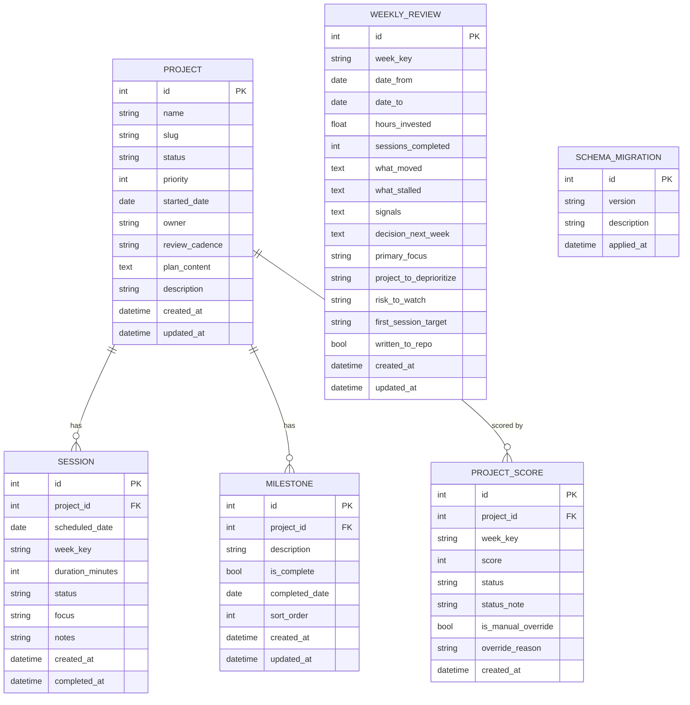

# Data Model

All data is stored in a single SQLite file at `~/.portfolio_manager/portfolio.db`.

---

## Entity-Relationship Diagram



---

## Table Definitions

### `project`

| Column | Type | Constraints | Notes |
|--------|------|-------------|-------|
| `id` | INTEGER | PK AUTOINCREMENT | |
| `name` | TEXT | NOT NULL | Display name |
| `slug` | TEXT | NOT NULL UNIQUE | URL-safe folder name |
| `status` | TEXT | CHECK IN ('active','backlog','archive') | |
| `priority` | INTEGER | DEFAULT 3, CHECK 1–5 | 1 = highest |
| `started_date` | DATE | | ISO 8601 |
| `owner` | TEXT | DEFAULT 'Matt Briggs' | |
| `review_cadence` | TEXT | DEFAULT 'weekly' | |
| `plan_content` | TEXT | DEFAULT '' | Markdown; may contain Mermaid blocks |
| `description` | TEXT | | |
| `created_at` | DATETIME | DEFAULT CURRENT_TIMESTAMP | |
| `updated_at` | DATETIME | DEFAULT CURRENT_TIMESTAMP | Refreshed by trigger |

### `session`

| Column | Type | Constraints | Notes |
|--------|------|-------------|-------|
| `id` | INTEGER | PK AUTOINCREMENT | |
| `project_id` | INTEGER | FK → project.id CASCADE DELETE | |
| `scheduled_date` | DATE | NOT NULL | |
| `week_key` | TEXT | NOT NULL | `YYYY.W` format |
| `duration_minutes` | INTEGER | DEFAULT 60, CHECK 60–180 | |
| `status` | TEXT | CHECK IN ('planned','completed','cancelled') | |
| `focus` | TEXT | | Brief focus description |
| `notes` | TEXT | | Completion notes |
| `created_at` | DATETIME | | |
| `completed_at` | DATETIME | | Set when status → completed |

### `milestone`

| Column | Type | Notes |
|--------|------|-------|
| `id` | INTEGER PK | |
| `project_id` | INTEGER FK | CASCADE DELETE |
| `description` | TEXT | Outcome statement |
| `is_complete` | BOOLEAN DEFAULT 0 | |
| `completed_date` | DATE | Set on toggle |
| `sort_order` | INTEGER DEFAULT 0 | Display order |

### `project_score`

One record per `(project_id, week_key)` pair — unique constraint enforced.

| Column | Type | Notes |
|--------|------|-------|
| `score` | INTEGER | 0–100 |
| `status` | TEXT | 'green' \| 'yellow' \| 'red' |
| `is_manual_override` | BOOLEAN | True when user set the score manually |
| `override_reason` | TEXT | Required when manual |

### `weekly_review`

One record per `week_key` — unique constraint enforced.

Fields: `what_moved`, `what_stalled`, `signals`, `decision_next_week`, `primary_focus`, `project_to_deprioritize`, `risk_to_watch`, `first_session_target`.

---

## Week Key Format

Week keys use **ISO 8601** calendar week numbers via Python's `datetime.isocalendar()`:

```
YYYY.W  →  e.g.  2026.15
```

Week 1 is the week containing the first Thursday of the year. The week always starts on Monday.

---

## Migrations

Schema changes are tracked in `schema_migration`. Each migration is a `(version, description, sql)` triple defined in `db/migrations.py`. The migration runner:

1. Reads `schema_migration` to find applied versions.
2. Backs up the database to `<name>.db.bak` before the first change.
3. Applies each pending migration's SQL via `executescript`.
4. Records the version in `schema_migration`.

To add a migration, append to the `_build_migrations()` list:

```python
("v2", "Add color column to project", "ALTER TABLE project ADD COLUMN color TEXT;"),
```
