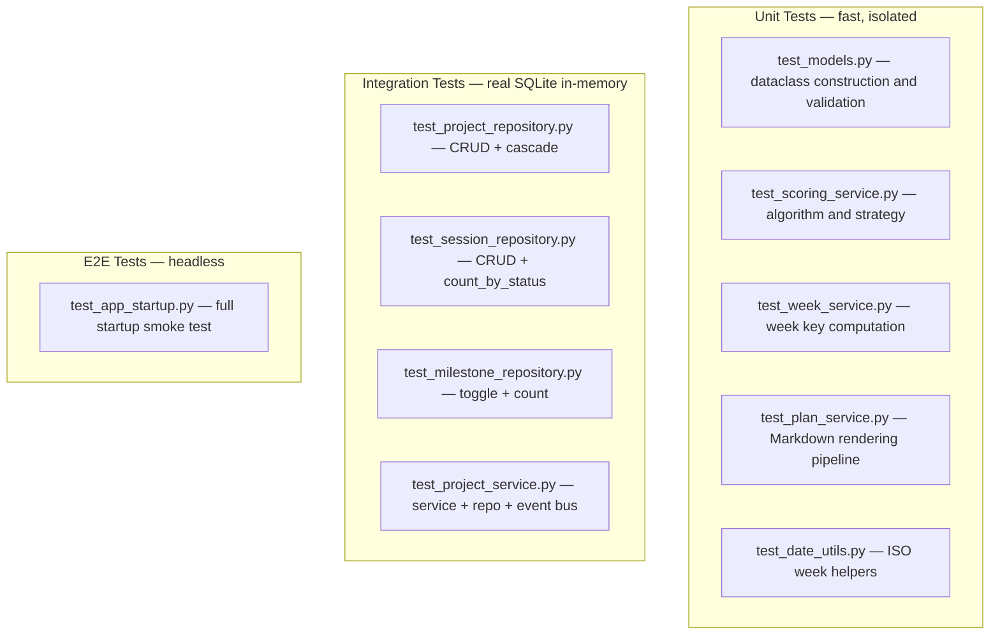

# Testing

## Running Tests

```bash
# Run the full test suite with coverage
pytest

# Run a specific tier
pytest tests/unit/
pytest tests/integration/
pytest tests/e2e/

# Run with verbose output
pytest -v

# Run a single file
pytest tests/unit/test_scoring_service.py
```

---

## Coverage Target

**Minimum: 80%** across all source files.

Coverage configuration in `pyproject.toml`:

```toml
[tool.pytest.ini_options]
testpaths = ["tests"]
addopts = "--cov=src/portfolio_manager --cov-report=term-missing --cov-fail-under=80"

[tool.coverage.run]
source = ["src/portfolio_manager"]
omit = ["*/views/*", "*/controllers/*", "*/__main__.py"]
```

Views and controllers are excluded from coverage since Tkinter GUI code cannot be reliably tested headlessly.

---

## Test Tiers



---

## Shared Fixtures (`tests/conftest.py`)

| Fixture | Type | Description |
|---------|------|-------------|
| `reset_singletons` | autouse | Resets `DatabaseConnection` and `EventBus` before/after each test |
| `in_memory_db` | `DatabaseConnection` | Fully migrated in-memory SQLite connection |
| `test_config` | `Settings` | Settings pointing at `:memory:` database |
| `sample_project` | `Project` | A persisted active project with `plan_content` |
| `sample_sessions` | `list[Session]` | Three sessions (planned, completed, cancelled) for `sample_project` |

---

## Writing Unit Tests

Unit tests use **fake repositories** — plain Python objects that satisfy the interface without hitting a database:

```python
class _FakeProjectRepo:
    def __init__(self, plan_content=""):
        from portfolio_manager.models.project import Project
        self._project = Project(id=1, name="Test", slug="test", plan_content=plan_content)

    def get(self, project_id):
        return self._project

    def update_plan(self, project_id, content):
        self._project.plan_content = content
```

---

## Writing Integration Tests

Integration tests use the `in_memory_db` fixture and create real repository instances:

```python
@pytest.fixture
def repo(in_memory_db):
    return ProjectRepository(in_memory_db)

def test_create_assigns_id(repo):
    p = repo.create(Project(name="Novel", slug="novel", status="active"))
    assert p.id > 0
```

---

## E2E / GUI Testing

Tkinter tests are minimised because GUI testing is fragile and platform-dependent.

The headless startup test uses `Tk.withdraw()` to suppress the window:

```python
def test_builds_without_error(headless_settings):
    try:
        window = build_app(settings=headless_settings)
        window.withdraw()
        window.update()
        window.destroy()
    except tk.TclError as exc:
        pytest.skip(f"No display available: {exc}")
```

On CI without a display the test is automatically skipped rather than failing.
