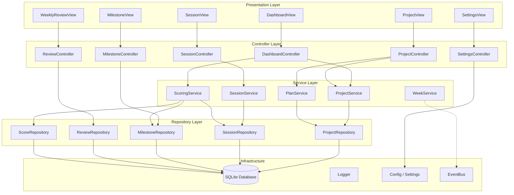
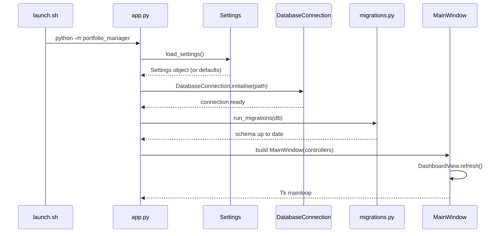
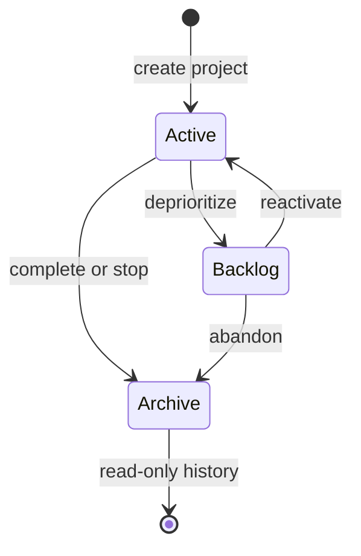
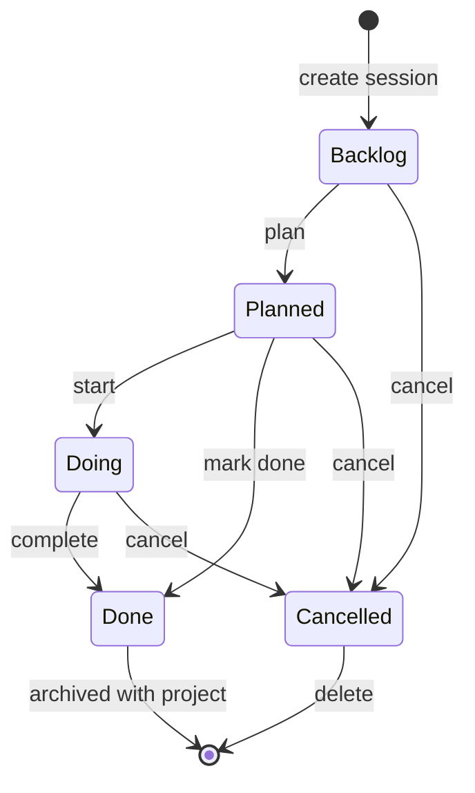
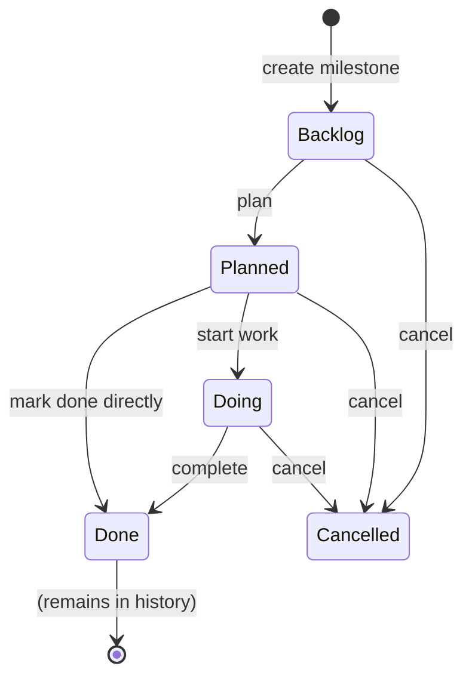

# Architecture

## Overview

Portfolio Manager uses a layered **Model-View-Controller (MVC)** architecture augmented with a **Service Layer** for business logic and a **Repository Layer** for data access. This separation ensures views contain no business logic and all SQL is confined to repositories.



---

## Layer Responsibilities

| Layer | Responsibility |
|-------|---------------|
| **Views** | Render Tkinter widgets; fire user events; call controller methods |
| **Controllers** | Translate UI actions to service calls; bind views to event bus |
| **Services** | Enforce business rules; orchestrate repositories; emit domain events |
| **Repositories** | Execute SQL; map rows to domain objects; enforce transaction boundaries |
| **Infrastructure** | Singleton DB connection; logging setup; TOML config; event bus |

---

## Application Startup Sequence



---

## Project Lifecycle



---

## Session Lifecycle



---

## Milestone Lifecycle



---

## Source Structure

```
src/portfolio_manager/
├── __main__.py          # python -m portfolio_manager entry point
├── app.py               # Bootstrap: wires all layers, returns MainWindow
├── exceptions.py        # Custom exception hierarchy
│
├── config/
│   └── settings.py      # Settings dataclass + TOML loader
│
├── db/
│   ├── connection.py    # Singleton DatabaseConnection
│   ├── migrations.py    # Versioned migration runner
│   └── schema.sql       # Initial DDL
│
├── models/              # Dataclass domain objects (no DB logic)
├── repositories/        # SQL access (one per entity)
├── services/            # Business logic (one per domain)
├── controllers/         # UI ↔ service mediation
├── views/               # Tkinter frames and widgets
├── events/              # EventBus (Observer pattern)
└── utils/               # Date helpers, logging setup
```
