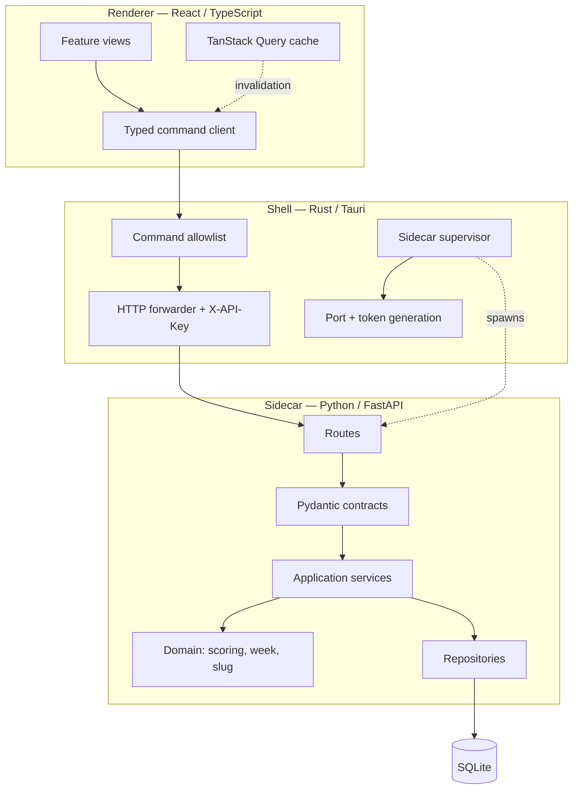
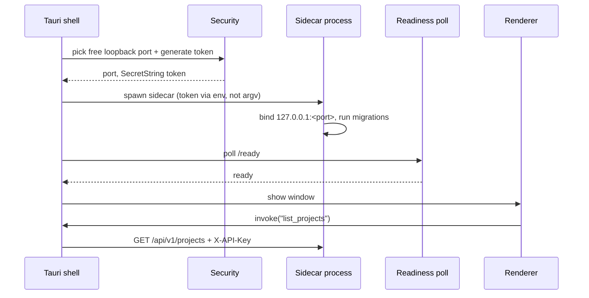
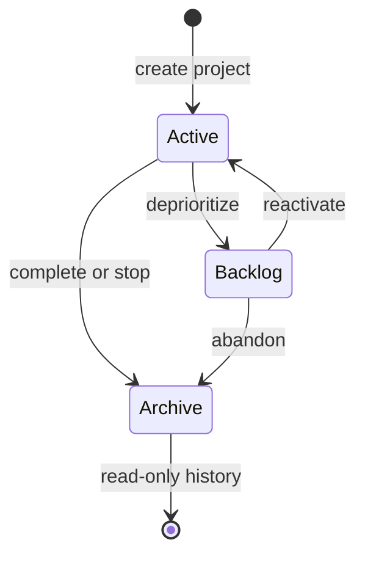
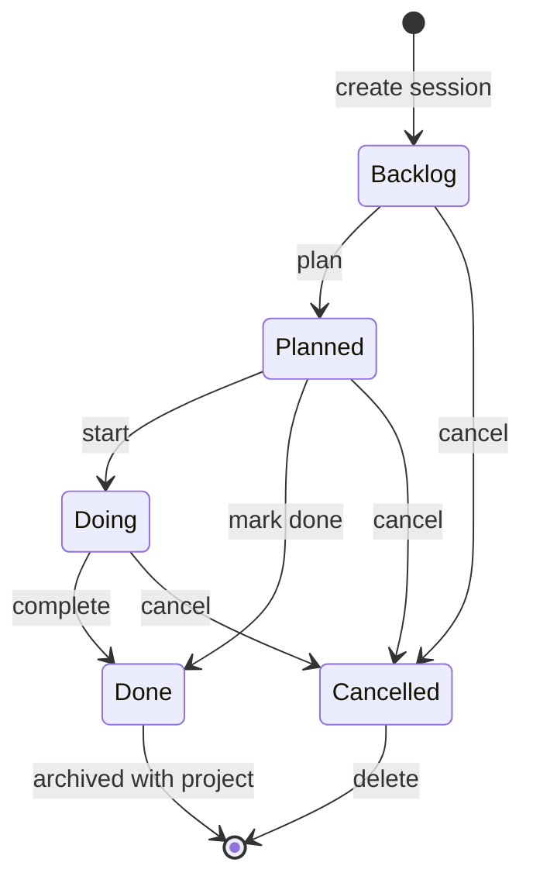
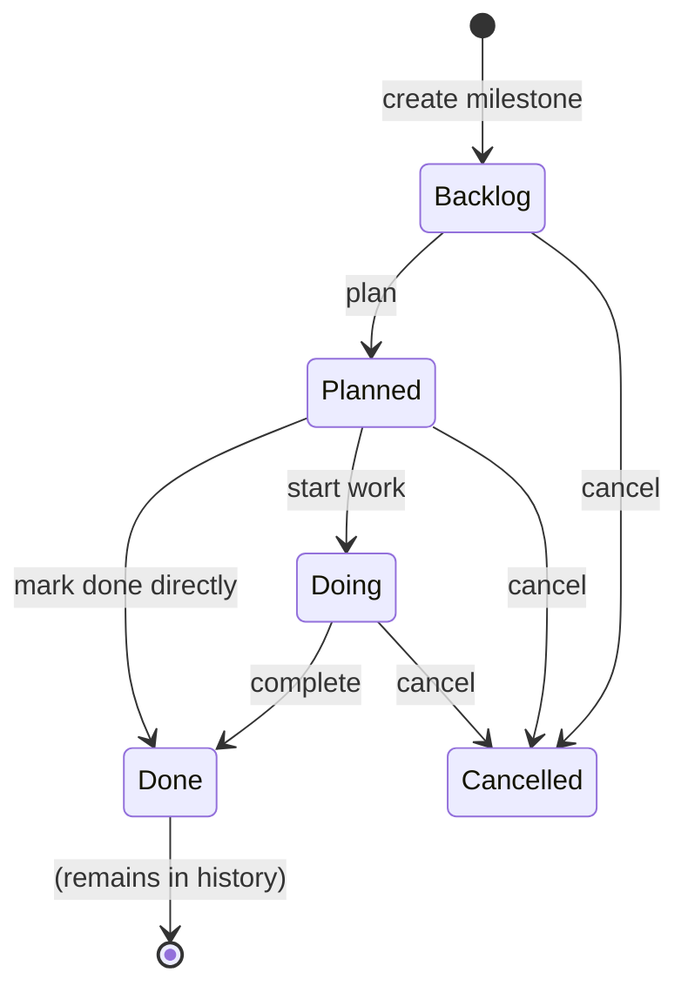

# Architecture

The repository contains the current Tauri desktop application and the legacy
Tkinter application. They share one SQLite database and a preserved set of
domain rules. New desktop work targets the Tauri stack; the Tkinter app remains
for compatibility and regression comparison. See [Home](index.md) for the
current status of each.

---

## Current architecture (Tauri + React + FastAPI)

The renderer never contacts the sidecar directly. Every call crosses a fixed
chain of layers, each of which can reject it.

```
React renderer
  → typed Tauri command client        (frontend/src/command-client)
  → allowlisted Tauri command         (src-tauri/src/commands)
  → authenticated Rust HTTP forwarder (src-tauri/src/http)
  → loopback-only FastAPI route       (backend/.../api/routes)
  → Pydantic contract                 (backend/.../contracts)
  → application service               (backend/.../application/services)
  → repository port → SQLite          (backend/.../infrastructure/db)
```


```mermaid
graph TD
    subgraph "Renderer — React / TypeScript"
        UI[Feature views]
        CC[Typed command client]
        Q[TanStack Query cache]
    end

    subgraph "Shell — Rust / Tauri"
        CMD[Command allowlist]
        FWD[HTTP forwarder + X-API-Key]
        SUP[Sidecar supervisor]
        SEC[Port + token generation]
    end

    subgraph "Sidecar — Python / FastAPI"
        RT[Routes]
        CON[Pydantic contracts]
        SVC[Application services]
        DOM[Domain: scoring, week, slug]
        REPO[Repositories]
    end

    DB[(SQLite)]

    UI --> CC --> CMD --> FWD --> RT
    Q -.invalidation.-> CC
    SUP --> SEC
    SUP -.spawns.-> RT
    RT --> CON --> SVC --> DOM
    SVC --> REPO --> DB
```

### Layer responsibilities

| Layer | Responsibility |
| --- | --- |
| **Renderer views** | Render accessible React components; no direct HTTP (enforced by a build check) |
| **Command client** | Typed wrapper over Tauri `invoke`; the renderer's only way out |
| **Tauri commands** | Explicit allowlist in `lib.rs` — the complete API surface |
| **HTTP forwarder** | Attaches the `X-API-Key` token; the only component that knows it |
| **Supervisor** | Spawns the sidecar, allocates a port and token, shuts it down with the app |
| **Routes / contracts** | Validate and shape requests and responses |
| **Services** | Enforce business rules and orchestrate repositories |
| **Domain** | Scoring, week keys, slugs — ported verbatim from the Tkinter app |
| **Repositories** | Execute SQL; map rows to domain objects; own transaction boundaries |

### Startup sequence


```mermaid
sequenceDiagram
    participant T as Tauri shell
    participant S as Security
    participant P as Sidecar process
    participant R as Readiness poll
    participant U as Renderer

    T->>S: pick free loopback port + generate token
    S-->>T: port, SecretString token
    T->>P: spawn sidecar (token via env, not argv)
    P->>P: bind 127.0.0.1:<port>, run migrations
    T->>R: poll /ready
    R-->>T: ready
    T->>U: show window
    U->>T: invoke("list_projects")
    T->>P: GET /api/v1/projects + X-API-Key
```

### Security boundary

- Dynamic loopback port and a cryptographically random per-launch token.
- The token lives only in Rust in-memory state (`secrecy::SecretString`). It is
  never persisted, sent to the renderer, or logged (redaction filters cover both
  the Rust and Python sides).
- Every route except `/health` and `/ready` requires `X-API-Key`; those two are
  unauthenticated because they expose no sensitive data (ADR-007).
- Production builds disable Swagger, ReDoc, the OpenAPI schema, and WebView
  devtools.
- There is no generic "call the API" command — the Tauri allowlist *is* the
  full surface.

### Source structure

```
backend/src/portfolio_manager/
├── domain/           # Scoring, week keys, slugs, domain models
├── application/      # Services, DTOs, repository ports
├── infrastructure/   # SQLite, migrations, config, logging, security
├── contracts/        # Pydantic request/response models
├── api/              # FastAPI app, routes, middleware, error handlers
└── cli/              # Sidecar entry point

frontend/src/
├── command-client/   # Typed wrappers over Tauri invoke (no direct HTTP)
├── contracts/        # Generated TypeScript types from OpenAPI
├── features/         # One module per workspace view
├── components/       # Shared accessible components
├── hooks/            # Query invalidation, sidecar health
└── state/            # Workspace context (selected week, etc.)

src-tauri/src/
├── lib.rs            # Command allowlist and app wiring
├── commands/         # One module per domain area
├── http/             # Authenticated forwarder to the sidecar
├── security/         # Port selection, token generation
├── sidecar/          # Supervisor, launcher, readiness, shutdown
└── logging.rs        # Secret-redacting log setup
```

---

## Domain lifecycles

These are enforced by the shared domain layer and apply to both applications.

### Project lifecycle


```mermaid
stateDiagram-v2
    [*] --> Active : create project
    Active --> Backlog : deprioritize
    Backlog --> Active : reactivate
    Active --> Archive : complete or stop
    Backlog --> Archive : abandon
    Archive --> [*] : read-only history
```

### Session lifecycle


```mermaid
stateDiagram-v2
    [*] --> Backlog : create session
    Backlog --> Planned : plan
    Planned --> Doing : start
    Doing --> Done : complete
    Planned --> Done : mark done
    Backlog --> Cancelled : cancel
    Planned --> Cancelled : cancel
    Doing --> Cancelled : cancel
    Done --> [*] : archived with project
    Cancelled --> [*] : delete
```

### Milestone lifecycle


```mermaid
stateDiagram-v2
    [*] --> Backlog : create milestone
    Backlog --> Planned : plan
    Planned --> Doing : start work
    Doing --> Done : complete
    Planned --> Done : mark done directly
    Backlog --> Cancelled : cancel
    Planned --> Cancelled : cancel
    Doing --> Cancelled : cancel
    Done --> [*] : (remains in history)
```

!!! note "One deliberate behavior change"
    The V2 scoring denominator excludes cancelled milestones; the Tkinter app
    counted them. This follows the SRS rule and is recorded in
    [ADR-002](architecture/decisions/adr-002-preserve-domain.md).

---

## Legacy architecture (Tkinter)

The original app uses layered **MVC** with a service layer for business logic
and a repository layer for data access. Views contain no business logic and all
SQL is confined to repositories.

```
User action → View → Controller → Service → Repository → SQLite
                                         ← Model ←
```

| Layer | Responsibility |
| --- | --- |
| **Views** | Render Tkinter widgets; fire user events; call controller methods |
| **Controllers** | Translate UI actions to service calls; bind views to the event bus |
| **Services** | Enforce business rules; orchestrate repositories; emit domain events |
| **Repositories** | Execute SQL; map rows to domain objects; enforce transaction boundaries |
| **Infrastructure** | Singleton DB connection; logging setup; TOML config; event bus |

```
src/portfolio_manager/
├── __main__.py          # python -m portfolio_manager entry point
├── app.py               # Bootstrap: wires all layers, returns MainWindow
├── exceptions.py        # Custom exception hierarchy
├── config/settings.py   # Settings dataclass + TOML loader
├── db/                  # Singleton connection, migrations, schema.sql
├── models/              # Dataclass domain objects (no DB logic)
├── repositories/        # SQL access (one per entity)
├── services/            # Business logic (one per domain)
├── controllers/         # UI ↔ service mediation
├── views/               # Tkinter frames and widgets
├── events/              # EventBus (Observer pattern)
└── utils/               # Date helpers, logging setup
```

See [Design Patterns](design-patterns.md) for the patterns used in each stack.
