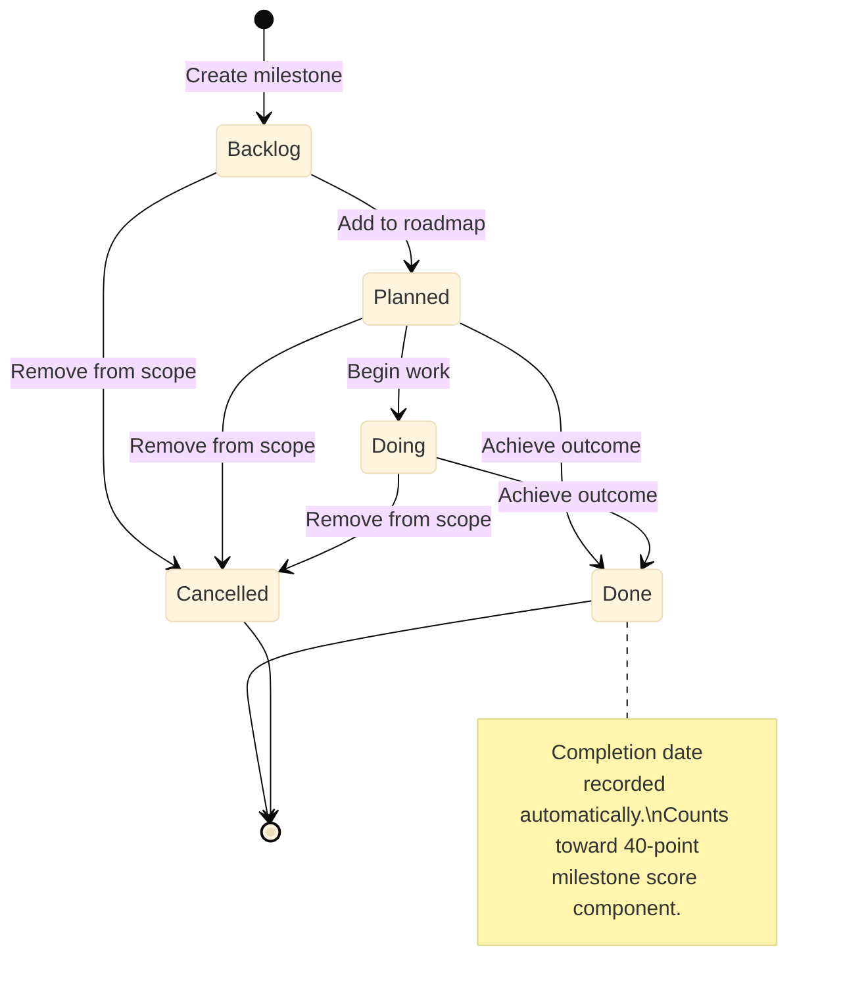

# Milestones

Milestones mark meaningful outcomes within a project. They represent achievements rather than tasks, and together they form a project's progress roadmap.

## What Is a Milestone?

A milestone describes a completed outcome: something that will be true when a significant phase of work is finished. Write milestones as past-tense statements or noun phrases that unambiguously define what done means:

-   "First draft complete"
-   "Recording tracks mixed and mastered"
-   "Beta version deployed to staging"
-   "Study guide reviewed and annotated"

Avoid defining milestones as task steps \("write chapter 3"\). Tasks belong in sessions or your project plan document. Milestones describe the meaningful threshold you are working toward.

## Milestone Lifecycle


*Milestone lifecycle matches the session lifecycle: five states progressing from Backlog through Done, with Cancelled as an exit state.*

Milestones share the same five-state lifecycle as sessions. You advance a milestone manually when the outcome is achieved; completing sessions linked to a milestone does **not** automatically mark the milestone done.

Backlog
:   The milestone is identified but not yet active.

Planned
:   The milestone is on the active roadmap with an optional target date.

Doing
:   Work toward this milestone is in progress.

Done
:   The outcome has been achieved. Portfolio Manager records the completion date automatically.

Cancelled
:   The milestone was removed from scope.

## Linking Sessions to Milestones

When you create or edit a session, you can optionally link it to one of the project's milestones. This link is informational—it lets you see which sessions are contributing to a specific outcome. One session can link to one milestone; multiple sessions can link to the same milestone.

To mark a milestone done, change its status directly in the Milestones tab. Review all linked sessions to confirm the outcome is achieved before marking it done.

## How Milestones Affect Scoring

Milestones contribute 40 percent of a project's weekly health score:

```
(completed milestones ÷ total milestones) × 40
```

A project with five milestones and two marked done earns 16 of a possible 40 milestone points. See [Project Health Scoring](c_scoring_model.md) for the full model.

**Tip:** Even if a project has no milestones defined, its score still reflects session completion. Add milestones when you want the score to track long-term outcomes.

