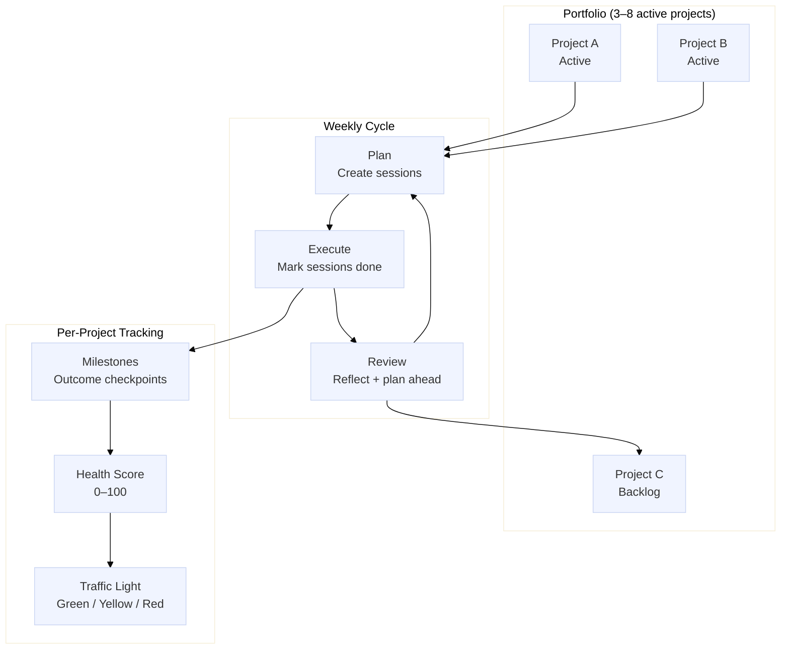

# The Portfolio Paradigm

Portfolio Manager treats your active commitments as a portfolio—a bounded set of projects that compete for your time and attention. This model gives you a single, honest view of what you are working on and how each project is progressing.

## Why a Portfolio Model?

Most task managers optimize for individual tasks or a single project. When you are running three, five, or eight parallel commitments—a novel, a home-recording project, a side business, a professional certification—that model breaks down. You end up with dozens of undifferentiated to-do items and no clear picture of whether each project is actually moving.

Portfolio Manager addresses this by treating each commitment as a named project with its own health score, milestones, and work history. You schedule time for each project in discrete, bounded sessions, and you review your portfolio as a whole every week. The result is a system that surfaces which projects need attention and which ones are on track—without requiring you to micromanage individual tasks.

## Portfolio Overview

*Portfolio overview: projects contain milestones; sessions are scheduled within weekly budgets; weekly reviews close the planning loop.*

## Design Philosophy

Portfolio Manager is built around three principles:

Non-punitive tracking
:   A missed session is not a failure. The system records what happened without generating guilt messages or penalty flags. You reflect on what stalled during your weekly review and move forward.

Time-boxing over task lists
:   The unit of work is the session—a block of time dedicated to one project. You plan how many sessions each project gets this week, not how many tasks you will complete. This matches how creative and professional work actually happens.

Portfolio-level awareness
:   The Dashboard shows every active project's health score in one view. You can see at a glance which projects are green, which are yellow, and which need immediate attention.

## Recommended Portfolio Size

Portfolio Manager is designed for three to eight concurrent active projects. Fewer than three projects rarely justify the overhead of portfolio tracking. More than eight projects typically means you are carrying commitments that are not receiving meaningful attention and should be moved to your backlog or archived.

Your projects can span any domain: creative work \(writing, music, art\), professional development \(certifications, side businesses\), personal goals \(fitness, learning a language\), or any long-running commitment that benefits from structured progress tracking.

## Core Entities

Portfolio Manager organizes your work into four interconnected entities:

-   **Projects** — named commitments, each with a lifecycle status, a priority level, and an optional plan document written in Markdown.
-   **Sessions** — time-boxed units of work \(15 to 480 minutes\) scheduled to specific dates and linked to a project. Sessions are the primary way you record and plan work.
-   **Milestones** — outcome-based checkpoints within a project. A milestone represents a meaningful deliverable or achievement, not a task step.
-   **Weekly Reviews** — structured reflections recorded each week. They capture what moved, what stalled, patterns you noticed, and your plan for the following week.

