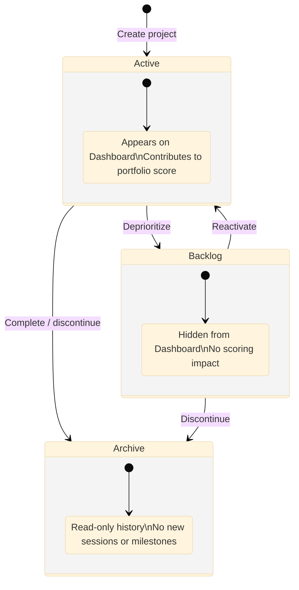

# Project Lifecycle

Every project in Portfolio Manager moves through three lifecycle states—Active, Backlog, and Archive—that reflect how much attention the project is currently receiving.

## Lifecycle States

*Project lifecycle: Active is the working state; Backlog is a deferred state; Archive is a terminal state for completed or abandoned projects.*

Active
:   The project appears on the Dashboard and is eligible for session scheduling. Active projects contribute to your portfolio score each week. Limit your active projects to what you can realistically schedule at least one session per week.

Backlog
:   The project is paused. It does not appear on the Dashboard and does not affect scoring. Use the backlog state when you need to deprioritize a project temporarily without abandoning it.

Archive
:   The project is complete or permanently closed. Archived projects are read-only and preserved for historical reference. You can view the project's sessions, milestones, and plan document, but you cannot create new sessions or milestones for an archived project.

## State Transitions

Transitions between states are always manual—you change a project's status explicitly. Portfolio Manager never moves a project automatically. Valid transitions are:

-   Active ↔ Backlog \(reversible at any time\)
-   Active → Archive
-   Backlog → Archive

**Tip:** There is no delete operation for projects with existing sessions or milestones. Archive a completed project to preserve its history.

## Project Metadata

Each project stores the following information:

-   **Name** — the display name shown throughout the interface.
-   **Description** — a brief summary of the project's purpose.
-   **Status** — Active, Backlog, or Archive.
-   **Priority** — a ranking from 1 \(highest\) to 5 \(lowest\) used for your own reference. Priority does not affect scoring or scheduling.
-   **Start date** — the date you began the project \(optional\).
-   **End date** — your target completion date \(optional\).
-   **Plan document** — a freeform Markdown document for notes, outlines, Mermaid diagrams, and any planning material specific to the project.

## Plan Documents

Each project includes an embedded plan document—a Markdown editor with a live preview panel. The plan document has no required structure. Use it for whatever helps you think through the project: an outline, a character list, a research log, a sprint plan, or a decision journal.

The plan document supports standard Markdown syntax, tables, and fenced Mermaid diagram blocks. Changes save automatically as you type; no explicit save action is required.

