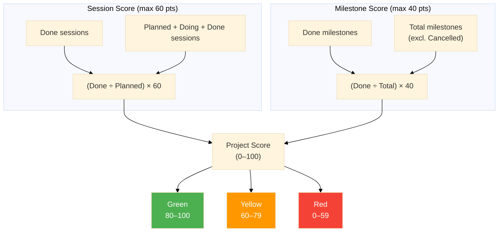

# Project Health Scoring

Portfolio Manager calculates a weekly health score for each active project using a weighted combination of session completion and milestone progress. The score drives the traffic-light status indicator on the Dashboard.

## Score Calculation


*Scoring model: session score (60 points max) plus milestone score (40 points max) produces a total score from 0 to 100.*

Each project receives a score from 0 to 100 for the current week. The score is the sum of two components:

Session component \(60 points maximum\)
:   ```
(sessions with Done status ÷ sessions with Planned, Doing, or Done status) × 60
```

    If a project has no sessions planned for the week, this component scores 0.

Milestone component \(40 points maximum\)
:   ```
(milestones with Done status ÷ total milestones) × 40
```

    If a project has no milestones defined, this component scores 0.

## Traffic-Light Status

Portfolio Manager converts each score to a color status for the Dashboard:

|Score Range|Status|Meaning|
|-----------|------|-------|
|80–100|Green|Project is progressing well this week.|
|60–79|Yellow|Project is moving, but attention is needed.|
|0–59|Red|Project has stalled or is significantly behind this week.|

## Score Examples

**Example 1 — Green project:** A novel draft project has four planned sessions and three completed \(session component: 45\), plus six milestones of which three are done \(milestone component: 20\). Total score: 65. Status: Yellow.

**Example 2 — Red project:** A recording project has two planned sessions and zero completed \(session component: 0\), plus three milestones with zero done \(milestone component: 0\). Total score: 0. Status: Red.

**Example 3 — Sessions only:** A professional-development project has no milestones defined. It has three planned sessions and three completed \(session component: 60\). Milestone component: 0. Total score: 60. Status: Yellow.

**Tip:** To reach Green status reliably, complete most of your planned sessions *and* advance at least some milestones each week.

## Manual Score Override

You can override a project's calculated score for any week. An override requires a reason, which is stored alongside the score for future reference. Use overrides sparingly—for situations where the algorithm does not reflect the actual project state, such as a week of unrecorded off-tool work.

## Portfolio Score

The Dashboard summary row displays an aggregate portfolio score, which is the average of all active projects' individual scores. The portfolio status badge reflects this average.

