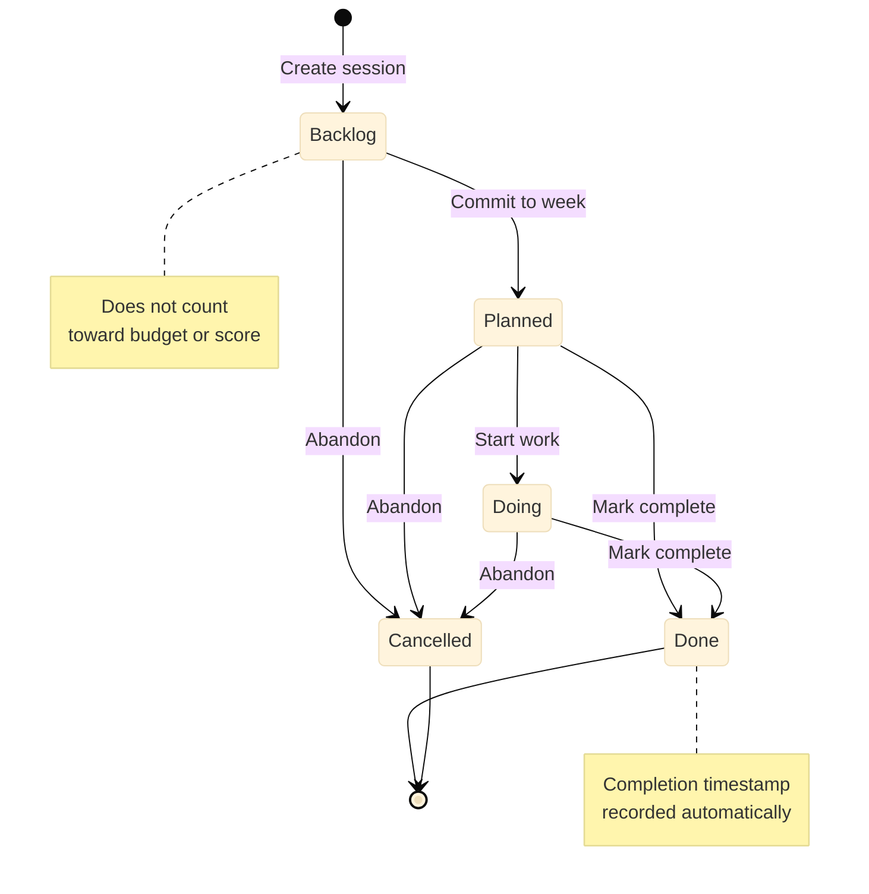

# Sessions

A session is a time-boxed block of work—the fundamental unit of scheduling and progress tracking in Portfolio Manager. Sessions connect your projects to your calendar and your weekly time budget.

## What Is a Session?

A session represents a committed block of time for one project. When you create a session, you specify the project it belongs to, the date it is scheduled, and its duration \(15 to 480 minutes, default 90 minutes\). You can optionally link the session to a specific milestone to track which outcome the work is advancing.

Sessions are not tasks. They do not describe every step of the work; they describe a block of time you intend to spend. The **Session** field holds a brief label for the session \(for example, "Write chapter 3 opening"\) and the **Description** field holds any additional notes or context.

## Session Lifecycle


*Session lifecycle: Backlog is the unscheduled state; Planned means committed to a week; Doing means in progress; Done means completed; Cancelled means abandoned.*

Sessions move through five states:

Backlog
:   The session exists but is not yet committed to a specific week. Use this state to capture work you intend to schedule without blocking out time yet.

Planned
:   The session is committed to its scheduled date and counts toward your weekly time budget. Planned sessions appear in the Dashboard's session counts.

Doing
:   You are currently working on this session. The Doing state is optional; many users move directly from Planned to Done.

Done
:   The session is complete. Portfolio Manager records the completion timestamp automatically. Done sessions count toward the project's weekly score.

Cancelled
:   The session was abandoned. Cancelled sessions can be deleted. They do not count toward the weekly budget or the project score.

## The Weekly Time Budget

Portfolio Manager tracks a configurable weekly time budget \(default: 12 hours\). The Sessions tab shows three running totals:

-   **Planned** — the total duration of all sessions with Planned, Doing, or Done status for the selected week.
-   **Done** — the total duration of sessions with Done status.
-   **Remaining** — the difference between the budget and the total planned time.

The budget is not enforced. You can schedule more sessions than your budget allows; the system simply shows the overrun. Treat it as a planning signal, not a hard limit.

**Tip:** If your planned time consistently exceeds your budget, move lower-priority sessions to Backlog status rather than cancelling them. They remain available for future weeks.

## How Sessions Affect Scoring

Sessions contribute 60 percent of a project's weekly health score. The scoring component is calculated as:

```
(completed sessions ÷ planned sessions) × 60
```

A project with four planned sessions and three completed sessions earns 45 of a possible 60 session points. See [Project Health Scoring](c_scoring_model.md) for the full scoring model.

