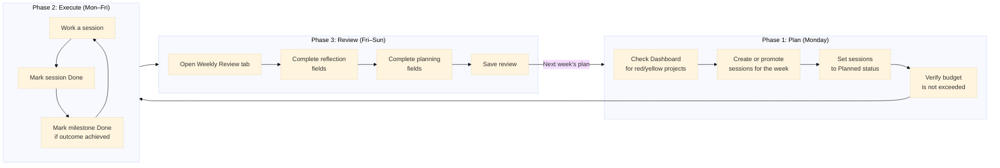

# The Weekly Workflow Process

Portfolio Manager structures your work into a three-phase weekly cycle: Plan, Execute, and Review. Understanding how these phases connect helps you get the most value from the tool.

## How the Weekly Cycle Works

*Weekly workflow: Plan phase (session creation and budgeting), Execute phase (working sessions and status updates), Review phase (weekly review and next-week planning).*

Each week begins with a planning step that sets your intentions, proceeds through a series of work sessions, and ends with a structured review. The review directly informs the next week's plan, creating a continuous improvement loop.

## Phase 1: Plan

At the start of each week \(typically Monday morning\), you open the Sessions tab and create or promote sessions for the coming week:

1.  Check the Dashboard to see which projects are red or yellow from last week. These projects deserve higher session priority this week.
2.  Review backlog sessions from previous weeks and promote relevant ones to the current week by updating their scheduled date.
3.  Create new sessions for work you have identified during your previous review or from your project plan documents.
4.  Set each committed session to **Planned** status.
5.  Check the weekly budget bar to confirm your planned sessions fit within your available hours.

The plan phase transforms the open-ended question "what do I work on this week?" into a concrete list of scheduled sessions with a project and a purpose.

## Phase 2: Execute

Throughout the week, you work your planned sessions and update their status:

1.  Before a session, open Portfolio Manager and review the session's description to orient yourself.
2.  Optionally set the session to **Doing** to signal you are starting.
3.  After completing the session, mark it **Done**. The Dashboard score updates automatically.
4.  If you cannot complete a session, mark it **Cancelled** or leave it in **Planned** status—it will appear in your review as incomplete.
5.  When a project milestone is achieved, advance it to **Done** in the Milestones tab.

The execute phase produces the data that the Review phase interprets. The more accurately you update session status during the week, the more useful your review data will be.

## Phase 3: Review

At the end of each week \(Friday evening or Sunday\), you open the Weekly Review tab and complete the structured reflection form:

1.  Examine the Dashboard for the current week: note which projects are green, yellow, and red.
2.  Open the Weekly Review tab. Portfolio Manager pre-populates the week key and session summary.
3.  Complete the reflection fields: what moved, what stalled, signals, and your decision for next week.
4.  Complete the planning fields: primary focus, project to deprioritize, risk to watch, and first session target.
5.  Save the review. It becomes part of your permanent review history.

The output of the review phase—particularly the primary focus and first session target—feeds directly into the next Plan phase. This continuity is what makes the three-phase cycle a genuine improvement system rather than a passive log.

## Why the Cycle Works

The three-phase cycle addresses the central challenge of managing multiple projects: *attention fragmentation*. Without a structure, you default to working on whichever project feels urgent or interesting, which leaves lower-energy projects stalled indefinitely.

The Plan phase forces a conscious allocation decision at the start of each week. The Execute phase creates a factual record of how time was actually spent. The Review phase surfaces the gap between intention and reality—and provides a structured moment to adjust.

