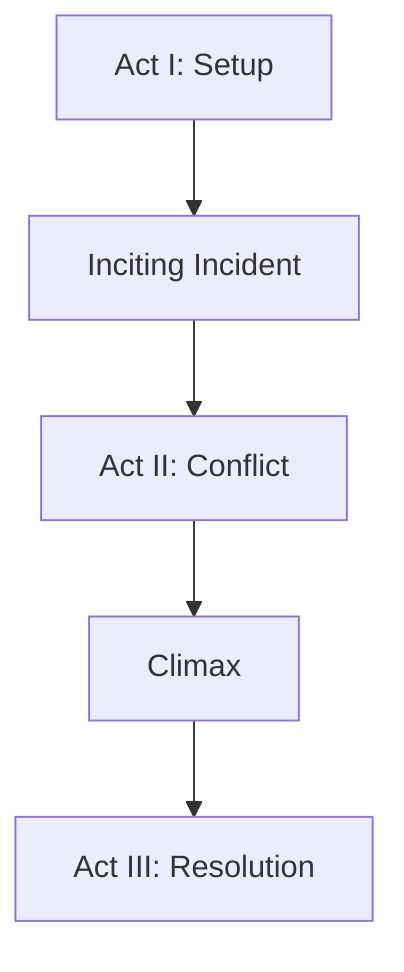
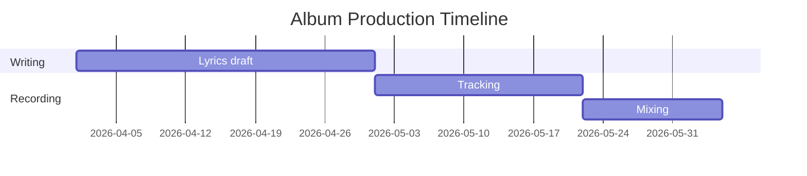

# Markdown and Mermaid Syntax Reference

Complete reference for the Markdown elements and Mermaid diagram types supported in project plan documents.

## Supported Markdown Elements

|Element|Syntax|Notes|
|-------|------|-----|
|Headings|`# H1`, `## H2` … `###### H6`|Use H1 for the document title, H2 for major sections.|
|Paragraphs|Separate with a blank line.| |
|Bullet list|`- item` or `* item`|Nested lists supported.|
|Numbered list|`1. item`| |
|Bold|`**text**`| |
|Italic|`*text*`| |
|Inline code|``code``| |
|Fenced code block|````language … ````|Use `mermaid` as the language for diagrams.|
|Table|GitHub-flavored table syntax with pipe characters|Header row required.|
|Blockquote|`> text`|Nested blockquotes supported.|
|Horizontal rule|`---`| |
|Link|`[text](url)`|External URLs only.|

## Supported Mermaid Diagram Types

Embed a Mermaid diagram in a plan document with a fenced code block using `mermaid` as the language identifier:

```
```mermaid
[diagram definition]
```
```

|Diagram Type|Use Case|Opening Keyword|
|------------|--------|---------------|
|Flowchart|Process flows, decision trees, outlines|`flowchart TD` or `flowchart LR`|
|Sequence diagram|Interaction flows, story scenes, API calls|`sequenceDiagram`|
|State diagram|Lifecycle states, character arcs, system states|`stateDiagram-v2`|
|Gantt chart|Project timelines, sprint plans|`gantt`|
|Entity-relationship diagram|Data models, world-building relationships|`erDiagram`|
|Pie chart|Time allocation, distribution summaries|`pie`|
|Mindmap|Brainstorming, concept maps|`mindmap`|

## Mermaid Diagram Examples

**Flowchart — story structure:**

```

```

**Gantt chart — project timeline:**

```

```

