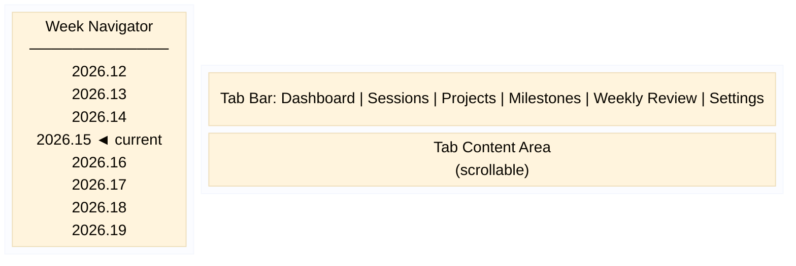

# User Interface Reference

Portfolio Manager uses a two-panel layout with a week navigator on the left and a six-tab notebook on the right. This topic describes each panel and tab.

## Main Window Layout

*Main window: left panel shows the week navigator list; right panel shows six tabs: Dashboard, Sessions, Projects, Milestones, Weekly Review, and Settings.*

The minimum window size is 1024 × 768 pixels. The window is resizable; both panels expand proportionally.

## Left Panel — Week Navigator

The left panel displays a scrollable list of week keys in YYYY.W format. The list shows the 12 preceding weeks, the current week \(highlighted\), and the 4 following weeks. Clicking a week navigates the Sessions and Weekly Review tabs to that week.

## Dashboard Tab

Displays a portfolio health snapshot for the selected week:

|Element|Description|
|-------|-----------|
|Week header|The week key and date range \(for example, "Week 2026.15 — Apr 13–19"\).|
|Project table|One row per active project. Columns: Name, Status, Planned sessions, Done sessions, Remaining sessions, Score.|
|Portfolio summary row|Aggregate session counts and the portfolio score with a color-coded status badge.|
|This Week panel|Total planned and done session hours, and a list of upcoming milestones for the week.|

## Sessions Tab

Lists all sessions for the selected week and provides tools to create, edit, and update them:

|Control|Action|
|-------|------|
|Week selector|Text entry plus Previous and Next buttons to navigate weeks.|
|Session table|Columns: Date, Project, Milestone, Duration, Status, Session \(label\). Color-coded by status.|
|New Session|Opens the Session dialog to create a session.|
|Edit Session|Opens the Session dialog for the selected session.|
|Mark Done|Advances the selected session directly to Done status.|
|Delete Session|Removes the selected session after confirmation.|
|Budget bar|Shows planned hours, done hours, and remaining hours against the weekly budget.|

## Projects Tab

|Control|Action|
|-------|------|
|Status filter|Dropdown to show Active, Backlog, Archive, or All projects.|
|Project table|Columns: Name, Status, Priority, Started, Milestones \(count\), Sessions \(count\).|
|New Project|Opens the Project dialog to create a project.|
|Edit Project|Opens the Project dialog for the selected project, including the plan document editor.|
|Archive Project|Moves the selected project to Archive status after confirmation.|
|Delete Project|Permanently removes the project and all its sessions and milestones. Requires confirmation.|

## Milestones Tab

|Control|Action|
|-------|------|
|Project dropdown|Selects the project whose milestones are displayed.|
|Milestone table|Columns: Description, Status, Target Date, Notes. Sorted by sort\_order.|
|New Milestone|Opens the Milestone dialog.|
|Edit Milestone|Opens the Milestone dialog for the selected milestone.|
|Delete Milestone|Removes the selected milestone after confirmation.|

## Weekly Review Tab

|Element|Description|
|-------|-----------|
|Review history list|Left panel listing all saved reviews by week key. Click any entry to view that review.|
|Week selector|Text entry and navigation buttons for the review week.|
|Load button|Loads or creates the review for the selected week.|
|Review form|Eight text fields for reflection \(what moved, what stalled, signals, decision for next week\) and planning \(primary focus, project to deprioritize, risk to watch, first session target\).|
|Save Review|Saves the current review.|

## Settings Tab

|Setting|Description|
|-------|-----------|
|Log level|Logging verbosity. Options: DEBUG, INFO, WARNING, ERROR.|
|Default session duration \(minutes\)|Pre-fills the duration field when creating a session. Range: 15–480.|
|Weekly budget \(hours\)|Hours available per week for personal projects. Range: 1–100.|
|Database path|Read-only display of the current database file location. A restart is required after changing this path.|

