# Software Requirements Specification (SRS)
## Personal Portfolio Work Orchestrator — Version 2

**Document Version:** 2.0
**Date:** 2026-04-09
**Standard:** IEEE 830-1998
**Status:** Released

---

## Table of Contents

1. [Introduction](#1-introduction)
2. [Overall Description](#2-overall-description)
3. [Specific Requirements](#3-specific-requirements)
4. [System Architecture](#4-system-architecture)
5. [Data Model](#5-data-model)
6. [Technology Stack](#6-technology-stack)
7. [Project Structure](#7-project-structure)
8. [Development Standards](#8-development-standards)
9. [Testing Requirements](#9-testing-requirements)
10. [Deployment and Launch Mechanism](#10-deployment-and-launch-mechanism)
11. [Documentation Requirements](#11-documentation-requirements)
12. [Appendices](#12-appendices)

---

## 1. Introduction

### 1.1 Purpose

This document specifies the requirements for **Version 2** of the Personal Portfolio Work Orchestrator — a desktop application that enables a single user to manage, schedule, and execute work across a portfolio of creative and technical projects using time-boxed sessions.

This SRS supersedes and extends the V1 SRS by providing a complete implementation specification including technology stack, architecture patterns, data model, project structure, development standards, testing requirements, and deployment mechanisms. It is intended for use as the authoritative design and build reference.

---

### 1.2 Scope

The system is a **desktop GUI application** named **Portfolio Manager** with the following scope:

**Included:**

- Tkinter-based desktop GUI
- SQLite backend with full schema definition
- In-app plan document editor with Markdown + Mermaid.js rendering
- Dashboard with status indicators, scoring, and weekly summary
- Project and session management
- Milestone tracking
- Weekly planning and review
- Dock-launchable application wrapper for macOS
- MkDocs-based documentation site
- Pytest-based test suite with 80%+ code coverage

**Excluded:**

- Multi-user collaboration
- Network connectivity or cloud sync
- External calendar integration
- Mobile or web interface
- Automated AI-assisted session suggestions (deferred to V3)

---

### 1.3 Definitions, Acronyms, and Abbreviations

| Term | Definition |
|------|------------|
| **Project** | A unit of work with goals, milestones, and work sessions tracked in the system |
| **Session** | A time-boxed work unit of 15–480 minutes linked to a project and optional milestone |
| **Week Key** | Canonical week identifier in `YYYY.W` format (e.g., `2026.15`) |
| **Weekly Budget** | Total hours the user has available for sessions in a given week |
| **Dashboard** | Primary UI view summarizing portfolio state, scores, and session schedule |
| **Status** | Traffic-light indicator: Green, Yellow, or Red |
| **Score** | Integer 1–100 representing project or portfolio health |
| **Milestone** | A named outcome-based state that marks meaningful project progress |
| **Plan Document** | A per-project Markdown text field stored in the database, supporting Mermaid diagrams |
| **MVC** | Model-View-Controller design pattern |
| **ORM** | Object-Relational Mapper |
| **SRS** | Software Requirements Specification |
| **DB** | Database |
| **GUI** | Graphical User Interface |
| **PEP8** | Python Enhancement Proposal 8 — Python style guide |
| **venv** | Python virtual environment |

---

### 1.4 References

| Reference | Description |
|-----------|-------------|
| `Portfolio-Manager-V1-SRS.md` | Version 1 SRS — behavioral and functional basis |
| IEEE 830-1998 | IEEE Recommended Practice for Software Requirements Specifications |
| PEP 8 | Python style guide |
| PEP 517/518 | Python build system interface (pyproject.toml) |

---

### 1.5 Overview

This SRS is organized as follows:

- **Section 2** describes the system from a product perspective, including functions, user characteristics, and constraints.
- **Section 3** provides specific functional and non-functional requirements.
- **Section 4** defines the system architecture and component relationships.
- **Section 5** specifies the complete data model.
- **Section 6** lists the technology stack and library choices.
- **Section 7** specifies the project directory structure.
- **Section 8** defines development standards.
- **Section 9** specifies testing requirements and coverage targets.
- **Section 10** defines the deployment and launch mechanism.
- **Section 11** defines documentation requirements.

---

## 2. Overall Description

### 2.1 Product Perspective

The system is a **self-contained personal orchestration tool**. The SQLite database is the sole authoritative data store for all project data — plans, milestones, sessions, reviews, and scores. There is no dependency on an external file-based repository.

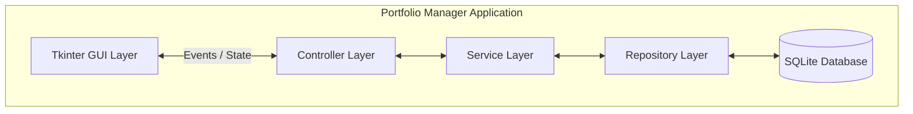

---

### 2.2 Product Functions

At a high level, the system shall:

1. Manage a portfolio of projects with status, priority, and lifecycle states
2. Represent work as discrete sessions of 15–480 minutes, linked to projects and optional milestones
3. Schedule sessions within a weekly time budget
4. Log completed sessions with notes and outcomes
5. Track milestones per project
6. Display a portfolio dashboard with scores and status indicators
7. Support weekly planning and review cycles
8. Provide an in-app editor for per-project plan documents with Markdown and Mermaid diagram rendering
9. Launch from a macOS dock shortcut with a single click

---

### 2.3 User Characteristics

The system is designed for a **single experienced user** who:

- Manages 3–8 concurrent projects across creative and technical domains
- Has 10–16 available hours per week
- Prefers low-friction interaction and quick entry
- Is comfortable writing Markdown and Mermaid diagram syntax
- Works from a macOS desktop environment
- Does not require team collaboration or external reporting

---

### 2.4 Constraints

| Constraint | Detail |
|------------|--------|
| Platform | macOS (primary); Python portability retained for Linux |
| Database | SQLite only — no external database server |
| GUI toolkit | Tkinter only (stdlib) — no Electron, Qt, or web UI |
| Network | No network connectivity required |
| Python version | Python 3.11 or later |
| Package management | `pyproject.toml` with `pip` and `venv` |
| Screen resolution | Minimum 1024×768 |

---

### 2.5 Assumptions and Dependencies

- The user's machine has Python 3.11+ installed or accessible via the launcher
- macOS is the primary target but no macOS-only APIs are used in core logic
- Week numbers use ISO calendar week via Python's `datetime.isocalendar()`
- The `tkinterweb` library is available for Mermaid diagram rendering via embedded WebKit

---

## 3. Specific Requirements

### 3.1 External Interface Requirements

#### 3.1.1 User Interface

The GUI shall be built with **Tkinter** using the `ttk` themed widget set.

**Main Window Layout:**

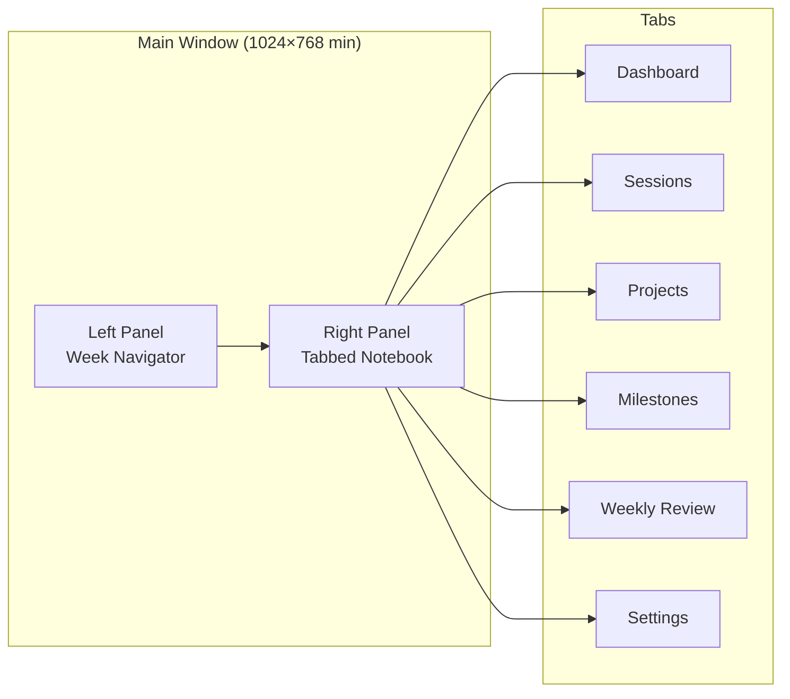

**UI Requirements:**

- REQ-UI-001: The main window shall be resizable with a minimum size of 1024×768 pixels
- REQ-UI-002: The left panel shall display a week navigator listing 17 weeks (12 past + current + 4 future), with the current week highlighted
- REQ-UI-003: Clicking a week in the navigator shall navigate the Sessions and Weekly Review tabs to that week
- REQ-UI-004: The tabbed notebook shall persist the active tab across navigation events
- REQ-UI-005: All destructive actions (delete project, delete session) shall require confirmation
- REQ-UI-006: The application shall use a consistent monospace or sans-serif font stack
- REQ-UI-007: Status indicators shall use color only in conjunction with text or icon labels (accessibility)
- REQ-UI-008: All form inputs shall have associated labels
- REQ-UI-009: The window title shall display the application name and current week key

#### 3.1.2 Hardware Interfaces

No specific hardware interfaces are required. Standard keyboard and mouse input is assumed.

#### 3.1.3 Software Interfaces

| Interface | Purpose |
|-----------|---------|
| SQLite 3.x (stdlib `sqlite3`) | Persistent data storage |
| Python `datetime` / `calendar` | Date and week key computation |
| Python `logging` | Application event logging |
| Python `tomllib` (stdlib 3.11+) | Reading application configuration |
| `markdown` library | Converting plan document Markdown to HTML for rendering |
| `tkinterweb` library | Embedded WebKit renderer for HTML + Mermaid diagram display |

#### 3.1.4 Communications Interfaces

None required. The application is fully offline.

---

### 3.2 Functional Requirements

Requirements use the format **REQ-[AREA]-[NUMBER]**.

#### 3.2.1 Application Startup

- **REQ-APP-001**: On first launch, the system shall create the SQLite database and apply the full schema
- **REQ-APP-002**: On every launch, the system shall verify schema integrity and apply any pending migrations
- **REQ-APP-003**: The system shall load application configuration from a user-level config file (`~/.portfolio_manager/config.toml`)
- **REQ-APP-004**: The system shall log all startup events to a rotating log file

#### 3.2.2 Project Management

- **REQ-PRJ-001**: The system shall allow the user to create a new project with at minimum: name; full detail (description, status, priority, start date, end date) shall be editable via a popup dialog
- **REQ-PRJ-002**: The system shall allow editing all project fields
- **REQ-PRJ-003**: The system shall allow deleting a project after confirmation; deletion shall cascade to associated sessions and milestones
- **REQ-PRJ-004**: Projects shall support three lifecycle states: `active`, `backlog`, `archive`
- **REQ-PRJ-005**: Projects shall have an optional priority value (1–3) for ordering; 1 = highest
- **REQ-PRJ-006**: The project list shall filter by status (default: active only)
- **REQ-PRJ-007**: Archiving a project shall move its status to `archive`; archived projects remain in the database and are read-only
- **REQ-PRJ-008**: The system shall record `created_at` and `updated_at` timestamps for all projects

#### 3.2.3 Session Management

- **REQ-SES-001**: The system shall define a session as a work unit with a duration of 15–480 minutes (configurable default, default 90 min)
- **REQ-SES-002**: The system shall allow creating sessions linked to a project, a date, and an optional milestone
- **REQ-SES-003**: Sessions shall have five states: `backlog`, `planned`, `doing`, `done`, `cancelled`
- **REQ-SES-004**: The system shall allow editing a session's name (Session field), description (notes), status, date, duration, project, and milestone via a popup dialog
- **REQ-SES-005**: The system shall allow rescheduling a session to a different date
- **REQ-SES-006**: The system shall allow cancelling or deleting sessions
- **REQ-SES-007**: Sessions shall be associated with a week key computed automatically from their date
- **REQ-SES-008**: The system shall display all sessions for the current week across all projects in a single table view, navigable by week

#### 3.2.4 Weekly Budget and Planning

- **REQ-WKL-001**: The user shall be able to define a weekly budget (hours) — default 12 hours
- **REQ-WKL-002**: The current week view shall display: total planned sessions, completed sessions, remaining sessions, hours planned, hours remaining
- **REQ-WKL-003**: The system shall visualize session load against budget (progress bar or indicator)
- **REQ-WKL-004**: The system shall support rapid drag-or-click session reallocation within the weekly view
- **REQ-WKL-005**: The system shall display all projects' sessions for the current week on a single planning view

#### 3.2.5 Dashboard

- **REQ-DSH-001**: The dashboard shall display a table of all active projects with: name, deliverable this week, sessions planned, sessions done, sessions remaining, status indicator
- **REQ-DSH-002**: The dashboard shall display a portfolio summary row: total sessions planned, total sessions done, total sessions remaining, portfolio score, portfolio state
- **REQ-DSH-003**: The dashboard shall display a portfolio summary row with total planned, done, remaining session counts, aggregate score, and traffic-light status badge
- **REQ-DSH-004**: The dashboard shall auto-refresh when the underlying data changes
- **REQ-DSH-005**: The dashboard shall display the current week key and date range

#### 3.2.6 Status and Scoring

- **REQ-SCR-001**: The system shall compute a project score (1–100) using the default algorithm:
  - Base score: ratio of completed to planned sessions this week × 60
  - Milestone bonus: ratio of completed milestones to total milestones × 40
- **REQ-SCR-002**: The system shall map score to status:
  - 80–100 → Green
  - 60–79 → Yellow
  - 0–59 → Red
- **REQ-SCR-003**: The system shall compute a portfolio score as the average of all active project scores
- **REQ-SCR-004**: The system shall allow manual override of any project's status and/or score
- **REQ-SCR-005**: Manual overrides shall be recorded with a flag and an optional override note
- **REQ-SCR-006**: The scoring algorithm shall be implemented as a replaceable Strategy so it can be swapped without modifying callers

#### 3.2.7 Milestone Tracking

- **REQ-MIL-001**: The system shall allow creating, editing, and deleting milestones per project
- **REQ-MIL-002**: Milestones shall have: name (description), status (backlog/planned/doing/done/cancelled), target date, completion date, sort order, and free-text notes
- **REQ-MIL-003**: The system shall allow setting a milestone's status via an action bar dropdown (quick change) or a popup dialog (full edit including name, target, notes)
- **REQ-MIL-004**: Milestones shall be displayed in sort order within the Milestones tab, filtered by the selected project

#### 3.2.8 Plan Document Management

- **REQ-PLN-001**: Each project shall have a single plan document stored as Markdown text in the database
- **REQ-PLN-002**: The system shall provide a plan editor that defaults to rendered HTML preview; an Edit button toggles to raw Markdown editing mode
- **REQ-PLN-003**: The rendered preview shall support standard Markdown formatting and Mermaid diagram blocks (flowchart, sequenceDiagram, stateDiagram-v2, erDiagram)
- **REQ-PLN-004**: Rendering shall be performed by converting Markdown to HTML (via the `markdown` library) and loading the result into an embedded WebKit view (`tkinterweb`) with the Mermaid.js script injected
- **REQ-PLN-005**: The preview shall refresh automatically when the user stops typing (debounced, ≤500ms delay)
- **REQ-PLN-006**: The plan document shall auto-save to the database on every edit; no explicit save action is required
- **REQ-PLN-007**: A new project shall be initialized with a blank plan document; the user may populate it freely
- **REQ-PLN-008**: The system shall record the `updated_at` timestamp on the project row whenever the plan document is modified

#### 3.2.9 Weekly Review

- **REQ-REV-001**: The system shall provide a weekly review form with fields: what moved, what stalled, signals, decision for next week, primary focus, project to deprioritize, risk to watch, first session target
- **REQ-REV-002**: The system shall store weekly reviews in the database indexed by week key
- **REQ-REV-003**: The system shall list past weekly reviews and allow viewing any prior week

#### 3.2.10 Settings

- **REQ-SET-001**: The system shall provide a settings panel for: default weekly budget, default session duration, log file location, theme preference (light/dark)
- **REQ-SET-002**: Settings shall be persisted to `~/.portfolio_manager/config.toml`
- **REQ-SET-003**: Changes to settings shall take effect without restarting the application where possible

---

### 3.3 Performance Requirements

| ID | Requirement |
|----|-------------|
| REQ-PERF-001 | All user interface actions shall respond in < 200ms under normal conditions |
| REQ-PERF-002 | The dashboard shall load within 500ms of application start |
| REQ-PERF-003 | The system shall support a database of up to 10,000 sessions without degradation |
| REQ-PERF-004 | Plan document preview shall re-render within 500ms of the user pausing input |
| REQ-PERF-005 | Session creation or modification shall complete in ≤ 3 clicks or keystrokes |

---

### 3.4 Design Constraints

| ID | Constraint |
|----|------------|
| REQ-CON-001 | The application shall use Python 3.11+ and the stdlib `tkinter` / `ttk` modules |
| REQ-CON-002 | The application shall use the stdlib `sqlite3` module for database access |
| REQ-CON-003 | All database access shall be mediated through the Repository layer — no SQL in controllers or views |
| REQ-CON-004 | The application shall follow PEP 8 style throughout |
| REQ-CON-005 | All public classes and functions shall have Sphinx-compatible docstrings |
| REQ-CON-006 | The application shall use Python `logging` with configurable log levels — no `print()` for diagnostics |
| REQ-CON-007 | The project shall use `pyproject.toml` as the sole build and dependency specification |
| REQ-CON-008 | A Python virtual environment shall be used for all dependency isolation |
| REQ-CON-009 | The application shall not require administrator or elevated privileges to run |

---

### 3.5 Software System Attributes

#### 3.5.1 Reliability

- **REQ-REL-001**: The system shall not lose data on unexpected termination — all writes shall use transactions
- **REQ-REL-002**: The system shall tolerate missing or malformed Markdown files without crashing
- **REQ-REL-003**: The system shall handle SQLite locked-database conditions gracefully with a retry and user notification
- **REQ-REL-004**: The system shall back up the database automatically to a `.bak` file before applying schema migrations

#### 3.5.2 Availability

- **REQ-AVL-001**: The application shall launch within 3 seconds on a standard macOS machine

#### 3.5.3 Security

- **REQ-SEC-001**: The database shall be stored in the user's home directory or a user-specified path — never in a world-writable location
- **REQ-SEC-002**: No external network connections shall be made without explicit user action

#### 3.5.4 Maintainability

- **REQ-MNT-001**: The system architecture shall use MVC separation — views shall contain no business logic
- **REQ-MNT-002**: All design patterns used shall be documented in code comments and the MkDocs documentation
- **REQ-MNT-003**: The system shall be rebuildable from source in under 30 minutes by the author
- **REQ-MNT-004**: Database schema changes shall use a versioned migration system

#### 3.5.5 Portability

- **REQ-PRT-001**: Core logic shall be platform-agnostic and runnable on macOS and Linux
- **REQ-PRT-002**: The launcher script shall detect the OS and use the appropriate mechanism

---

### 3.6 Soft Requirements (Behavioral Constraints)

These are carried forward from V1 and remain binding.

| ID | Requirement |
|----|-------------|
| REQ-SFT-001 | **Low Cognitive Overhead** — The system shall require no more than 3 fields to create a session |
| REQ-SFT-002 | **Flexibility** — The system shall allow arbitrary changes to schedules without penalty |
| REQ-SFT-003 | **Forgiveness** — Manual overrides of status and score shall always be permitted |
| REQ-SFT-004 | **Immediate Feedback** — Every completed action shall update the UI immediately |
| REQ-SFT-005 | **Non-Punitive** — The system shall never display failure messages for missed sessions; it shall simply reflect state |
| REQ-SFT-006 | **Rediscoverability** — After 4 weeks of non-use, the user shall be able to understand the current state in under 5 minutes |
| REQ-SFT-007 | **Quick Exit** — The system shall never require a save action — all changes shall auto-commit |
| REQ-SFT-008 | **Non-Addictive** — The UI shall not encourage prolonged engagement or gamification beyond simple scoring |

---

## 4. System Architecture

### 4.1 Architectural Overview

The system uses a layered **Model-View-Controller (MVC)** architecture augmented with a **Service Layer** for business logic and a **Repository Layer** for data access. Design patterns are applied at well-defined seams.

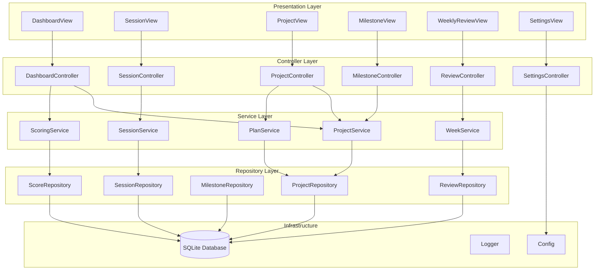

---

### 4.2 Design Patterns

| Pattern | Where Applied | Purpose |
|---------|---------------|---------|
| **MVC** | Full application | Separates presentation, logic, and data access |
| **Repository** | All data access classes | Abstracts SQL from services; enables testability via fakes |
| **Strategy** | `ScoringService` | Scoring algorithm is injectable and replaceable |
| **Observer** | View updates on data change | Views subscribe to model change events; controllers notify |
| **Singleton** | `DatabaseConnection` | One database connection shared across repositories |
| **Factory** | `SessionFactory`, `ProjectFactory` | Creates domain objects with defaults applied |
| **Command** | User actions (create, edit, delete) | Enables future undo support; keeps controllers thin |
| **Template Method** | Plan document renderer | Shared HTML generation logic with per-diagram-type overrides |

---

### 4.3 Application Startup Sequence

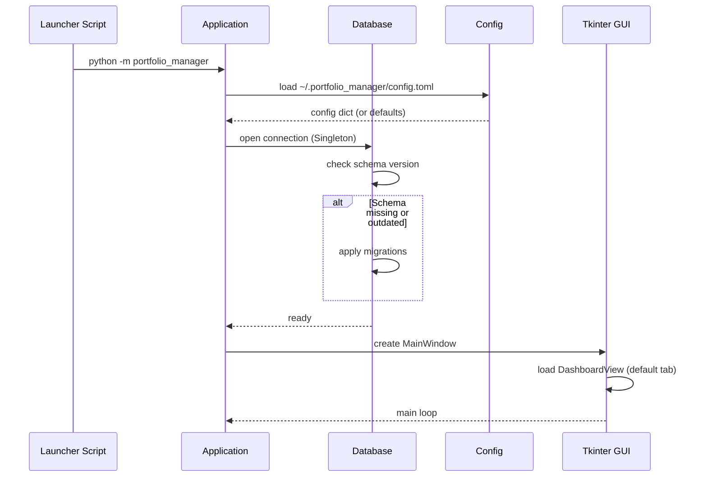

---

### 4.4 Session Lifecycle

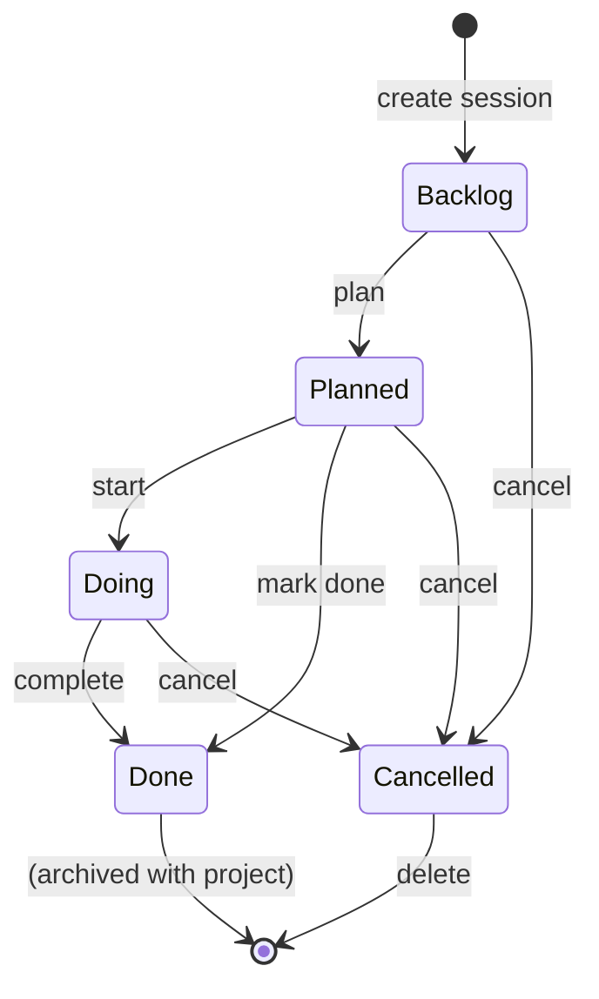

---

### 4.5 Project Lifecycle

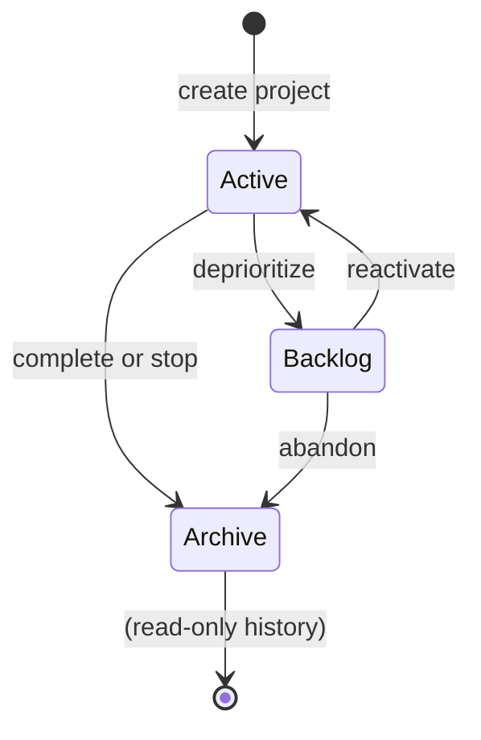

---

### 4.6 Observer Pattern — View Refresh

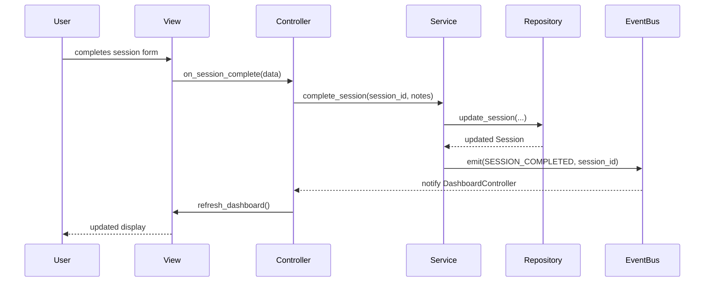

---

## 5. Data Model

### 5.1 Entity-Relationship Diagram

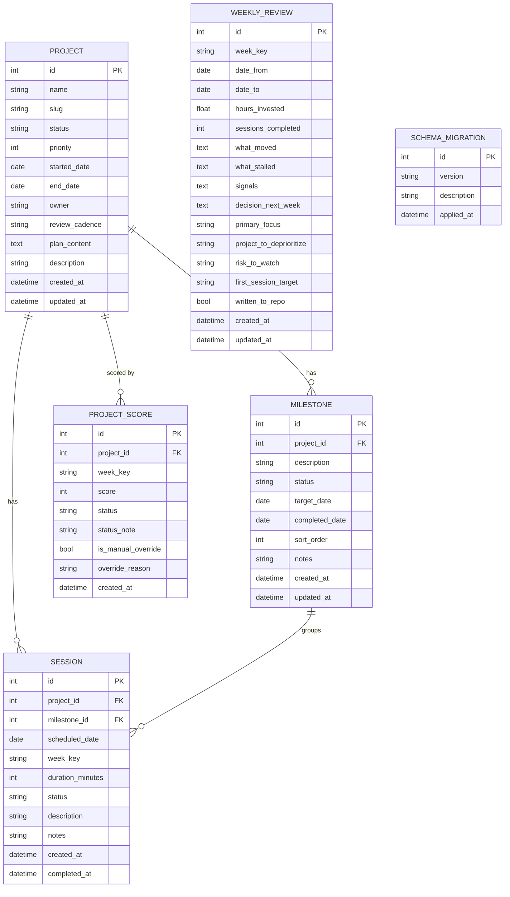

---

### 5.2 Schema Details

#### 5.2.1 PROJECT

| Column | Type | Constraints | Notes |
|--------|------|-------------|-------|
| `id` | INTEGER | PK, AUTOINCREMENT | |
| `name` | TEXT | NOT NULL | Display name |
| `slug` | TEXT | NOT NULL, UNIQUE | URL-safe folder name |
| `status` | TEXT | NOT NULL, CHECK IN ('active','backlog','archive') | |
| `priority` | INTEGER | DEFAULT 3, CHECK 1–3 | 1 = highest |
| `started_date` | DATE | | ISO 8601 date |
| `end_date` | DATE | | ISO 8601 target completion date |
| `owner` | TEXT | DEFAULT 'Matt Briggs' | |
| `review_cadence` | TEXT | DEFAULT 'weekly' | |
| `plan_content` | TEXT | DEFAULT '' | Markdown text of the project plan document; may contain Mermaid blocks |
| `description` | TEXT | | Free text |
| `created_at` | DATETIME | NOT NULL, DEFAULT CURRENT_TIMESTAMP | |
| `updated_at` | DATETIME | NOT NULL, DEFAULT CURRENT_TIMESTAMP | Updated by trigger |

#### 5.2.2 SESSION

| Column | Type | Constraints | Notes |
|--------|------|-------------|-------|
| `id` | INTEGER | PK, AUTOINCREMENT | |
| `project_id` | INTEGER | FK → project.id, NOT NULL | CASCADE DELETE |
| `milestone_id` | INTEGER | FK → milestone.id | SET NULL on delete; optional |
| `scheduled_date` | DATE | NOT NULL | ISO 8601 |
| `week_key` | TEXT | NOT NULL | Computed: `YYYY.W` |
| `duration_minutes` | INTEGER | DEFAULT 90, CHECK 15–480 | |
| `status` | TEXT | CHECK IN ('backlog','planned','doing','done','cancelled') | |
| `description` | TEXT | NOT NULL, DEFAULT '' | Session name / brief focus |
| `notes` | TEXT | NOT NULL, DEFAULT '' | Longer session notes |
| `created_at` | DATETIME | NOT NULL, DEFAULT CURRENT_TIMESTAMP | |
| `completed_at` | DATETIME | | Set when status → done |

#### 5.2.3 MILESTONE

| Column | Type | Constraints | Notes |
|--------|------|-------------|-------|
| `id` | INTEGER | PK, AUTOINCREMENT | |
| `project_id` | INTEGER | FK → project.id, NOT NULL | CASCADE DELETE |
| `description` | TEXT | NOT NULL | Outcome-based milestone name |
| `status` | TEXT | NOT NULL, CHECK IN ('backlog','planned','doing','done','cancelled') | DEFAULT 'backlog' |
| `target_date` | DATE | | Optional target completion date |
| `completed_date` | DATE | | Set automatically when status → done |
| `sort_order` | INTEGER | DEFAULT 0 | |
| `notes` | TEXT | NOT NULL, DEFAULT '' | Free-text notes |
| `created_at` | DATETIME | NOT NULL, DEFAULT CURRENT_TIMESTAMP | |
| `updated_at` | DATETIME | NOT NULL, DEFAULT CURRENT_TIMESTAMP | Updated by trigger |

#### 5.2.4 PROJECT_SCORE

| Column | Type | Constraints | Notes |
|--------|------|-------------|-------|
| `id` | INTEGER | PK, AUTOINCREMENT | |
| `project_id` | INTEGER | FK → project.id, NOT NULL | |
| `week_key` | TEXT | NOT NULL | |
| `score` | INTEGER | CHECK 0–100 | |
| `status` | TEXT | CHECK IN ('green','yellow','red') | |
| `status_note` | TEXT | | Displayed in dashboard notes panel |
| `is_manual_override` | BOOLEAN | DEFAULT 0 | |
| `override_reason` | TEXT | | Required when is_manual_override = 1 |
| `created_at` | DATETIME | NOT NULL, DEFAULT CURRENT_TIMESTAMP | |

**Unique constraint:** `(project_id, week_key)` — one score record per project per week.

#### 5.2.5 WEEKLY_REVIEW

| Column | Type | Constraints | Notes |
|--------|------|-------------|-------|
| `id` | INTEGER | PK, AUTOINCREMENT | |
| `week_key` | TEXT | NOT NULL, UNIQUE | |
| `date_from` | DATE | | Monday of the week |
| `date_to` | DATE | | Sunday of the week |
| `hours_invested` | REAL | | |
| `sessions_completed` | INTEGER | | |
| `what_moved` | TEXT | | Free text |
| `what_stalled` | TEXT | | |
| `signals` | TEXT | | |
| `decision_next_week` | TEXT | | |
| `primary_focus` | TEXT | | |
| `project_to_deprioritize` | TEXT | | |
| `risk_to_watch` | TEXT | | |
| `first_session_target` | TEXT | | |
| `written_to_repo` | BOOLEAN | DEFAULT 0 | Whether written to weekly.md |
| `created_at` | DATETIME | NOT NULL, DEFAULT CURRENT_TIMESTAMP | |
| `updated_at` | DATETIME | NOT NULL, DEFAULT CURRENT_TIMESTAMP | |

---

## 6. Technology Stack

### 6.1 Runtime and Language

| Component | Choice | Rationale |
|-----------|--------|-----------|
| Language | Python 3.11+ | Availability, simplicity, cross-platform |
| GUI | `tkinter` / `ttk` | Stdlib, no external GUI dependency |
| Database | `sqlite3` (stdlib) | Embedded, no server, zero config |
| Packaging | `pyproject.toml` | PEP 517/518 compliant, modern standard |
| Environment | `venv` (stdlib) | Simple isolation, no Conda dependency |

### 6.2 Third-Party Libraries

| Library | Version | Purpose |
|---------|---------|---------|
| `markdown` | ≥3.5 | Converting plan document Markdown to HTML |
| `tkinterweb` | ≥3.20 | Embedded WebKit HTML renderer for plan preview (Mermaid.js support) |
| `mkdocs` | ≥1.5 | Documentation site generator |
| `mkdocs-material` | ≥9.5 | Material theme for MkDocs |
| `pytest` | ≥8.0 | Test runner |
| `pytest-cov` | ≥4.0 | Code coverage measurement |

### 6.3 Development Tools

| Tool | Purpose |
|------|---------|
| `ruff` | Fast Python linter (PEP 8 enforcement) |
| `black` | Code formatter |
| `mypy` | Optional static type checking |
| `pre-commit` | Git hook runner for lint/format checks |

---

## 7. Project Structure

```text
portfolio-manager/
├── pyproject.toml                  # Build system, dependencies, tool config
├── README.md                       # Quick-start guide
├── CHANGELOG.md                    # Version history
├── LICENSE
│
├── launch.sh                       # One-click launcher script (activates venv, runs app)
├── create_shortcut.sh              # Creates macOS .app wrapper for Dock placement
│
├── src/
│   └── portfolio_manager/
│       ├── __init__.py
│       ├── __main__.py             # Entry point: python -m portfolio_manager
│       ├── app.py                  # Application bootstrap and main window
│       │
│       ├── config/
│       │   ├── __init__.py
│       │   └── settings.py         # Config loader (config.toml reader)
│       │
│       ├── db/
│       │   ├── __init__.py
│       │   ├── connection.py       # Singleton database connection
│       │   ├── migrations.py       # Schema versioning and migration runner
│       │   └── schema.sql          # Initial schema DDL
│       │
│       ├── models/
│       │   ├── __init__.py
│       │   ├── project.py          # Project dataclass / domain model
│       │   ├── session.py          # Session dataclass
│       │   ├── milestone.py        # Milestone dataclass
│       │   ├── score.py            # ProjectScore dataclass
│       │   └── review.py           # WeeklyReview dataclass
│       │
│       ├── repositories/
│       │   ├── __init__.py
│       │   ├── base.py             # Abstract base repository
│       │   ├── project_repo.py     # ProjectRepository
│       │   ├── session_repo.py     # SessionRepository
│       │   ├── milestone_repo.py   # MilestoneRepository
│       │   ├── score_repo.py       # ScoreRepository
│       │   └── review_repo.py      # ReviewRepository
│       │
│       ├── services/
│       │   ├── __init__.py
│       │   ├── project_service.py  # ProjectService (business logic)
│       │   ├── session_service.py  # SessionService
│       │   ├── scoring_service.py  # ScoringService (Strategy pattern)
│       │   ├── plan_service.py     # PlanService (plan document CRUD + HTML rendering)
│       │   └── week_service.py     # WeekService (week key computation)
│       │
│       ├── controllers/
│       │   ├── __init__.py
│       │   ├── dashboard_controller.py
│       │   ├── session_controller.py
│       │   ├── project_controller.py
│       │   ├── milestone_controller.py
│       │   ├── review_controller.py
│       │   └── settings_controller.py
│       │
│       ├── views/
│       │   ├── __init__.py
│       │   ├── main_window.py      # Root Tk window, left panel, notebook
│       │   ├── dashboard_view.py   # Portfolio dashboard tab
│       │   ├── session_view.py     # Session management tab
│       │   ├── project_view.py     # Project detail and list tab
│       │   ├── milestone_view.py   # Milestone tracking tab
│       │   ├── review_view.py      # Weekly review tab
│       │   ├── settings_view.py    # Settings tab
│       │   └── widgets/
│       │       ├── status_badge.py  # Traffic-light status widget
│       │       └── plan_editor.py   # Preview-first Markdown editor + WebKit preview widget
│       │
│       ├── events/
│       │   ├── __init__.py
│       │   └── event_bus.py        # Simple in-process Observer event bus
│       │
│       └── utils/
│           ├── __init__.py
│           ├── date_utils.py       # Week key, ISO calendar helpers
│           └── logging_config.py   # Logger setup and configuration
│
├── tests/
│   ├── __init__.py
│   ├── conftest.py                 # Shared fixtures (in-memory DB, test config)
│   ├── unit/
│   │   ├── test_models.py
│   │   ├── test_week_service.py
│   │   ├── test_scoring_service.py
│   │   ├── test_plan_service.py
│   │   └── test_date_utils.py
│   ├── integration/
│   │   ├── test_project_repository.py
│   │   ├── test_session_repository.py
│   │   ├── test_milestone_repository.py
│   │   └── test_project_service.py
│   └── e2e/
│       └── test_app_startup.py     # Headless startup smoke test
│
├── docs/
│   ├── mkdocs.yml                  # MkDocs config (Material theme + Mermaid)
│   └── src/
│       ├── index.md
│       ├── architecture.md
│       ├── data-model.md
│       ├── design-patterns.md
│       ├── development.md
│       ├── testing.md
│       └── api/                    # Auto-generated from Sphinx / mkdocstrings
│
├── scripts/
│   └── archive-project.sh          # Existing repo archive script
│
└── .github/
    └── workflows/
        └── ci.yml                  # Lint + test on push
```

---

## 8. Development Standards

### 8.1 Python Style

- **PEP 8** compliance is mandatory for all source files
- Line length: 88 characters (Black default)
- Enforcement: `ruff` linter configured in `pyproject.toml`
- Formatting: `black` applied before commit via `pre-commit` hook
- Type hints shall be used on all public function signatures
- `mypy --strict` warnings shall be addressed (not required to pass for merge, but tracked)

### 8.2 Docstring Standard (Sphinx-Compatible)

All public modules, classes, and functions shall have docstrings following the **reStructuredText** format compatible with Sphinx `autodoc`:

```python
def set_status(self, session_id: int, status: SessionStatus) -> Session:
    """Set the status of a session, managing completed_at automatically.

    :param session_id: Primary key of the session.
    :type session_id: int
    :param status: New status — one of ``backlog``, ``planned``, ``doing``, ``done``, ``cancelled``.
    :type status: SessionStatus
    :returns: The updated Session domain object.
    :rtype: Session
    :raises ValidationError: If *status* is not a recognised value.
    """
```

### 8.3 Logging

- The application shall use Python's standard `logging` module
- Log levels shall be used consistently:
  - `DEBUG` — detailed trace information for development
  - `INFO` — normal application events (startup, session complete, etc.)
  - `WARNING` — unexpected but recoverable conditions
  - `ERROR` — failures that prevent an action from completing
  - `CRITICAL` — conditions that require application restart
- A rotating file handler shall write to `~/.portfolio_manager/logs/app.log`
- Log format: `%(asctime)s | %(levelname)-8s | %(name)s | %(message)s`
- No `print()` statements shall be used for diagnostics in production code
- Log level shall be configurable via `config.toml` (default: `INFO`)

### 8.4 Error Handling

- All database operations shall be wrapped in try/except blocks at the service layer
- Exceptions shall be logged before being re-raised or converted to user-facing messages
- The UI shall never expose raw exception tracebacks to the user — all errors shall be translated to plain-language messages
- Custom exception classes shall be defined in `portfolio_manager/exceptions.py`

### 8.5 Database Transactions

- All multi-step database writes shall use explicit `BEGIN` / `COMMIT` / `ROLLBACK` transactions
- The repository base class shall provide a context manager for transaction scoping:

```python
with self.db.transaction():
    self.session_repo.update(session)
    self.score_repo.invalidate(project_id, week_key)
```

### 8.6 Configuration Management

- All user-configurable values shall be in `~/.portfolio_manager/config.toml`
- Default values shall be defined in code and documented in the MkDocs site
- The `settings.py` module shall expose a typed `Settings` dataclass
- No hardcoded paths or values shall appear outside of `settings.py` or `schema.sql`

---

## 9. Testing Requirements

### 9.1 Framework

- **Pytest** shall be the sole test runner
- **pytest-cov** shall measure code coverage
- Tests shall be organized into three tiers: `unit/`, `integration/`, `e2e/`

### 9.2 Coverage Target

- Minimum code coverage: **80%** across all source files
- Coverage report shall be generated in HTML and terminal formats
- Coverage configuration in `pyproject.toml`:

```toml
[tool.pytest.ini_options]
testpaths = ["tests"]
addopts = "--cov=src/portfolio_manager --cov-report=term-missing --cov-fail-under=80"
```

### 9.3 Test Strategy

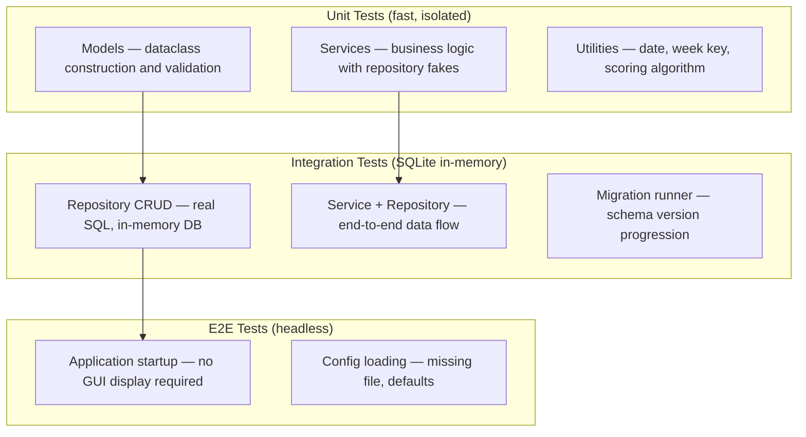

### 9.4 Test Fixtures

- `conftest.py` shall provide:
  - `in_memory_db` — SQLite `:memory:` connection with full schema applied
  - `test_config` — Settings object with test defaults
  - `sample_project` — A pre-created Project in the test DB (with a non-empty `plan_content`)
  - `sample_sessions` — A set of sessions (planned, completed, cancelled) for the sample project

### 9.5 GUI Testing Approach

- Tkinter GUI components shall **not** be tested with automated UI tests (fragile, platform-dependent)
- GUI logic shall be kept minimal — controllers shall be the primary test target
- A headless startup test shall verify the application initializes without error using `Tk.withdraw()` to suppress window display

---

## 10. Deployment and Launch Mechanism

### 10.1 Overview

The application shall be launchable via three mechanisms:

1. **Command line** (development): `python -m portfolio_manager`
2. **Shell script** (daily use): `./launch.sh` — activates venv and launches app
3. **macOS Dock shortcut** (convenience): A `.app` wrapper created by `create_shortcut.sh`

### 10.2 Installation Steps

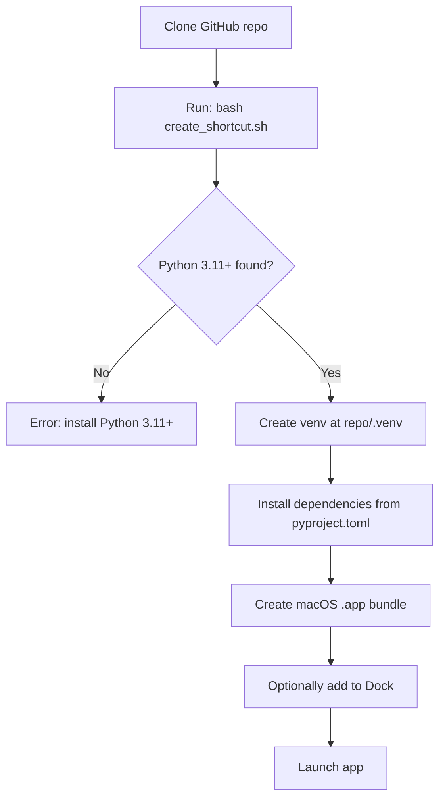

### 10.3 `launch.sh`

```bash
#!/usr/bin/env bash
# launch.sh — Activate venv and run Portfolio Manager
set -e
SCRIPT_DIR="$(cd "$(dirname "${BASH_SOURCE[0]}")" && pwd)"
VENV="$SCRIPT_DIR/.venv"

if [ ! -d "$VENV" ]; then
    echo "Creating virtual environment..."
    python3 -m venv "$VENV"
    "$VENV/bin/pip" install -e "$SCRIPT_DIR[dev]" --quiet
fi

exec "$VENV/bin/python" -m portfolio_manager "$@"
```

### 10.4 `create_shortcut.sh`

The script shall:

1. Verify Python 3.11+ is available
2. Create the venv at `<repo>/.venv` if it does not exist
3. Install dependencies via `pip install -e .[dev]`
4. Create a macOS `.app` bundle at `~/Applications/Portfolio Manager.app`
5. The `.app` bundle's executable shall call `launch.sh` from the repo directory
6. Optionally prompt the user to drag the `.app` to the Dock

**macOS `.app` bundle structure:**

```text
Portfolio Manager.app/
└── Contents/
    ├── Info.plist
    ├── MacOS/
    │   └── portfolio-manager      # Shell script calling launch.sh
    └── Resources/
        └── AppIcon.icns           # Optional custom icon
```

**Info.plist minimum keys:**

```xml
<key>CFBundleName</key>
<string>Portfolio Manager</string>
<key>CFBundleIdentifier</key>
<string>com.mattbriggs.portfolio-manager</string>
<key>CFBundleExecutable</key>
<string>portfolio-manager</string>
```

### 10.5 First-Run Experience

On first launch (no database, no config):

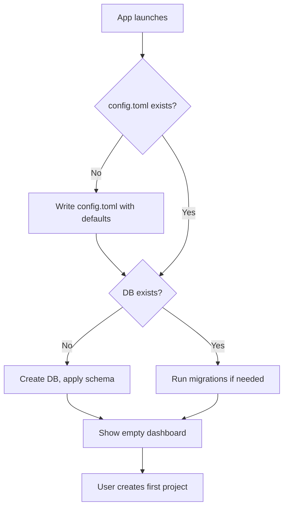

### 10.6 Updating

To update the application:

```bash
git pull origin main
.venv/bin/pip install -e .[dev] --quiet
```

No rebuild of the `.app` bundle is required after updating Python source — the bundle calls `launch.sh` which always runs from the current repo state.

---

## 11. Documentation Requirements

### 11.1 MkDocs Site

The project shall maintain a documentation site built with **MkDocs** and the **Material** theme.

**Configuration (`docs/mkdocs.yml`):**

```yaml
site_name: Portfolio Manager
theme:
  name: material
  palette:
    scheme: default
plugins:
  - search
  - mermaid2
markdown_extensions:
  - mermaid2
  - admonition
  - pymdownx.superfences:
      custom_fences:
        - name: mermaid
          class: mermaid
          format: !!python/name:pymdownx.superfences.fence_code_format
nav:
  - Home: index.md
  - Architecture: architecture.md
  - Data Model: data-model.md
  - Design Patterns: design-patterns.md
  - Development Guide: development.md
  - Testing: testing.md
  - API Reference: api/
```

### 11.2 Required Documentation Pages

| Page | Content |
|------|---------|
| `index.md` | Overview, quick-start, installation |
| `architecture.md` | MVC diagram, component descriptions, design decisions |
| `data-model.md` | ER diagram, table definitions, schema notes |
| `design-patterns.md` | Each pattern with code example and rationale |
| `development.md` | Venv setup, running tests, style guide, contribution notes |
| `testing.md` | Coverage target, fixture guide, how to run tests |
| `api/` | Auto-generated from Sphinx docstrings (via `mkdocstrings`) |

### 11.3 Inline Code Documentation

- Every module shall have a module-level docstring describing its purpose
- Every public class shall have a class-level docstring
- Every public method shall have a function docstring following the Sphinx format
- Private methods (`_name`) are exempt but encouraged for complex logic

---

## 12. Appendices

### Appendix A — Scoring Algorithm (Default Strategy)

```python
def compute_score(
    planned: int,
    completed: int,
    total_milestones: int,
    completed_milestones: int,
) -> int:
    """Compute a project score using the default weighted strategy.

    Session component (60 points max):
        completed / planned * 60  (0 if planned == 0)

    Milestone component (40 points max):
        completed_milestones / total_milestones * 40  (0 if total == 0)

    :returns: Integer score in range 0–100.
    """
    session_score = (completed / planned * 60) if planned > 0 else 0
    milestone_score = (
        (completed_milestones / total_milestones * 40)
        if total_milestones > 0
        else 0
    )
    return min(100, round(session_score + milestone_score))
```

---

### Appendix B — Plan Document Rendering Pipeline

When the user views the plan preview pane, `PlanService` executes the following pipeline:

```
plan_content (TEXT from DB)
    → markdown.convert()          # produces HTML body
    → inject <script> mermaid.js  # bundled or CDN, loaded once
    → wrap in minimal HTML shell  # <html><head>…</head><body>…</body></html>
    → tkinterweb HtmlFrame.load_html()  # WebKit renders HTML + runs Mermaid.js
```

The Mermaid.js script is injected with `startOnLoad: true` so diagrams render automatically. Supported diagram types: `flowchart`, `sequenceDiagram`, `stateDiagram-v2`, `erDiagram`, `gantt`.

---

### Appendix C — Week Key Computation

Week keys use the ISO 8601 calendar week number via Python's `datetime.isocalendar()`:

```python
from datetime import date

def to_week_key(d: date) -> str:
    """Convert a date to the canonical YYYY.W week key format.

    Uses ISO 8601 calendar week numbering. Week 1 is the week containing
    the first Thursday of the year.

    :param d: The date to convert.
    :type d: datetime.date
    :returns: Week key string, e.g. '2026.15'.
    :rtype: str
    """
    iso = d.isocalendar()
    return f"{iso.year}.{iso.week}"
```

---

### Appendix D — Status Mapping Table

| Score Range | Status | Color | Meaning |
|-------------|--------|-------|---------|
| 80–100 | Green | `#2e7d32` | Executing well — risks managed, deliverables shipping |
| 60–79 | Yellow | `#f9a825` | Plans in place — execution starting or mixed; risks unresolved |
| 40–59 | Yellow | `#f9a825` | Momentum fragile — active blockers |
| 0–39 | Red | `#c62828` | Portfolio needs intervention — significant stall or drift |

---

### Appendix E — Success Criteria (Carried from V1)

The system is considered successful when:

- The user consistently logs sessions (≥ 4 per week) using the application
- The user can resume effective use after ≥ 4 weeks of inactivity in under 5 minutes
- The dashboard accurately reflects the state of all active projects at a glance
- No session data has been lost due to application error
- The application launches from the Dock in under 3 seconds

---

*End of Software Requirements Specification — Portfolio Manager V2*
